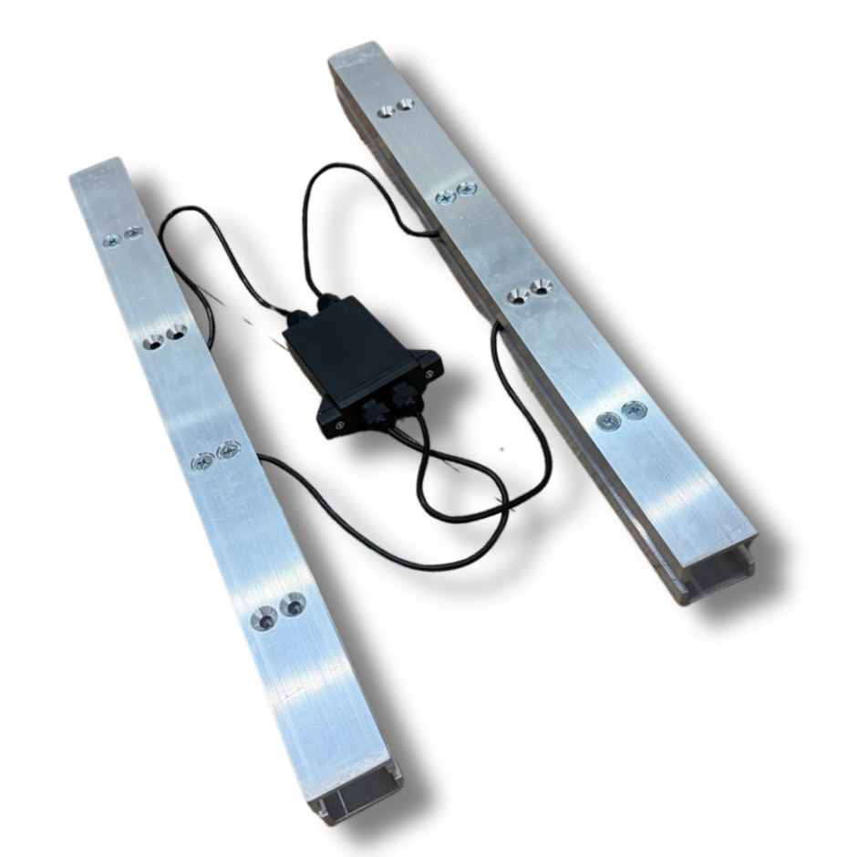
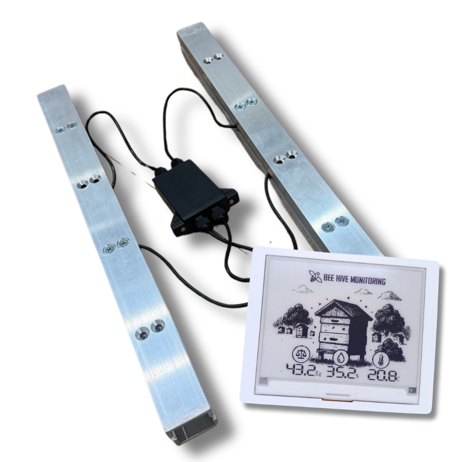
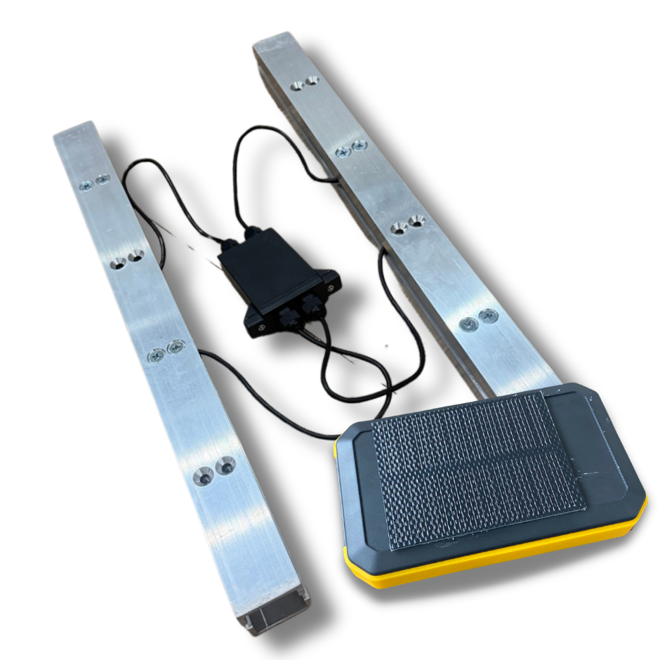

## Overview

Bee Hive Monitoring is a Slovak/EU precision beekeeping supplier with a broad e-shop of hive scales, gateways, a bee counter, internal "Hive Heart" sensor, GPS add-ons and a cloud web application. It is one of the more mature low-to-mid-cost European sensor vendors.

## Product Features

- Hive scales in multiple form factors: wooden, metal, XY, scientific, black PRO and quatro scale
- Internal monitoring via Hive Heart and configurable "Bee hive monitoring" product bundles
- Bee counter and GPS monitoring add-ons
- GSM/4G gateways, solar gateway options and SIM/data subscriptions
- Web application, online graphs, alerts and data export/remote dashboard workflows
- Multilingual EU site and reseller network

## Competitive Analysis

### Strengths

- Very broad hardware catalog at accessible prices
- European manufacturing/support and multilingual website
- Modular system lets a beekeeper start with one scale and expand gradually
- Clear e-commerce pricing and yearly subscription options
- Bee counter overlaps partially with entrance-observer use cases

### Weaknesses vs Gratheon

- Mostly scalar/time-series telemetry; no strong computer-vision positioning
- Bee counter is not equivalent to video-based behavioral analysis
- No frame-level inspection or visual disease/pest evidence
- Product range is fragmented and may require multiple modules/gateways
- UX appears more traditional e-shop/dashboard than AI-first product

### Strategic Implications

Bee Hive Monitoring validates that EU beekeepers buy affordable telemetry hardware. Gratheon should treat them as a baseline competitor for price and reliability, while differentiating with camera-based evidence, AI interpretation and integrated colony-health workflows.

## Product images / screenshots

Official product visuals/screenshots used for competitive reference.

