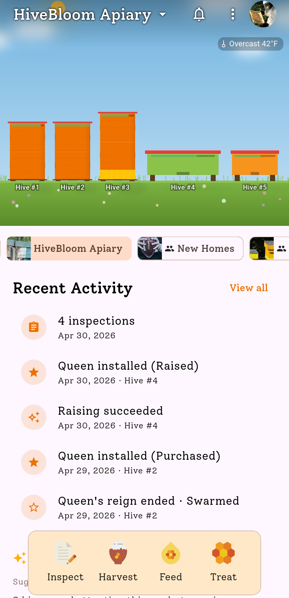
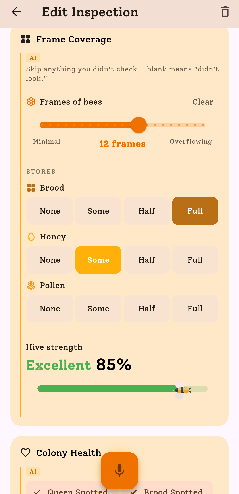
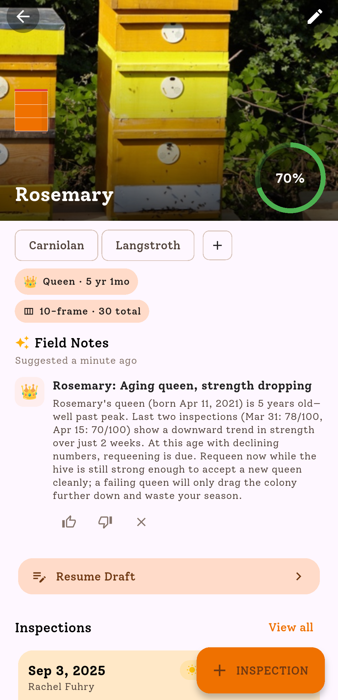

## Overview

HiveBloom is a modern beekeeping journal and management app for iOS, Android and web. It positions itself as "a mentor in your pocket" with AI dictation, seasonal coaching and a free tier for up to two hives.

## Product Features

- Apiary and hive management with map/location views
- AI dictation: speak inspections and have forms filled automatically
- Tailored coaching/mentor notes across the season
- Queen tracking with milestones, brood patterns and lineage
- Smart reminders and weather-aware notifications
- Offline mode
- Sharing with friends or mentors
- QR/NFC tag support for quick hive identification
- Web app announced/available through app.hivebloom.com

## Competitive Analysis

### Strengths

- Strong modern UX and app-store presence
- AI-assisted inspection entry reduces manual data friction
- Free tier is compelling for hobbyists
- Coaching/mentor framing is close to the value users expect from AI
- Offline and QR/NFC workflows are practical for field use

### Weaknesses vs Gratheon

- Software-only; no native sensor/camera hardware ecosystem
- AI is based on user-entered inspection data, not automated hive observations
- No entrance observer or frame-level computer vision
- Less suitable as a complete remote monitoring solution for larger operations

### Strategic Implications

HiveBloom is a strong UX benchmark. Gratheon should learn from its AI dictation and mentor-like guidance, while differentiating with automated evidence from sensors, entrance cameras and frame imagery.

## Product images / screenshots

Official product visuals/screenshots used for competitive reference.

