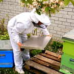
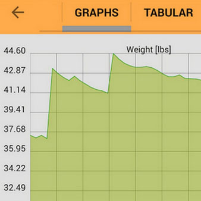

## Overview

Solutionbee LLC produces B-ware hive scales and monitors in Raleigh, North Carolina. The company serves hobbyists, commercial beekeepers, university research facilities and contract research organizations across North America.

## Product Features

- Hive monitor records weight and outside temperature at intervals such as hourly
- Internal temperature and humidity monitoring through monitor variants
- Data upload through HiveHub or smartphone
- Cloud-based information management and dashboard
- Downloadable individual/apiary reports and spreadsheet exports
- Alarm reporting for intrusion, swarming or other colony issues
- Hive localization on Google Maps
- Use cases for hobbyists, commercial beekeepers and researchers

## Competitive Analysis

### Strengths

- Established US company with long outdoor-measurement hardware experience
- Strong positioning for researchers and commercial operations
- Cloud reports and spreadsheet exports are practical for trials and CROs
- Reliable/rugged product messaging
- Customer testimonials show field value from weight data

### Weaknesses vs Gratheon

- US-focused; less direct pressure in EU/Baltic launch markets
- No entrance computer vision or frame-level image inspection
- Data is mainly weight/temperature/humidity, requiring manual interpretation
- Hardware + hub/app model can be less integrated than an AI-first product

### Strategic Implications

Solutionbee is a credible benchmark for reliability and research-grade reporting. Gratheon should match export/report credibility while differentiating with image-based diagnostics and automated recommendations.

## Product images / screenshots

Official product visuals/screenshots used for competitive reference.

