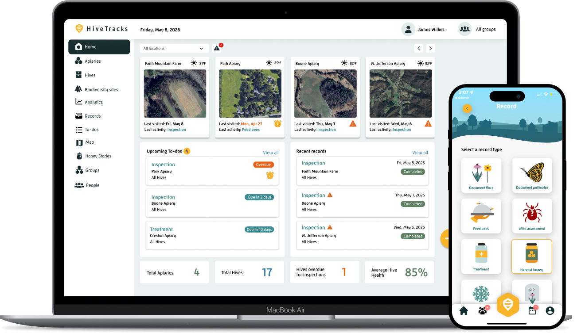

## Overview

HiveTracks is an established beekeeping management web application based in the United States. One of the older platforms in the space.

## Competitive Analysis

### Strengths
- Long market presence (established brand)
- US market penetration
- Digital record keeping
- Inspection logging
- Treatment tracking

### Weaknesses vs Gratheon
- No IoT hardware integration
- No computer vision or automation
- Dated user interface
- Pure software solution
- Limited innovation
- US-focused (not European market)

### Strategic Implications
- Shows market longevity for web apps
- Demonstrates need for modernization
- Geographic separation reduces direct competition
- Gratheon's hardware integration is key differentiator
- Opportunity to attract users seeking modern solution

## Product images / screenshots

Official product visuals/screenshots used for competitive reference.

