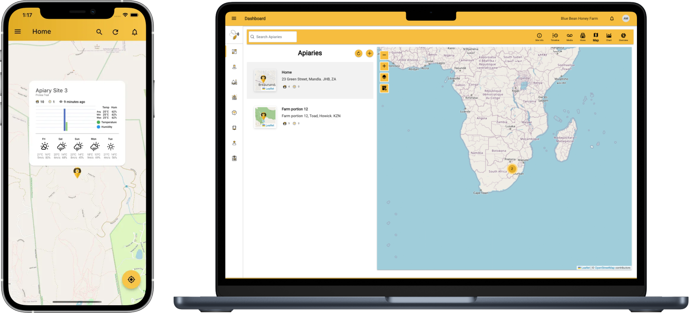
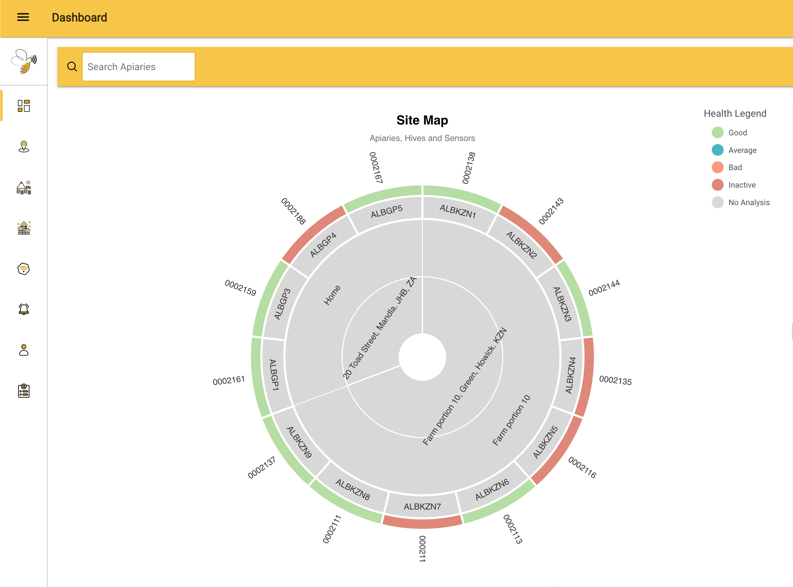

## Overview

HivePulse is a South African smart beehive monitoring and management product. The public site is JavaScript-heavy, but search-indexed official snippets describe an in-hive monitoring device that analyzes data and sends alerts about hive movement and conditions such as healthy, empty and swarming hives.

## Product Features

- In-hive smart monitoring device
- Remote and real-time hive health/condition tracking
- Alerts for movement and hive condition changes
- App-store presence for iOS and Android
- Beekeeping management platform
- Hive marker products with NFC, barcode, QR code and serial number integration
- Field/inspection recording workflows through hive markers

## Competitive Analysis

### Strengths

- Practical focus on alerts and hive status rather than raw data alone
- Regional South African market presence and beekeeping events
- Combines hardware monitoring with hive identification/record-keeping tags
- Movement/theft awareness is valuable for remote apiaries

### Weaknesses vs Gratheon

- Limited public technical detail available without app/site interaction
- No visible computer vision or frame inspection
- Geographic focus is outside Gratheon's initial European market
- Unknown pricing and hardware availability

### Strategic Implications

HivePulse shows that smart tags/QR/NFC markers can complement sensor devices. Gratheon should consider cheap physical hive identifiers to connect field inspections, camera devices and app records.

## Product images / screenshots

Official product visuals/screenshots used for competitive reference.

