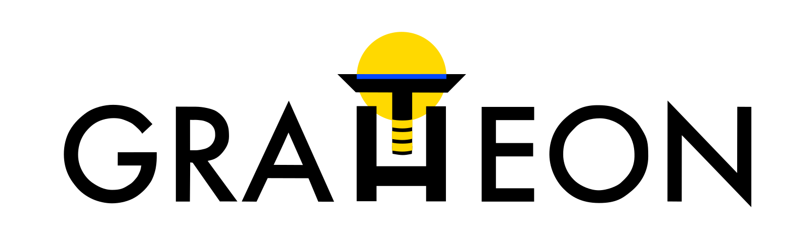
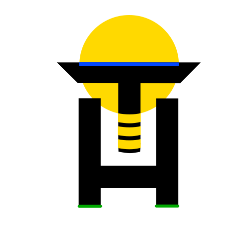

# Brand Symbolism

Colors represent main wavelengths that 🐝 bees can see, company values and other associations:

## Gratheon™ Trademark Notice
While our software remains open source under AGPL license (see [Why open source](../company/🤲%20Why%20open%20source.md)), the Gratheon brand and logo are protected trademarks.

**Gratheon™** is a trademark of Gratheon OÜ, registered in Estonia by the Estonian Patent Office under registration number **65350** and application **M202501179**. The registration was made on June 18, 2026 and is valid until December 8, 2035. The certificate is available as [Gratheon trademark certificate 65350](/assets/assets/legal/gratheon-trademark-certificate-65350.pdf).

The registered figurative mark with verbal element covers Nice Classification classes:
- **Class 7:** Industrial robots for working with bee colonies; automatic lifting mechanisms for hive sections; industrial robots for agricultural use; mechanized equipment for beekeeping; robotic lifting devices for moving hive frames.
- **Class 9:** Electronic monitoring devices and instruments for bee colonies; scales for bee colonies; temperature and humidity sensors; video cameras for monitoring hive entrances; robotic devices for hive inspection; downloadable mobile applications for bee colony management; downloadable software for beekeeping analytics; IoT sensors; inspection apparatus and instruments for beekeeping; electronic imaging devices for automatic hive frame photography; electric monitoring and control devices for tracking bee colonies.
- **Class 42:** Software as a service (SaaS) for bee colony management and monitoring; cloud computing services for storing and analyzing beekeeping results; platform as a service (PaaS) for bee colony management software; artificial intelligence as a service (AIaaS) for analyzing bee behavior and health; temporary use of non-downloadable software for beekeeping analytics; research and scientific analysis services in beekeeping.

## Brand meanings and association matrix

💡 Logo can be interpreted in many ways, same as [Naming](Naming.md). 
Some are actual technological blueprint of our products. 
Other meanings are more abstract, are tied to bees, spirituality and [values](../company/values/values.md)

## Company and product meanings

| Company Value                                                                          | Color                 | What is color-coded in the app UI | [web_app](../products/web_app/index.md) | [entrance_observer](../products/entrance_observer/entrance_observer.md) | [robotic_beehive](../products/robotic_beehive/robotic_beehive.md) |
| -------------------------------------------------------------------------------------- | --------------------- | --------------------------------- | ----------------------------------------------- | ------------------------------------------------------------------------------------------------------- | ---------------------------------------------------------------------------------- |
| [Observable mind 🧿](../company/values/Observable%20mind%20🧿.md) | indigo   #0248ff | queen                             | Vision model doing image detection. Data.       | A camera making an observation and bee counting and antennas of the cpu                                 | Frame with brood and hive roof elevated for inspection..                           |
| [New horizons 🏔️](../company/values/New%20horizons%20🏔️.md)     | black                 | drone                             | Microservice                                    | Body                                                                                                    | Frame                                                                              |
| [Team effort 🐝](../company/values/Team%20effort%20🐝.md)         | yellow   #FFD900 | nectar                            | Timeseries database, neural network layers      | Video frames                                                                                            | Frame movement                                                                     |
| [Ethical heart 🌳](../company/values/Ethical%20heart%20🌳.md)     | green   #2f8b0b  | brood                             | API gateway                                     | A beehive, landing board and entrance                                                                   | Hive as seen from the side or from the top                                         |
| [Radiate truth 🌞](../company/values/Radiate%20truth%20🌞.md)     | yellow   #FFD900 | honey                             | Insights, alerts, actions                       | A computing device                                                                                      | A camera inspecting a frame                                                        |
| [Humbly kind 🧸](../company/values/Humbly%20kind%20🧸.md)         | white                 | bee worker                        | Internal API calls                              | Transparent glass                                                                                       | Signal passing through the hive                                                    |

## General associations

| Company Value                                                                          | Symbol piece on a logo | Associations                                                                                                                     | Theological Orthodox colors                         |
| -------------------------------------------------------------------------------------- | ---------------------- | -------------------------------------------------------------------------------------------------------------------------------- | --------------------------------------------------- |
| [Observable mind 🧿](../company/values/Observable%20mind%20🧿.md) | — (T)                  | bee eyes and wings, sky, water, oasis, data lake, rationalism, foresight, ajna                                                   | Mary, Holy spirit, purity                           |
| [New horizons 🏔️](../company/values/New%20horizons%20🏔️.md)     | — (T)                  | bee thorax, cross, sacrifice, altar, hammer, वज्र, man, tree crona, vertical depth                                               | Repetance, Fasting                                  |
| [Team effort 🐝](../company/values/Team%20effort%20🐝.md)         | **I≡** (T)             | bee abdomen, database, data storage, seargeant stripes, trinity, 🐟                                                              | Christ, glory                                       |
| [Ethical heart 🌳](../company/values/Ethical%20heart%20🌳.md)     | H                      | heart, hive, grass, table, cup, grail, tree roots, earth, woman, plants, compassion, anahata, घण्टा                              | Trinity                                             |
| [Radiate truth 🌞](../company/values/Radiate%20truth%20🌞.md)     | O                      | rising sun, lion, circle of life, hope, warmth, fire, will, enlightenment, idea, spirituality, glory, conception,  manipura, oud | Christ, love                                        |
| [Humbly kind 🧸](../company/values/Humbly%20kind%20🧸.md)         | U                      | Union, spirit, signal, music, transport, medium, transparency, open source, trust                                                | Divine Light, Epiphany, Ascension, Baptism, Wedding |

## Music theme

<object data={require('./img/gratheon-theme.mp3').default} type="audio/mp3" width="100%" height="200"></object>

## Logos
Recomendation on logo usage
- Use white background whenever possible
- Use wide version only if there is company name stated
- You can use sunflower emoji 🌻 as stylized alternative in chat conversations

## Wide PNG version

## Wide SVG version

## Minimal icon-like PNG version

## Minimal icon-like SVG version

## Minimal HDR png version with glow and mac OSX retina display

![[logo_v7-linkedin-hdr7x.png|278]]

## Email template

## Cover backgrounds

