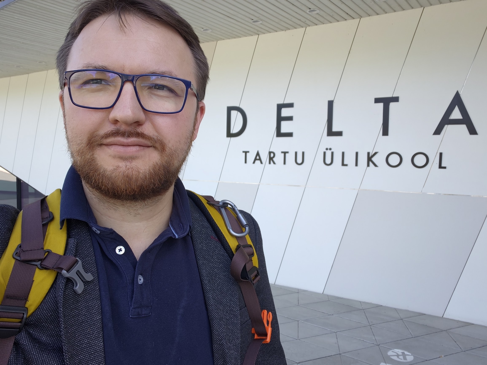
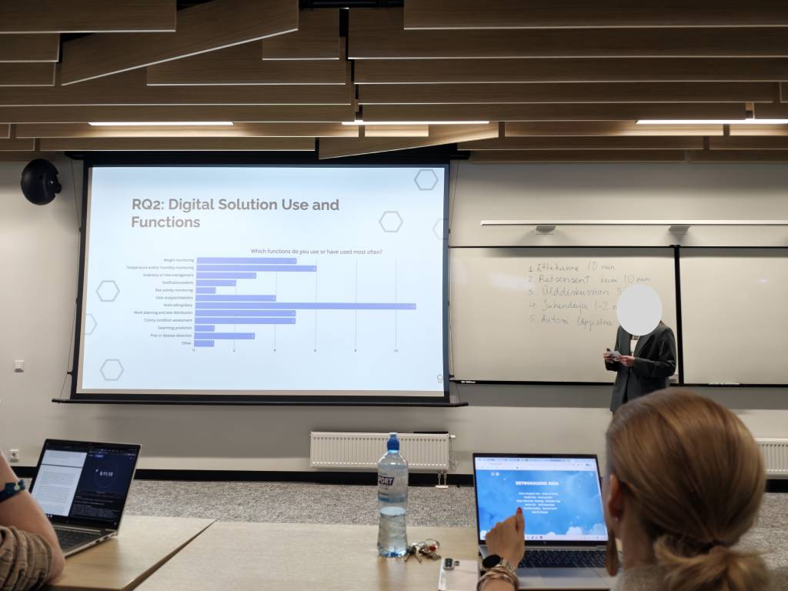

Congratulations to **Milissa Laane** from the University of Tartu on completing her bachelor's thesis, **[Digital Solutions in Beekeeping: Linking Industry Challenges with Existing Solutions and Identifying Gaps](https://thesis.cs.ut.ee/79551472-52d4-45bc-bc55-80bed2e2ca63)**.

We are happy that Gratheon could support the work with practical advice and guidance from the beekeeping technology side. It is especially meaningful to see academic research connect directly with real beekeepers' needs and the everyday constraints of hive monitoring.

<!-- truncate -->

Milissa's thesis studies how existing digital beekeeping tools relate to the biological, environmental, operational, and economic challenges faced by beekeepers. The work combines a literature-based overview with empirical data from **25 Estonian beekeepers**: 22 online questionnaire responses and three short telephone interviews.

The abstract highlights an important reality for smart beekeeping: digital tools are already used for note-taking, basic monitoring, planning, and decision-making, but adoption remains selective. Cost, connectivity, usability in field conditions, manual data entry, and unclear return on investment still limit how useful these tools can be in practice.

## Why this matters

The thesis conclusion matches what we often see when building Gratheon: technology should support beekeepers rather than pretend to fully solve complex biological, environmental, or economic problems on its own. Future tools need to be affordable, user-centred, context-aware, and adapted to real apiary conditions.

For us, this is a valuable reminder that successful beekeeping technology is not only about sensors, AI models, or dashboards. It is also about practical field usability, trust, clear value, and reducing the manual effort required from beekeepers.

Congratulations again, Milissa. We wish you success in your next steps and are grateful that your bachelor thesis helps clarify where digital beekeeping solutions can create real value. 🐝
