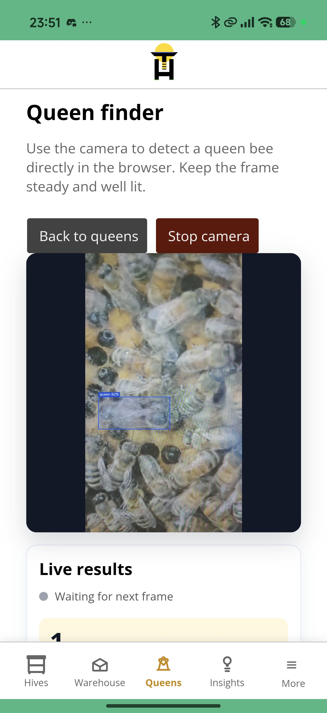
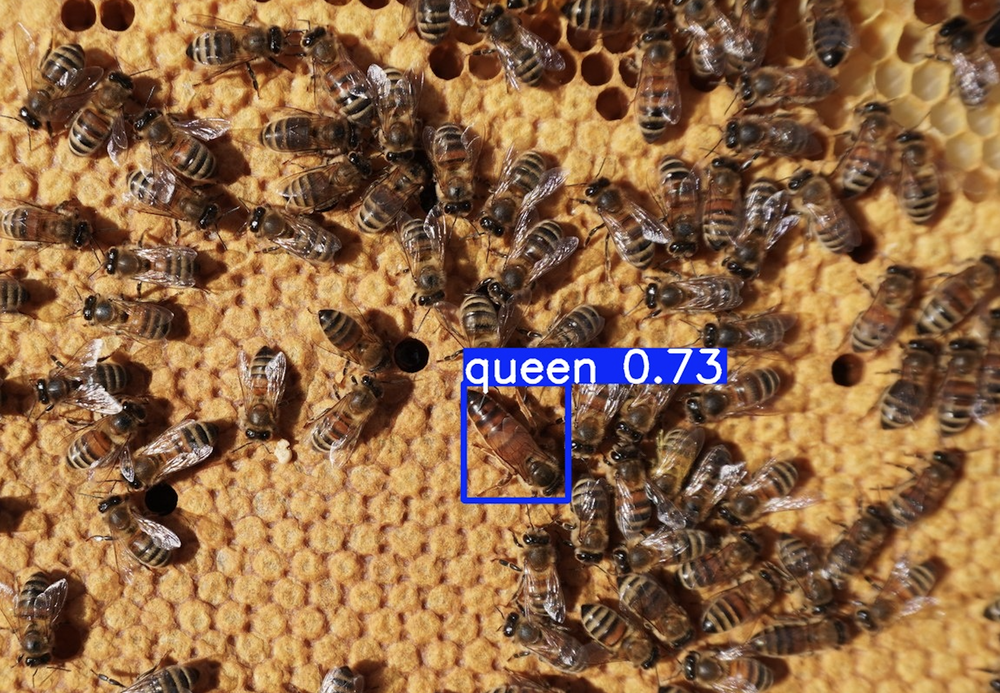

We are releasing **Live Queen Finder** in the Gratheon app.

Open the app on your phone during a hive inspection, start the camera, and Gratheon will look for the queen in real time. When the queen moves through the frame, the app draws a detection box around her so you can spot her faster.

<!-- truncate -->

Finding the queen is one of those jobs that can quietly eat a lot of inspection time. You scan the frame, move bees aside, check again, and try not to lose track of where you already looked.

Live Queen Finder is meant to help with that moment. It does not replace your judgement, but it gives you another pair of eyes when you are working in the field.

## How to use it

1. Open [Gratheon app](https://app.gratheon.com/) on your mobile phone.
2. Go to **Queens** and choose **Live detector**.
3. Allow camera access.
4. Point the camera at the frame and move steadily across the comb.

You can also open it directly here:

[app.gratheon.com/warehouse/queens/detect](https://app.gratheon.com/warehouse/queens/detect)

The feature is available now for free.

## Open-source queen detection model

We are also open-sourcing the in-house trained model behind the detector:

[github.com/Gratheon/models-queen-bee-detector](https://github.com/Gratheon/models-queen-bee-detector)

The current baseline uses a YOLOv8 nano model exported to ONNX for browser inference with ONNX Runtime Web. On the test split, the model reports:

- precision: `0.9727`
- recall: `0.8590`
- mAP50: `0.9187`
- mAP50-95: `0.6114`

The model was trained to detect queen bees among workers, drones, pollen bees, and frame/background content. The browser detector processes camera frames locally; performance depends on the phone, lighting, camera focus, and how clearly the queen is visible.

If you try it in the apiary, we would like to hear where it works well and where it fails. That feedback helps us improve the model for real inspections, not just clean demo images.
