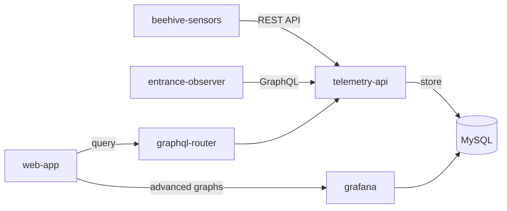

Speichern und visualisieren Sie Zeitreihen-Sensordaten von IoT-Geräten an Beuten. So können Gesundheitsindikatoren wie Temperatur, Luftfeuchtigkeit, Gewicht und Fluglochaktivität langfristig überwacht werden.

## Überblick

Professionelle und datenorientierte Imker brauchen historische Daten, um fundierte Entscheidungen in der Völkerführung zu treffen. Die Telemetriespeicherung sammelt Messwerte von Hardware-Sensoren und legt sie für Analyse und Visualisierung ab.

Diese Funktion unterstützt:
- kontinuierliche Überwachung von Umweltbedingungen,
- historische Trendanalyse über Saisons hinweg,
- frühes Erkennen von Auffälligkeiten in Datenmustern,
- datenbasierte Entscheidungen für Eingriffe am Volk.

## Unterstützte Messwerte

### Umweltdaten
- **Temperatur** – Innentemperatur der Beute in Grad Celsius.
- **Luftfeuchtigkeit** – Feuchte im Inneren der Beute in Prozent.
- **Gewicht** – Gesamtgewicht der Beute zur Beobachtung von Tracht und Futtervorräten.

### Fluglochaktivität
- **Bienen rein/raus** – Anzahl ein- und ausfliegender Bienen.
- **Nettofluss** – Differenz zwischen ein- und ausfliegenden Bienen.
- **Durchschnittsgeschwindigkeit** – Bewegungsgeschwindigkeit am Flugloch.
- **Stationäre Bienen** – Bienen, die sich am Eingang kaum bewegen.
- **Erkannte Bienen** – Gesamtzahl im Kamerabild.
- **Bieneninteraktionen** – Begegnungen zwischen Bienen am Flugloch.

## Funktionsweise

1. **Hardware-Sensoren verbinden**
   - Beehive-Sensors für Temperatur, Luftfeuchtigkeit und Gewicht installieren.
   - Entrance Observer für Flugloch- und Verkehrsanalysen installieren.
   - Geräte mit einem API-Authentifizierungstoken konfigurieren.

2. **Automatische Datenerfassung**
   - Sensoren senden regelmäßig Daten an die Telemetry API.
   - Daten werden in zeitreihenoptimierten MySQL-Tabellen gespeichert.
   - Die Authentifizierung wird über den User-Cycle-Service geprüft.

3. **Daten ansehen und analysieren**
   - Echtzeitnahe Messwerte im Beuten-Dashboard anzeigen.
   - Historische Diagramme mit konfigurierbaren Zeitbereichen nutzen.
   - Erweiterte Auswertungen über Grafana einsehen.
   - Daten für externe Analysen exportieren.

4. **Warnungen einrichten**
   - Schwellenwertbasierte Regeln anlegen.
   - Benachrichtigungen erhalten, wenn Messwerte sichere Bereiche verlassen.
   - Plötzliche Änderungen oder Anomalien überwachen.

## Datenaufbewahrung

Der Pro-Tarif enthält:
- **Speicherdauer**: 3 Jahre historische Daten.
- **Auflösung**: Konfigurierbar von Minutenwerten bis Tagesaggregaten.
- **Abfragebereiche**: Von der letzten Stunde bis zu 2 Jahren.
- **Speicherbedarf**: Ungefähr 500 MB pro Beute und Jahr.

## Architektur



Das System verwendet:
- **telemetry-api** – zentraler Dienst für Speicherung und Abfrage von Messwerten,
- **MySQL** – zeitreihenoptimierte Speicherung,
- **graphql-router** – API-Gateway für Web-App-Abfragen,
- **grafana** – erweiterte Visualisierung und Analyse.

## API-Zugriff

REST- und GraphQL-APIs stehen zur Verfügung.

**REST API** (für IoT-Geräte):
```text
POST /v1/metrics/:hiveId
POST /v1/entrance/:hiveId/:boxId
GET /v1/metrics/:hiveId/temperature?minutes=60
```

**GraphQL API** (für die Web-App):
```graphql
query {
  temperatureCelsius(hiveId: "123", timeRangeMin: 60)
  humidityPercent(hiveId: "123", timeRangeMin: 1440)
  weightKgAggregated(hiveId: "123", days: 7, aggregation: DAILY_AVG)
  entranceMovement(hiveId: "123", timeFrom: "2024-12-01", timeTo: "2024-12-06")
}
```

## Anwendungsfälle

### Saisonvergleich
Vergleichen Sie Temperatur- und Feuchtemuster über mehrere Jahre, um Frühjahrsentwicklung, Brutbedingungen und Überwinterung besser zu planen.

### Trachtverlauf
Überwachen Sie Gewichtsänderungen, um Trachtbeginn, optimale Erntezeitpunkte und tägliche Zunahmen zu erkennen.

### Volksgesundheit
Beobachten Sie Fluglochaktivität, um weisellose Völker, Räuberei oder verändertes Sammelverhalten früher zu erkennen.

### Wirksamkeit von Behandlungen
Analysieren Sie Messwerte vor und nach Eingriffen, um Erholung, Temperaturstabilität und Behandlungstiming zu bewerten.

## Technische Einschränkungen

- Maximaler Abfragebereich ohne Aggregation: 2 Jahre.
- Datenpunktlimit: 10.000 Werte pro Abfrage.
- Schreibfrequenz: mindestens 1 Sekunde Abstand pro Gerät.
- Aktualisierung per Polling, keine Echtzeit-WebSockets.
- Grafana benötigt eine separate Authentifizierung.

## Verwandte Funktionen

- [🔔 Warnungen](../flexible-tier/alerts/) – Schwellenwertbasierte Benachrichtigungen konfigurieren.
- [⚖️ Völkervergleich](colony-comparison-analytics/) – Messwerte über Beuten hinweg vergleichen.

## Ressourcen

- [Technische Dokumentation](/docs/web-app/features/telemetry-storage/)
- [Telemetry API auf GitHub](https://github.com/Gratheon/telemetry-api)
- [Beehive-Sensors-Einrichtung](/docs/beehive-sensors/beehive-sensors/)
- [Entrance-Observer-Einrichtung](/docs/entrance-observer/entrance-observer/)
