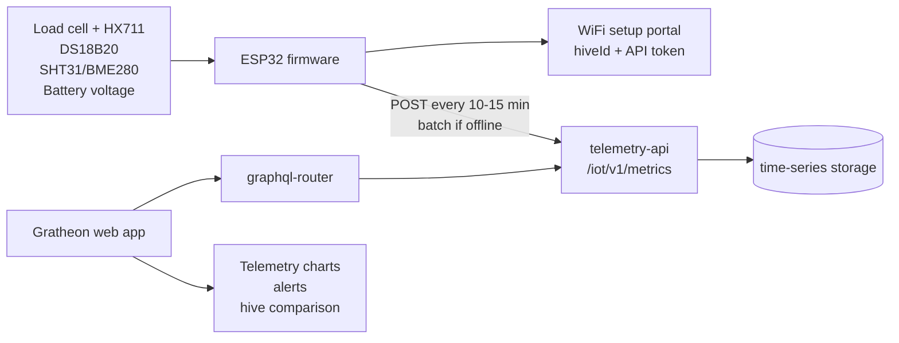
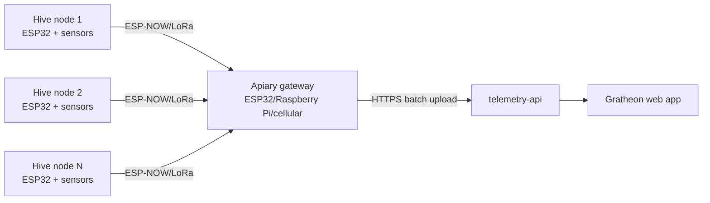
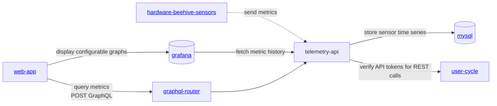

<iframe width="100%" height="400" src="https://www.youtube.com/embed/Ags3rplPkQE" title="Getting started with iot sensors development" frameborder="0" allow="accelerometer; autoplay; clipboard-write; encrypted-media; gyroscope; picture-in-picture; web-share" referrerpolicy="strict-origin-when-cross-origin" allowfullscreen></iframe>

## Product direction

Beehive IoT sensors should start as a **simple DIY telemetry kit** for beekeepers who want affordable hive weight and climate history before buying a finished industrial device. The first version should optimize for:

- **Open, available parts**: ESP32 dev boards, HX711 load-cell amplifiers, commodity load cells, DS18B20/SHT31/BME280-class sensors, 18650 battery holders, solar charger modules, and IP65 junction boxes.
- **Low installation risk**: external scale frame and one waterproof temperature probe; no invasive electronics inside the colony for the first kit.
- **Useful alerts before complex AI**: sudden weight drops, daily honey-flow gain/loss, winter food reserve trend, overheating, humidity anomalies, low battery, and missing data.
- **Hackable path to paid product**: DIY docs build trust; Gratheon can later sell pre-flashed kits, calibrated scale frames, gateways, and telemetry/analytics subscriptions.

The current prototype already proves the most important path: an ESP32 collects temperature/weight data and sends readings to [telemetry-api](https://github.com/gratheon/telemetry-api). The improvement is to make the product page explicit about the MVP scope, component trade-offs, expected cost, and upgrade path.

## Current approach assessment

| Area | Current state | Gap | Recommended change |
| --- | --- | --- | --- |
| Value proposition | Docs say sensors support the [beehive scales](../../products/scales/scales.md) product. | The page does not explain why a beekeeper should build it or what events it detects. | Lead with “DIY hive scale + climate telemetry” and map metrics to beekeeper decisions. |
| Bill of materials | Existing [BOM](components/index.md) lists purchased parts and many `todo` sensors. | It mixes MVP, optional research sensors, mechanical prototype parts, and missing prices. | Split BOM into **MVP**, **recommended field kit**, and **phase-2 modules**. |
| Chip choice | ESP32 is listed as popular and cheap. | No decision rule for WiFi vs LoRa vs cellular. | Keep ESP32-WROOM/DevKit for MVP; add ESP32-C3/S3 and LoRa/cellular gateway as later variants. |
| Telemetry API | `telemetry-api` supports `temperatureCelsius`, `humidityPercent`, `weightKg`, timestamps, batching, and `dedupeKey`. | Firmware/docs should consistently use the new `/iot/v1/metrics` JSON contract; battery voltage is not yet represented. | No backend blocker for MVP; add future `batteryVoltage`, `rssi`, and device metadata. |
| Power | Firmware sleeps most of the time. | Page has no battery budget, send interval guidance, or solar recommendation. | Default to 10–15 minute reporting in the field; keep 1 minute for demos/lab. |
| Product representation | Page is engineering-only. | It does not look like a product with install steps, expected cost, data examples, or next purchase/action. | Add sections for cost, architecture, API payload, and roadmap. |

## Research findings

Local research notes and internet checks point to the same MVP order: **weight + temperature/humidity first**, then acoustic/CO₂/air-quality later.

- A multisensor hive-monitoring platform measuring **weight, sound, temperature, humidity, and CO₂** was shown to detect events such as swarming, theft, honey gathering, food shortage, and colony decline through sensor fusion ([Sensors 2020, DOI:10.3390/s20092726](https://doi.org/10.3390/s20092726)). For Gratheon, this validates the long-term multimodal direction, but not all sensors are needed on day one.
- A 2024 low-cost beehive monitoring review highlights temperature, humidity, hive weight, and sound as common practical modalities, while stressing that accuracy and beekeeper interpretation determine usefulness ([E3S 2024, DOI:10.1051/e3sconf/202458904001](https://doi.org/10.1051/e3sconf/202458904001)).
- Energy-focused precision-beekeeping work confirms that offline field deployments must be designed around sleep cycles, radio duty cycle, and reduced edge processing rather than constant streaming ([arXiv:2010.14934](https://arxiv.org/abs/2010.14934)).
- ESP8266/ESP32 + ESP-NOW + GSM/GPRS gateway research shows a cost-effective apiary topology where cheap hive nodes talk locally to a single internet gateway ([PeerJ CS 2023, DOI:10.7717/peerj-cs.1363](https://doi.org/10.7717/peerj-cs.1363)). This is a good phase-2 architecture for apiaries without WiFi.
- Open DIY examples and component guides repeatedly use **ESP32/ESP8266 + HX711 + load cell + DS18B20/DHT-style climate sensor**, including public tutorials and open-source smart-scale projects. This reduces adoption risk because beekeepers can source parts and debug with common Arduino/ESP32 tooling.

## Recommended MVP kit

### MVP sensor set

1. **Weight** — one 100–200 kg single-point load cell or four 50 kg bar load cells + HX711.
2. **Internal temperature** — waterproof DS18B20 probe placed under the cover or near the brood area edge.
3. **Ambient humidity/temperature** — SHT31/SHTC3/BME280 in a protected vented enclosure; use this instead of DHT22 where budget allows.
4. **Battery voltage** — resistor divider or fuel-gauge module so the web app can warn before data stops.

Defer these until the base telemetry product is reliable:

- **Acoustic microphone**: valuable for queenlessness/swarm research, but enclosure placement and ML interpretation add complexity.
- **CO₂/VOC/PM sensors**: useful for research, but cost, calibration drift, power draw, and condensation risk are poor for a first DIY kit.
- **Display**: useful on a bench, but unnecessary outdoors; prefer phone/web setup and LEDs for status.
- **IMU/vibration/tamper**: good add-on for theft/storm detection after battery reporting and weight anomaly alerts are stable.

### DIY BOM estimate

Prices vary strongly by region and supplier; this range is for common retail/AliExpress/Amazon/EU maker-shop parts and intentionally uses freely available modules.

| Tier | Component | Example parts | Qty | Rough cost |
| --- | --- | --- | ---: | ---: |
| Required | MCU + WiFi | ESP32 DevKit / ESP32-WROOM-32 board | 1 | €4–10 |
| Required | Weight ADC | HX711 breakout | 1 | €1–4 |
| Required | Load cell option A | 100–200 kg single-point load cell | 1 | €12–35 |
| Required | Load cell option B | 50 kg bar load cells | 4 | €8–20 total |
| Required | Waterproof temperature | DS18B20 probe | 1 | €2–5 |
| Recommended | Humidity/ambient sensor | SHT31, SHTC3, or BME280 module | 1 | €3–10 |
| Recommended | Power | 18650 holder + protected cells or USB power bank | 1 | €8–25 |
| Recommended | Weather enclosure | IP65 junction box + cable glands | 1 | €6–18 |
| Recommended | Solar charging | TP4056/CN3065-class charger + 5–6 V solar panel | 1 | €8–25 |
| Optional | Better battery telemetry | INA219/LC709203/MAX17048 module | 1 | €3–9 |
| Optional | Connectivity upgrade | LoRa SX1276/SX1262 module or board | 1 | €6–20 |

**Target DIY cost:**

- **Lab demo**: €20–35 using USB power, ESP32, HX711, DS18B20, and one cheap load cell.
- **Outdoor MVP**: €45–90 with enclosure, battery, humidity sensor, cable glands, and a sturdier load-cell setup.
- **Field-ready scale frame**: €90–180 when aluminium/stainless mechanical parts, calibration weights, solar panel, and waterproof connectors are included.

The existing BOM is closer to a mechanical prototype and can exceed €150 before calibration and weatherproofing. For market entry, keep the first DIY guide inexpensive, then offer a paid calibrated mechanical kit.

## Chip and connectivity recommendation

### Start with ESP32-WROOM DevKit

Use a standard ESP32-WROOM DevKit for the first public DIY kit because it is cheap, familiar, Arduino-compatible, and already used by the prototype. It has enough RAM/CPU for local filtering, WiFi provisioning, TLS HTTP requests, and deep sleep.

### Variants to document next

| Variant | Use when | Recommendation |
| --- | --- | --- |
| ESP32-WROOM DevKit | Hobby DIY, WiFi in range, lowest support burden | **Default MVP** |
| ESP32-C3 | Lower cost/power, RISC-V, single-core is enough | Good second board after firmware is stable |
| ESP32-S3 | Need more RAM, USB, or future TinyML/audio experiments | Use for acoustic/edge ML prototypes, not base scale |
| ESP32 + LoRa | Remote apiary with no WiFi but multiple hives near each other | Build a local gateway architecture first |
| ESP32 + SIM7080/SIM7000 LTE-M/NB-IoT | Single remote hive without WiFi/LoRa gateway | Later paid/field kit; raises cost and power complexity |
| nRF52/STM32/RP2040 | Custom PCB or ultra-low-power redesign | Defer until there is field data from ESP32 MVP |

Decision rule: **WiFi first, LoRa gateway second, cellular last**. Cellular is attractive commercially but too expensive and power-sensitive for a low-friction DIY launch.

## Target architecture

### DIY MVP architecture



### Future remote-apiary architecture



This keeps the first kit simple while preserving a path to remote apiaries: many cheap hive nodes, one internet-connected gateway.

## Telemetry API contract

For the current MVP, devices should use the REST endpoint already exposed by telemetry-api:

```http
POST https://telemetry.gratheon.com/iot/v1/metrics
Authorization: Bearer <api-token>
Content-Type: application/json
```

```json
{
  "hiveId": "54",
  "timestamp": 1717238400,
  "dedupeKey": "esp32-54:1717238400",
  "fields": {
    "temperatureCelsius": 34.2,
    "humidityPercent": 61.5,
    "weightKg": 47.8
  }
}
```

The endpoint also accepts batches, so firmware should queue readings in flash/RTC memory when WiFi is unavailable and retry with stable `dedupeKey` values.

### API changes to consider after MVP

Not required for the first release, but useful for field reliability:

- Add `batteryVoltage`, `batteryPercent`, `solarVoltage`, `rssi`, and `firmwareVersion` fields.
- Add a device registry in the web app so a beekeeper can pair a physical device with a hive without manually copying `hiveId`.
- Add a “last seen” and “missing telemetry” alert using the latest timestamp per device/hive.
- Add calibration metadata: load-cell factor, tare date, and mechanical configuration.

## Firmware changes to prioritize

- Report every **10–15 minutes by default** in outdoor mode; keep 1-minute reporting as a demo setting.
- Use deep sleep and power-gate HX711/sensors between readings where possible.
- Add first-run setup fields for `deviceId`, `hiveId`, API token, endpoint URL, send interval, and calibration factor.
- Add a calibration flow: tare empty scale, place known weight, calculate factor, store in non-volatile memory.
- Send JSON to `/iot/v1/metrics` with `timestamp` and `dedupeKey`.
- Keep a small offline queue and retry uploads instead of dropping all readings during weak WiFi.
- Add battery voltage measurement and low-battery LED/status even before the API stores it.

## Website/product-page improvements

The public page should present the product as a guided DIY path, not only a repository diagram:

1. **Hero message**: “Build a €45–90 DIY hive scale that streams weight, temperature, and humidity into Gratheon.”
2. **What you can detect**: honey flow, food shortage, sudden theft/storm movement, overheating, humidity risk, missing data.
3. **Three kit levels**: lab demo, outdoor DIY, calibrated field kit.
4. **Compatibility badge**: “Works with Gratheon telemetry storage and timeseries analytics.”
5. **Install journey**: buy parts → flash firmware → calibrate scale → pair hive → view dashboard → configure alerts.
6. **Roadmap**: LoRa gateway, cellular kit, acoustic sensor, tamper detection, and prebuilt enclosures.
7. **Call to action**: join pilot, request pre-flashed kit, or contribute firmware/BOM improvements.

## Services

- [https://github.com/Gratheon/hardware-beehive-sensors](https://github.com/Gratheon/hardware-beehive-sensors) - sensor firmware and hardware notes
- [https://github.com/gratheon/telemetry-api](https://github.com/gratheon/telemetry-api) - server-side ingestion and querying
- [Telemetry API docs](../API/rest/telemetry-api.md) - service-owned OpenAPI documentation

## Current service architecture




