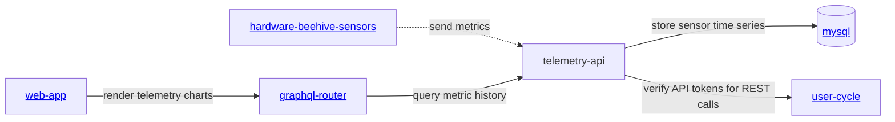

<iframe width="100%" height="400" src="https://www.youtube.com/embed/Ags3rplPkQE" title="Getting started with iot sensors development" frameborder="0" allow="accelerometer; autoplay; clipboard-write; encrypted-media; gyroscope; picture-in-picture; web-share" referrerpolicy="strict-origin-when-cross-origin" allowfullscreen></iframe>

## Product direction

Beehive IoT sensors should grow through three clear hardware phases:

1. **Lab validation** - prove firmware, wiring, calibration, and telemetry ingestion on a bench.
2. **Field MVP** - deploy a weatherproof DIY hive scale that measures the signals beekeepers need first.
3. **Production kit** - convert the proven design into a repeatable, supportable, sellable device.

This split keeps the first public build cheap and learnable while still showing the path to a finished Gratheon product. The current prototype already proves the most important path: an ESP32 collects temperature and weight data and sends readings to [telemetry-api](https://github.com/gratheon/telemetry-api). The hardware scope, bill of materials, functionality, and upgrade path are now documented as separate phase pages so the overview stays readable.

## Phase overview

| Phase | Goal | Primary user | Target cost | Details | BOM |
| --- | --- | --- | ---: | --- | --- |
| Phase 1 - Lab | Fast bench prototype for firmware and API validation | Developer, contributor, early maker | €20-35 | [Lab validation](phases/lab.md) | [Lab BOM](components/lab.md) |
| Phase 2 - Field MVP | Weatherproof DIY hive scale for pilot apiaries | Pilot beekeeper, field tester | €45-90 | [Field MVP](phases/mvp.md) | [Field MVP BOM](components/mvp.md) |
| Phase 3 - Production | Calibrated, supportable hardware kit | Paying customer, reseller, managed apiary | €90-180+ | [Production kit](phases/production.md) | [Production BOM](components/production.md) |

For the end-to-end roadmap, see the [phase index](phases/index.md).

## Current approach assessment

| Area | Current state | Gap | Recommended change |
| --- | --- | --- | --- |
| Value proposition | Docs say sensors support the [beehive scales](../../products/scales/scales.md) product. | The page did not explain why a beekeeper should build it or what events it detects. | Lead with “DIY hive scale + climate telemetry” and map metrics to beekeeper decisions. |
| Bill of materials | Existing [BOM](components/index.md) listed purchased parts and many research sensors together. | It mixed lab, MVP, optional research sensors, mechanical prototype parts, and missing prices. | Split BOM into [Lab](components/lab.md), [Field MVP](components/mvp.md), and [Production](components/production.md). |
| Chip choice | ESP32 is listed as popular and cheap. | No decision rule for WiFi vs LoRa vs cellular. | Keep ESP32-WROOM/DevKit for [Lab](phases/lab.md) and [Field MVP](phases/mvp.md); add LoRa/cellular gateway as [Production](phases/production.md) variants. |
| Telemetry API | `telemetry-api` supports `temperatureCelsius`, `humidityPercent`, `weightKg`, timestamps, batching, and `dedupeKey`. | Firmware/docs should consistently use the `/iot/v1/metrics` JSON contract; battery voltage is not yet represented. | No backend blocker for MVP; add future `batteryVoltage`, `rssi`, and device metadata. |
| Power | Firmware sleeps most of the time. | Page had no battery budget, send interval guidance, or solar recommendation. | Use 30-60 seconds in lab and 10-15 minutes in field. |
| Product representation | Page was engineering-only. | It did not look like a phased product with install scope, cost, data examples, or next purchase/action. | Use the three-phase roadmap and phase-specific BOM pages. |

## Research findings

Local research notes and internet checks point to the same MVP order: **weight + temperature/humidity first**, then acoustic, CO₂, air-quality, and tamper sensors later.

- A multisensor hive-monitoring platform measuring **weight, sound, temperature, humidity, and CO₂** was shown to detect events such as swarming, theft, honey gathering, food shortage, and colony decline through sensor fusion ([A Smart Sensor-Based Measurement System for Advanced Bee Hive Monitoring](../../research/papers/A%20Smart%20Sensor-Based%20Measurement%20System%20for%20Advanced%20Bee%20Hive%20Monitoring.md), DOI:10.3390/s20092726). For Gratheon, this validates the long-term multimodal direction, but not all sensors are needed on day one.
- A 2024 low-cost beehive monitoring review highlights temperature, humidity, hive weight, and sound as common practical modalities, while stressing that accuracy and beekeeper interpretation determine usefulness ([Advances in Beehive Monitoring Systems: Low-Cost Integrating Sensor Technology for Improved Apiculture Management](../../research/papers/Advances%20in%20Beehive%20Monitoring%20Systems%20Low-Cost%20Integrating%20Sensor%20Technology%20for%20Improved%20Apiculture%20Management.md), DOI:10.1051/e3sconf/202458904001).
- Energy-focused precision-beekeeping work confirms that offline field deployments must be designed around sleep cycles, radio duty cycle, and reduced edge processing rather than constant streaming ([Analysis of Energy Consumption in a Precision Beekeeping System](../../research/papers/Analysis%20of%20Energy%20Consumption%20in%20a%20Precision%20Beekeeping%20System.md), arXiv:2010.14934).
- ESP8266/ESP32 + ESP-NOW + GSM/GPRS gateway research shows a cost-effective apiary topology where cheap hive nodes talk locally to a single internet gateway ([Bee colony remote monitoring based on IoT using ESP-NOW protocol](../../research/papers/Bee%20colony%20remote%20monitoring%20based%20on%20IoT%20using%20ESP-NOW%20protocol.md), DOI:10.7717/peerj-cs.1363). This is a good production architecture for apiaries without WiFi.
- Open DIY examples and component guides repeatedly use **ESP32/ESP8266 + HX711 + load cell + DS18B20/DHT-style climate sensor**, including public tutorials and open-source smart-scale projects. This reduces adoption risk because beekeepers can source parts and debug with common Arduino/ESP32 tooling.

## Services

- [https://github.com/Gratheon/hardware-beehive-sensors](https://github.com/Gratheon/hardware-beehive-sensors) - sensor firmware and hardware notes
- [https://github.com/gratheon/telemetry-api](https://github.com/gratheon/telemetry-api) - server-side ingestion and querying
- [Telemetry API docs](../API/rest/telemetry-api.md) - service-owned OpenAPI documentation

## Current service architecture

