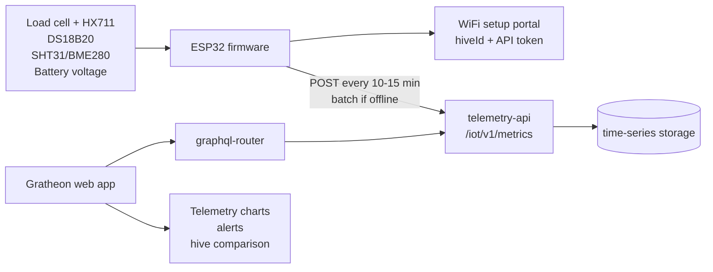
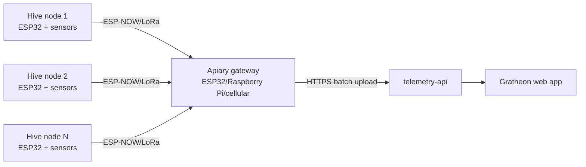
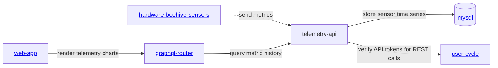

<iframe width="100%" height="400" src="https://www.youtube.com/embed/Ags3rplPkQE" title="Getting started with iot sensors development" frameborder="0" allow="accelerometer; autoplay; clipboard-write; encrypted-media; gyroscope; picture-in-picture; web-share" referrerpolicy="strict-origin-when-cross-origin" allowfullscreen></iframe>

## Product direction

Beehive IoT sensors should grow through three clear hardware phases:

1. **Lab validation** - prove firmware, wiring, calibration, and telemetry ingestion on a bench.
2. **Field MVP** - deploy a weatherproof DIY hive scale that measures the signals beekeepers need first.
3. **Production kit** - convert the proven design into a repeatable, supportable, sellable device.

This split keeps the first public build cheap and learnable while still showing the path to a finished Gratheon product. The current prototype already proves the most important path: an ESP32 collects temperature and weight data and sends readings to [telemetry-api](https://github.com/gratheon/telemetry-api). The next improvement is to make the hardware scope, bill of materials, functionality, and upgrade path explicit.

## Phase overview

| Phase | Goal | Primary user | Target cost | BOM |
| --- | --- | --- | ---: | --- |
| Phase 1 - Lab | Fast bench prototype for firmware and API validation | Developer, contributor, early maker | €20-35 | [Lab BOM](components/lab.md) |
| Phase 2 - Field MVP | Weatherproof DIY hive scale for pilot apiaries | Pilot beekeeper, field tester | €45-90 | [Field MVP BOM](components/mvp.md) |
| Phase 3 - Production | Calibrated, supportable hardware kit | Paying customer, reseller, managed apiary | €90-180+ | [Production BOM](components/production.md) |

## Phase 1 - Lab validation

### Description

The lab phase is a table-top electronics build. It should be cheap, easy to rewire, and easy to debug over USB serial. It does not need outdoor power, enclosure sealing, solar charging, or a final mechanical scale frame.

Use this phase to validate:

- ESP32 firmware build and flashing flow.
- HX711 and load-cell readings.
- DS18B20 internal temperature readings.
- Local calibration and tare logic.
- JSON upload to `/iot/v1/metrics`.
- Gratheon chart visibility and missing-data behavior.

### Functionality

- Reads one load cell through HX711.
- Reads one waterproof DS18B20 probe.
- Sends telemetry every 30-60 seconds for demos and debugging.
- Runs from USB power.
- Uses serial logs for setup and troubleshooting.
- Stores only minimal configuration: endpoint URL, API token, `hiveId`, and calibration factor.

### Bill of materials

The detailed purchase list is in [Phase 1 - Lab BOM](components/lab.md). The core parts are ESP32, HX711, one low-cost load cell, DS18B20, jumper wires, breadboard or screw terminals, and USB power.

## Phase 2 - Field MVP

### Description

The field MVP is the first useful outdoor version. It should be installable by a beekeeper with common tools and should avoid invasive electronics inside the colony. The product promise is simple: a DIY hive scale that streams weight, internal temperature, ambient humidity, battery status, and connectivity health into Gratheon.

This is the recommended public pilot scope.

### Functionality

- Measures hive weight for honey-flow, food-reserve, theft, storm, or handling events.
- Measures internal temperature with a waterproof DS18B20 probe.
- Measures ambient humidity and temperature with SHT31, SHTC3, or BME280 in a vented protected location.
- Measures battery voltage or battery state so the web app can warn before telemetry stops.
- Reports every 10-15 minutes by default.
- Batches readings when WiFi is weak and retries with stable `dedupeKey` values.
- Uses a simple weatherproof enclosure, cable glands, and external scale frame.
- Uses phone or web setup instead of an outdoor LCD.

### Bill of materials

The detailed purchase list is in [Phase 2 - Field MVP BOM](components/mvp.md). It adds an IP65 box, cable glands, battery, optional solar charger, humidity sensor, and better field wiring to the lab electronics.

## Phase 3 - Production kit

### Description

The production phase converts the pilot design into hardware that Gratheon can sell and support. The priority changes from cheapest parts to repeatability, calibration, enclosure quality, supply-chain stability, and remote diagnostics.

This phase can still use ESP32-class hardware, but it should move toward pre-assembled wiring, a PCB or carrier board, a calibrated mechanical frame, and a clean pairing flow in the web app.

### Functionality

- Factory-calibrated load-cell frame or repeatable calibration process.
- Pre-flashed firmware with device identity and secure pairing.
- Battery and solar subsystem sized for months of operation.
- Waterproof connectors and strain relief for field servicing.
- Device health telemetry: battery, RSSI, firmware version, last seen, reset reason, and enclosure temperature where useful.
- Optional LoRa/ESP-NOW apiary gateway for multiple hives without WiFi.
- Optional cellular gateway or cellular device variant for remote single-hive deployments.
- Supportable replacement parts and documented mechanical tolerances.

### Bill of materials

The detailed purchase list is in [Phase 3 - Production BOM](components/production.md). It includes the field MVP components plus calibrated mechanical parts, a PCB/carrier board, waterproof connectors, solar sizing, and optional gateway connectivity.

## Current approach assessment

| Area | Current state | Gap | Recommended change |
| --- | --- | --- | --- |
| Value proposition | Docs say sensors support the [beehive scales](../../products/scales/scales.md) product. | The page did not explain why a beekeeper should build it or what events it detects. | Lead with “DIY hive scale + climate telemetry” and map metrics to beekeeper decisions. |
| Bill of materials | Existing [BOM](components/index.md) listed purchased parts and many research sensors together. | It mixed lab, MVP, optional research sensors, mechanical prototype parts, and missing prices. | Split BOM into [Lab](components/lab.md), [Field MVP](components/mvp.md), and [Production](components/production.md). |
| Chip choice | ESP32 is listed as popular and cheap. | No decision rule for WiFi vs LoRa vs cellular. | Keep ESP32-WROOM/DevKit for lab and MVP; add LoRa/cellular gateway as production variants. |
| Telemetry API | `telemetry-api` supports `temperatureCelsius`, `humidityPercent`, `weightKg`, timestamps, batching, and `dedupeKey`. | Firmware/docs should consistently use the `/iot/v1/metrics` JSON contract; battery voltage is not yet represented. | No backend blocker for MVP; add future `batteryVoltage`, `rssi`, and device metadata. |
| Power | Firmware sleeps most of the time. | Page had no battery budget, send interval guidance, or solar recommendation. | Use 30-60 seconds in lab and 10-15 minutes in field. |
| Product representation | Page was engineering-only. | It did not look like a phased product with install scope, cost, data examples, or next purchase/action. | Use the three-phase roadmap and phase-specific BOM pages. |

## Research findings

Local research notes and internet checks point to the same MVP order: **weight + temperature/humidity first**, then acoustic, CO₂, air-quality, and tamper sensors later.

- A multisensor hive-monitoring platform measuring **weight, sound, temperature, humidity, and CO₂** was shown to detect events such as swarming, theft, honey gathering, food shortage, and colony decline through sensor fusion ([Sensors 2020, DOI:10.3390/s20092726](https://doi.org/10.3390/s20092726)). For Gratheon, this validates the long-term multimodal direction, but not all sensors are needed on day one.
- A 2024 low-cost beehive monitoring review highlights temperature, humidity, hive weight, and sound as common practical modalities, while stressing that accuracy and beekeeper interpretation determine usefulness ([E3S 2024, DOI:10.1051/e3sconf/202458904001](https://doi.org/10.1051/e3sconf/202458904001)).
- Energy-focused precision-beekeeping work confirms that offline field deployments must be designed around sleep cycles, radio duty cycle, and reduced edge processing rather than constant streaming ([arXiv:2010.14934](https://arxiv.org/abs/2010.14934)).
- ESP8266/ESP32 + ESP-NOW + GSM/GPRS gateway research shows a cost-effective apiary topology where cheap hive nodes talk locally to a single internet gateway ([PeerJ CS 2023, DOI:10.7717/peerj-cs.1363](https://doi.org/10.7717/peerj-cs.1363)). This is a good production architecture for apiaries without WiFi.
- Open DIY examples and component guides repeatedly use **ESP32/ESP8266 + HX711 + load cell + DS18B20/DHT-style climate sensor**, including public tutorials and open-source smart-scale projects. This reduces adoption risk because beekeepers can source parts and debug with common Arduino/ESP32 tooling.

## Sensor scope by phase

| Capability | Lab | Field MVP | Production |
| --- | --- | --- | --- |
| Weight | One test load cell | Single-point 100-200 kg cell or 4 x 50 kg bars | Calibrated frame with repeatable load path |
| Internal temperature | DS18B20 | Waterproof DS18B20 probe | Waterproof probe with service connector |
| Ambient humidity/temperature | Optional | SHT31/SHTC3/BME280 | SHT31/BME280 in vented protected enclosure |
| Battery telemetry | Optional resistor divider | Required voltage or fuel gauge | Required fuel gauge plus solar status |
| Display | Optional bench debug only | Not included | Not included by default |
| Acoustic sensor | Not included | Not included | Optional research variant |
| CO₂/VOC/PM sensors | Not included | Not included | Optional research variant |
| Tamper/vibration | Not included | Optional after battery reporting | Optional supported add-on |
| Connectivity | WiFi over USB-powered ESP32 | WiFi first | WiFi, LoRa gateway, or cellular gateway variant |

## Chip and connectivity recommendation

### Start with ESP32-WROOM DevKit

Use a standard ESP32-WROOM DevKit for lab and field MVP because it is cheap, familiar, Arduino-compatible, and already used by the prototype. It has enough RAM/CPU for local filtering, WiFi provisioning, TLS HTTP requests, and deep sleep.

### Variants to document next

| Variant | Use when | Recommendation |
| --- | --- | --- |
| ESP32-WROOM DevKit | Hobby DIY, WiFi in range, lowest support burden | Default for lab and MVP |
| ESP32-C3 | Lower cost/power, single-core is enough | Good second board after firmware is stable |
| ESP32-S3 | Need more RAM, USB, or future TinyML/audio experiments | Use for acoustic/edge ML prototypes, not base scale |
| ESP32 + LoRa | Remote apiary with no WiFi but multiple hives nearby | Production gateway architecture |
| ESP32 + SIM7080/SIM7000 LTE-M/NB-IoT | Single remote hive without WiFi/LoRa gateway | Later paid/field kit; raises cost and power complexity |
| nRF52/STM32/RP2040 | Custom PCB or ultra-low-power redesign | Defer until there is field data from ESP32 MVP |

Decision rule: **WiFi first, LoRa gateway second, cellular last**. Cellular is attractive commercially but too expensive and power-sensitive for a low-friction DIY launch.

## Target architecture

### Field MVP architecture



### Production remote-apiary architecture



This keeps the first kit simple while preserving a path to remote apiaries: many cheap hive nodes, one internet-connected gateway.

## Telemetry API contract

For the current MVP, devices should use the REST endpoint already exposed by telemetry-api:

```http
POST https://telemetry.gratheon.com/iot/v1/metrics
Authorization: Bearer <api-token>
Content-Type: application/json
```

```json
{
  "hiveId": "54",
  "timestamp": 1717238400,
  "dedupeKey": "esp32-54:1717238400",
  "fields": {
    "temperatureCelsius": 34.2,
    "humidityPercent": 61.5,
    "weightKg": 47.8
  }
}
```

The endpoint also accepts batches, so firmware should queue readings in flash/RTC memory when WiFi is unavailable and retry with stable `dedupeKey` values.

### API changes to consider after MVP

Not required for the first release, but useful for field reliability:

- Add `batteryVoltage`, `batteryPercent`, `solarVoltage`, `rssi`, and `firmwareVersion` fields.
- Add a device registry in the web app so a beekeeper can pair a physical device with a hive without manually copying `hiveId`.
- Add a “last seen” and “missing telemetry” alert using the latest timestamp per device/hive.
- Add calibration metadata: load-cell factor, tare date, and mechanical configuration.

## Firmware changes to prioritize

- Support phase profiles: `lab`, `field-mvp`, and `production`.
- Report every **30-60 seconds** in lab mode and every **10-15 minutes** in field mode.
- Use deep sleep and power-gate HX711/sensors between readings where possible.
- Add first-run setup fields for `deviceId`, `hiveId`, API token, endpoint URL, send interval, and calibration factor.
- Add a calibration flow: tare empty scale, place known weight, calculate factor, store in non-volatile memory.
- Send JSON to `/iot/v1/metrics` with `timestamp` and `dedupeKey`.
- Keep a small offline queue and retry uploads instead of dropping all readings during weak WiFi.
- Add battery voltage measurement and low-battery LED/status even before the API stores it.

## Website/product-page improvements

The public page should present the product as a guided DIY path, not only a repository diagram:

1. **Hero message**: “Build a €45-90 DIY hive scale that streams weight, temperature, and humidity into Gratheon.”
2. **What you can detect**: honey flow, food shortage, sudden theft/storm movement, overheating, humidity risk, missing data.
3. **Three phases**: lab validation, field MVP, production kit.
4. **Compatibility badge**: “Works with Gratheon telemetry storage and timeseries analytics.”
5. **Install journey**: buy parts -> flash firmware -> calibrate scale -> pair hive -> view dashboard -> configure alerts.
6. **Roadmap**: LoRa gateway, cellular kit, acoustic sensor, tamper detection, and prebuilt enclosures.
7. **Call to action**: join pilot, request pre-flashed kit, or contribute firmware/BOM improvements.

## Services

- [https://github.com/Gratheon/hardware-beehive-sensors](https://github.com/Gratheon/hardware-beehive-sensors) - sensor firmware and hardware notes
- [https://github.com/gratheon/telemetry-api](https://github.com/gratheon/telemetry-api) - server-side ingestion and querying
- [Telemetry API docs](../API/rest/telemetry-api.md) - service-owned OpenAPI documentation

## Current service architecture




