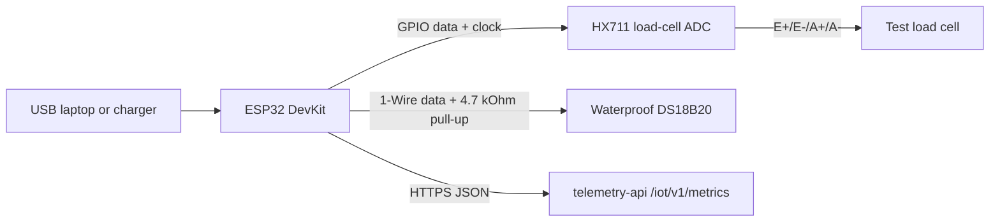

## Goal

The lab phase is a table-top electronics build. It should be cheap, easy to rewire, and easy to debug over USB serial. It does not need outdoor power, enclosure sealing, solar charging, or a final mechanical scale frame.

Use this phase to validate:

- ESP32 firmware build and flashing flow.
- HX711 and load-cell readings.
- DS18B20 internal temperature readings.
- Local calibration and tare logic.
- JSON upload to `/iot/v1/metrics`.
- Gratheon chart visibility and missing-data behavior.

## Functionality

- Reads one load cell through HX711.
- Reads one waterproof DS18B20 probe.
- Sends telemetry every 30-60 seconds for demos and debugging.
- Runs from USB power.
- Uses serial logs for setup and troubleshooting.
- Stores only minimal configuration: endpoint URL, API token, `hiveId`, and calibration factor.

## Lab interconnect map



## Electrical connection plan

| Subsystem | ESP32 connection | Signal type | Lab wiring rule | Why it matters |
| --- | --- | --- | --- | --- |
| HX711 power | 3.3 V and GND | Power | Keep HX711 and ESP32 on the same ground. | Prevents ADC reference drift and random readings. |
| HX711 digital | Two GPIOs, for example DT on GPIO16 and SCK on GPIO17 | Digital | Use short jumper wires first, then screw terminals if readings jump. | HX711 is easy to debug when the digital lines are stable. |
| Load cell bridge | E+, E-, A+, A- to HX711 | Low-level analog differential | Do not route next to USB power bricks or switching converters. | Load-cell signals are tiny and sensitive to noise. |
| DS18B20 probe | 3.3 V, GND, one GPIO data line | 1-Wire | Add a 4.7 kOhm pull-up from data to 3.3 V unless the breakout already includes one. | Without a pull-up, the probe may appear intermittently. |
| USB serial | USB cable | Power + debug | Keep serial logs enabled in lab mode. | Fastest way to inspect WiFi, calibration, payloads, and API responses. |

## Recommended lab pin allocation

The exact pins can change in firmware, but the lab build should reserve pins by function so the design can grow without rewiring everything later.

| Function | Suggested ESP32 pin | Notes |
| --- | --- | --- |
| HX711 DT | GPIO16 | Avoid boot strapping pins for first prototype. |
| HX711 SCK | GPIO17 | Keep paired with DT in firmware config. |
| DS18B20 data | GPIO4 | Common 1-Wire example pin, simple to document. |
| I2C SDA for future humidity sensor | GPIO21 | Reserve even if not populated in phase 1. |
| I2C SCL for future humidity sensor | GPIO22 | Reserve even if not populated in phase 1. |
| Battery voltage ADC for future field build | GPIO34 or GPIO35 | Input-only pins are suitable for ADC sensing. |

## Mechanical setup

The lab does not need the final hive-scale frame, but it still needs a repeatable test fixture.

- Bolt the load cell to a rigid board or aluminium profile instead of holding it by hand.
- Leave the sensing end free to bend in the intended direction.
- Add a small flat plate or hook for known test weights.
- Keep the cable fixed with tape or a zip tie so cable movement does not become apparent weight drift.
- Record the load-cell orientation in a photo, because calibration values are only meaningful for a repeated geometry.

## Calibration workflow

1. Start with no weight on the fixture and run tare.
2. Place a known mass, for example 1 kg, 5 kg, or 10 kg depending on the test cell.
3. Calculate and store the calibration factor in non-volatile memory.
4. Remove and re-add the weight three times.
5. Accept the setup only if readings return close to the same value after each cycle.
6. Send at least one accepted telemetry payload to Gratheon with the calibration factor logged locally.

## Telemetry API contract

For lab validation, devices should use the REST endpoint already exposed by telemetry-api:

```http
POST https://telemetry.gratheon.com/iot/v1/metrics
Authorization: Bearer <api-token>
Content-Type: application/json
```

```json
{
  "hiveId": "54",
  "timestamp": 1717238400,
  "dedupeKey": "esp32-54:1717238400",
  "fields": {
    "temperatureCelsius": 34.2,
    "humidityPercent": 61.5,
    "weightKg": 47.8
  }
}
```

The same contract should be reused in later phases so the firmware does not diverge from the current ingestion path.

## Firmware changes to prioritize

- Support phase profiles: `lab`, `field-mvp`, and `production`.
- Report every **30-60 seconds** in lab mode.
- Add first-run setup fields for `deviceId`, `hiveId`, API token, endpoint URL, send interval, and calibration factor.
- Add a calibration flow: tare empty scale, place known weight, calculate factor, store in non-volatile memory.
- Send JSON to `/iot/v1/metrics` with `timestamp` and `dedupeKey`.

## Exit criteria

- Weight reading is stable enough to detect known test weights.
- Temperature readings are visible in serial logs.
- A telemetry payload is accepted by `telemetry-api`.
- Gratheon UI can show the submitted history.
- Calibration factor can be stored and reused after restart.

## Bill of materials

The detailed purchase list is in [Phase 1 - Lab BOM](bill-of-materials.md). The core parts are ESP32, HX711, one low-cost load cell, DS18B20, jumper wires, breadboard or screw terminals, and USB power.
