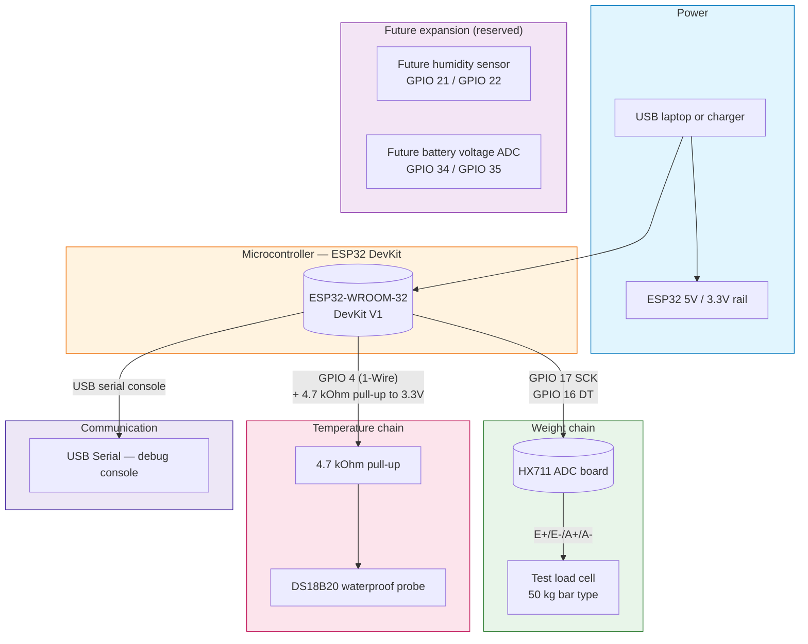

## Purpose

This page provides the high-level system overview for the Phase 1 lab validation. It is split into a software principle diagram and a hardware wiring diagram. It is meant to be your starting point when you first open the project docs.

## Software general principle

The software architecture describes the logical flow of data from sensors to the backend.

```mermaid
flowchart TB
    subgraph SENSORS["Sensors"]
        LC[Load Cell (Weight)]
        TEMP[DS18B20 (Temperature)]
    end

    subgraph MCU["Microcontroller Firmware"]
        READ[Read Sensor Data]
        WIFI_CONN[Connect to WiFi]
        SEND[Send Telemetry]
    end

    subgraph BACKEND["Cloud"]
        TELEM[telemetry-api /iot/v1/metrics]
    end

    LC --> READ
    TEMP --> READ
    READ --> WIFI_CONN
    WIFI_CONN --> SEND
    SEND -- "HTTPS POST" --> TELEM
    
    style SENSORS fill:#e8f5e9,stroke:#2e7d32
    style MCU fill:#fff3e0,stroke:#ef6c00
    style BACKEND fill:#ede7f6,stroke:#4527a0
```

## Hardware wiring

This diagram shows the physical connections between the components. Click on the sub-components to view detailed wiring pages.


