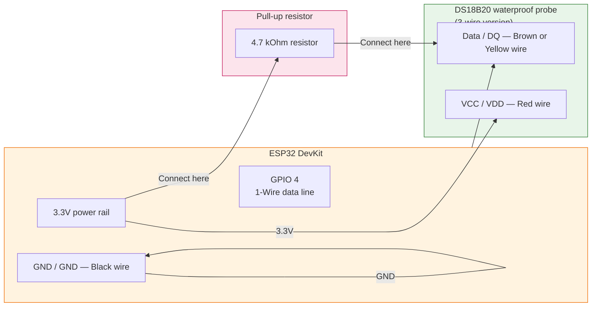
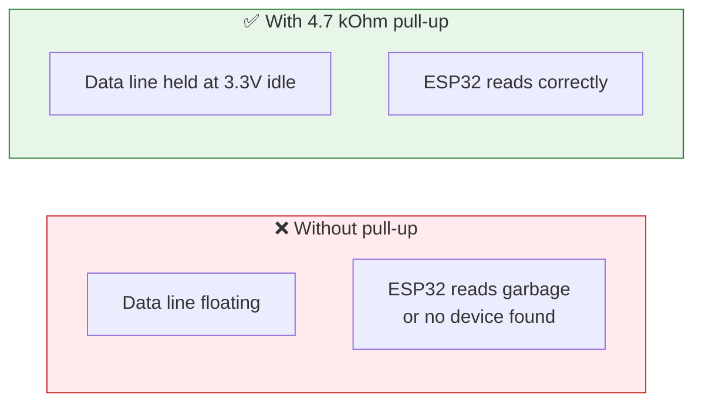
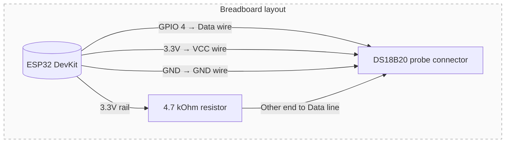

## Purpose

Detailed pin-by-pin wiring for the temperature sensor. Follow this page when you connect the DS18B20 waterproof probe to the ESP32.

## DS18B20 1-Wire connections



## Pin allocation table

| DS18B20 wire colour | Function | ESP32 connection | Notes |
| --- | --- | --- | --- |
| Red | VCC (power) | 3.3V on ESP32 | Do not connect to 5V — DS18B20 is a 3.3V device on this board |
| Black | GND (ground) | GND on ESP32 | Must share ground with ESP32 |
| Brown or Yellow | Data / DQ | GPIO 4 via 4.7 kOhm pull-up | The pull-up is mandatory for correct 1-Wire operation |

## Why the pull-up resistor matters

The DS18B20 uses the 1-Wire protocol, which requires a pull-up resistor on the data line to keep it at logic high when no device is driving it. Without this resistor:

- The probe may appear intermittently in firmware scans
- Temperature readings will be unreliable or missing entirely
- Debugging becomes very confusing because symptoms look like a dead sensor



## Firmware config

The firmware uses these constants for the DS18B20 connection:

- `DS18B20_PIN = 4` — GPIO pin for the 1-Wire data line
- The 4.7 kOhm pull-up is a **hardware** component, not configured in software

## Physical wiring on breadboard



### Wiring steps

1. Connect the red wire (VCC) from DS18B20 to the 3.3V rail on the breadboard, then to ESP32 3.3V pin.
2. Connect the black wire (GND) from DS18B20 to the GND rail on the breadboard, then to ESP32 GND pin.
3. Connect one end of the 4.7 kOhm resistor to the 3.3V rail.
4. Connect the other end of the 4.7 kOhm resistor to the data line (brown or yellow wire).
5. Connect the data line from DS18B20 to GPIO 4 on ESP32.

## Testing the connection

After wiring, you can verify the connection by scanning for 1-Wire devices:

```cpp
// In setup(), after initializing the OneWire library:
auto devices = oneWire->search();
if (devices.empty()) {
    Serial.println("No DS18B20 found! Check pull-up resistor and wiring.");
} else {
    Serial.printf("Found DS18B20 with address: %s\n", devices[0].toString().c_str());
}
```

If no device is found:

- Verify the 4.7 kOhm resistor is connected between 3.3V and the data line
- Check that all wires are securely connected in breadboard rows
- Try swapping the data wire (brown/yellow) with VCC — you may have misidentified the wires
- Measure voltage on the data line with a multimeter — it should read ~3.3V when idle

## Common problems

| Symptom | Check |
| --- | --- |
| No device found during scan | Verify pull-up resistor is connected between 3.3V and data line |
| Intermittent readings | Check all breadboard connections — loose wires cause intermittent contact |
| Readings show -127°C or 85°C | The sensor is not responding — check wiring again, especially the pull-up |
| Readings are stable but wrong | The probe may be damaged or measuring something other than what you expect |
