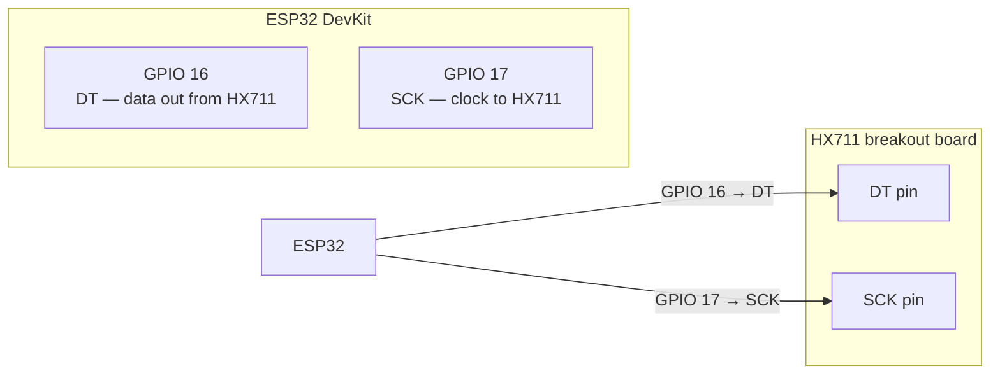
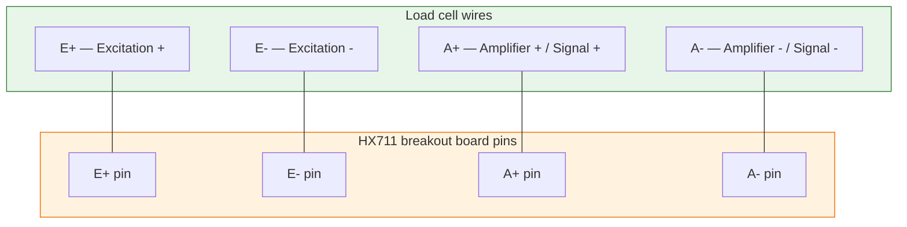
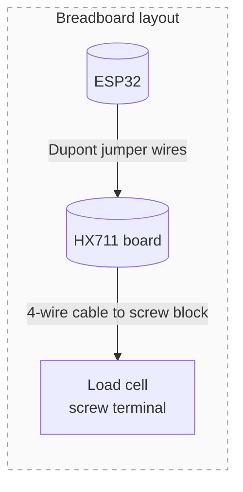

## Purpose

Detailed pin-by-pin wiring for the weight chain. Follow this page when you connect the HX711 board and load cell to the ESP32.

## HX711 power connections

| HX711 pin | ESP32 pin | Wire colour (typical) | Notes |
| --- | --- | --- | --- |
| VCC | 5V or 3.3V | Red | The HX711 board accepts 5 V and generates its own 3.3 V rail internally |
| GND | GND | Black | **Must share ground with ESP32** — different grounds cause ADC drift |

## HX711 digital connections (to ESP32)

These are the two GPIO lines the firmware talks to:

**Firmware config:** `HX711_DT_PIN = 16`, `HX711_SCK_PIN = 17`. These can be changed later but keeping them fixed makes the lab wiring consistent.

## Load cell bridge connections (to HX711)

The load cell is a Wheatstone bridge. The HX711 board labels each terminal clearly:

### Typical wire colours on a 4-wire load cell

| Bridge terminal | Common colour | HX711 label |
| --- | --- | --- |
| Excitation + (E+) | Red | TP or E+ |
| Excitation - (E-) | Black | TN or E- |
| Signal + (A+) | White | RP or A+ |
| Signal - (A-) | Green | RN or A- |

> **Tip:** If the readings go in the wrong direction, swap A+ and A-. The bridge polarity is the only thing that flips sign.

## Breadboard wiring tips for lab use

- Use short Dupont jumper wires between ESP32 and HX711 first.
- If readings jump, switch to screw-terminal blocks for both power and signal lines.
- Keep the load-cell cable away from USB power bricks or switching converters — the bridge signals are very small and noise-sensitive.
- Label each wire with masking tape: `E+`, `E-`, `A+`, `A-`, `DT`, `SCK`, `VCC`, `GND`.

## Common problems

| Symptom | Check |
| --- | --- |
| Readings jump randomly | Verify HX711 and ESP32 share the same ground |
| No readings at all | Check DT/SCK wiring; try swapping GPIO 16/17 in firmware config |
| Load cell reads negative | Swap A+ and A- wires on the load-cell terminal |
| Large offset after tare | Cable is moving or touching something — fix cable routing with a zip tie |
