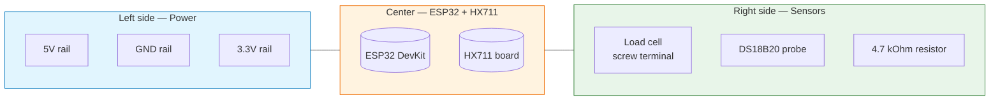

## Purpose

This page combines every connection in one place with exact GPIO pin numbers, wire colours, and breadboard layout notes. Use it as your final reference before powering on the system for the first time.

## Complete pin allocation table

| Function | ESP32 pin | Wire colour | Connected to | Notes |
| --- | --- | --- | --- | --- |
| HX711 SCK (clock) | GPIO 17 | Blue | HX711 SCK pin | Firmware clock output |
| HX711 DT (data) | GPIO 16 | Orange | HX711 DT pin | Firmware data input |
| DS18B20 Data | GPIO 4 | Brown/Yellow | DS18B20 DQ + 4.7 kOhm pull-up to 3.3V | Mandatory pull-up resistor |
| DS18B20 VCC | 3.3V rail | Red | DS18B20 VDD pin | Do not use 5V |
| HX711 VCC | 5V or 3.3V | Red | HX711 VCC pin | Board accepts both |
| System GND | Any GND pin | Black | All GND pins (HX711, DS18B20, ESP32) | **Must be common ground** |
| I2C SDA (reserved) | GPIO 21 | Purple | Future humidity sensor | Do not connect anything yet |
| I2C SCL (reserved) | GPIO 22 | Grey | Future humidity sensor | Do not connect anything yet |
| Battery ADC (reserved) | GPIO 34 or 35 | White | Future voltage divider | Input-only pins, do not use for output |

## Full wiring diagram with all connections

```mermaid
flowchart TB
    subgraph POWER["Power distribution"]
        USB[USB power<br/>5V / 2A]
        ESP_PWR[ESP32 5V pin]
        HX711_VCC[HX711 VCC]
        DS18B20_VCC[DS18B20 VCC]
    end

    subgraph MCU["ESP32 DevKit"]
        ESP32[(ESP32-WROOM-32)]
        GPIO16[GPIO 16<br/>HX711 DT]
        GPIO17[GPIO 17<br/>HX711 SCK]
        GPIO4[GPIO 4<br/>DS18B20 Data]
        GND_ESP[GND]
    end

    subgraph WEIGHT["Weight chain"]
        HX711[(HX711 ADC)]
        LC[Test load cell]
    end

    subgraph TEMP["Temperature chain"]
        R_PULLUP[4.7 kOhm<br/>pull-up resistor]
        DS18B20[DS18B20 probe]
    end

    subgraph FUTURE["Reserved for future"]
        I2C_SDA[GPIO 21 — I2C SDA<br/>(reserved)]
        I2C_SCL[GPIO 22 — I2C SCL<br/>(reserved)]
        ADC_PIN[GPIO 34/35 — ADC<br/>(reserved)]
    end

    USB --> ESP_PWR
    ESP_PWR --> HX711_VCC
    ESP_PWR --> DS18B20_VCC

    GPIO16 --- HX711
    GPIO17 --- HX711
    HX711 --- LC

    GPIO4 --- R_PULLUP
    R_PULLUP --- DS18B20

    style POWER fill:#e1f5fe,stroke:#0277bd
    style MCU fill:#fff3e0,stroke:#ef6c00
    style WEIGHT fill:#e8f5e9,stroke:#2e7d32
    style TEMP fill:#fce4ec,stroke:#c2185b
    style FUTURE fill:#f3e5f5,stroke:#7b1fa2
```

## Breadboard layout guide



### Recommended breadboard row assignments

| Row | Component / Connection | Notes |
| --- | --- | --- |
| Top rail (red) | 5V from ESP32 USB | Powers HX711 VCC and ESP32 5V pin |
| Bottom rail (blue) | GND common bus | All GND connections meet here |
| Row 10-11 | ESP32 DevKit mounted | Leave space around the board for wiring access |
| Row 20-21 | HX711 board mounted | Close to ESP32 for short signal wires |
| Row 30 | 4.7 kOhm resistor between row 30 and row 35 | One end to VCC rail, other to DS18B20 data |
| Row 35-36 | DS18B20 probe connector | Brown wire to GPIO 4 via row 35 |

## Pre-power checklist

Before applying power for the first time, verify every connection against this list:

- [ ] ESP32 USB cable is connected to laptop or charger
- [ ] HX711 VCC is connected to 5V or 3.3V rail
- [ ] HX711 GND shares the same ground as ESP32
- [ ] HX711 DT (GPIO 16) and SCK (GPIO 17) wires are in correct rows
- [ ] Load cell E+/E-/A+/A- wires match HX711 pin labels
- [ ] DS18B20 VCC is connected to 3.3V (not 5V!)
- [ ] DS18B20 GND shares the same ground as ESP32
- [ ] **4.7 kOhm pull-up resistor connects 3.3V rail to GPIO 4 / data line**
- [ ] No jumper wires are touching each other or shorting adjacent pins
- [ ] Reserved pins (GPIO 21, 22, 34/35) have nothing connected

## First power-on sequence

1. Connect USB cable to laptop.
2. Open serial monitor at 115200 baud.
3. Press the ESP32 reset button if serial output does not start automatically.
4. Check that firmware prints: `HX711 found`, `DS18B20 found`, and initial readings.
5. If anything fails, refer to the troubleshooting sections in the individual wiring pages.
