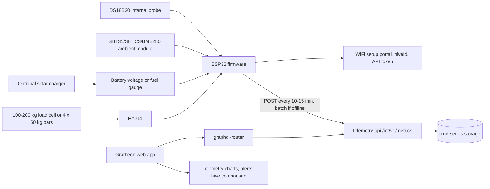

## Goal

The field MVP is the first useful outdoor version. It should be installable by a beekeeper with common tools and should avoid invasive electronics inside the colony. The product promise is simple: a DIY hive scale that streams weight, internal temperature, ambient humidity, battery status, and connectivity health into Gratheon.

This is the recommended public pilot scope.

## Functionality

- Measures hive weight for honey-flow, food-reserve, theft, storm, or handling events.
- Measures internal temperature with a waterproof DS18B20 probe.
- Measures ambient humidity and temperature with SHT31, SHTC3, or BME280 in a vented protected location.
- Measures battery voltage or battery state so the web app can warn before telemetry stops.
- Reports every 10-15 minutes by default.
- Batches readings when WiFi is weak and retries with stable `dedupeKey` values.
- Uses a simple weatherproof enclosure, cable glands, and external scale frame.
- Uses phone or web setup instead of an outdoor LCD.

## Field MVP architecture

## Electrical subsystem boundaries

The Field MVP should stop treating the enclosure as a breadboard box. Divide the hardware into serviceable subsystems.

| Subsystem | Inside enclosure | Outside enclosure | Connector or pass-through | Recommendation |
| --- | --- | --- | --- | --- |
| Weight | HX711, ESP32 | Load cell or scale frame | Cable gland for MVP, M8/M12 later | Keep low-level load-cell cable short and strain-relieved. |
| Internal temperature | ESP32 pull-up resistor | DS18B20 probe routed into hive | PG7 cable gland or 3-pin waterproof connector | Use 3-wire powered mode, not parasite power. |
| Ambient humidity | SHT31/SHTC3/BME280 board | Vented air pocket outside direct rain | Internal cable, small protected vent, or remote pod | Do not seal humidity sensor in the main box without air exchange. |
| Power | Battery holder, charger, fuse, switch | Optional solar panel | Separate gland or 2-pin waterproof connector | Keep solar/power wiring separate from load-cell signal cable. |
| Service/debug | USB or UART header | None during normal operation | Internal header only | Avoid an external USB hole in the enclosure for MVP. |

## Wiring rules for field reliability

- Put a physical strain relief on every cable before it reaches solder joints or screw terminals.
- Use drip loops so rainwater runs below the cable entry before reaching the enclosure.
- Keep load-cell analog wires away from solar charger and boost-converter wiring.
- Use ferrules or tinned wire ends in screw terminals only when the terminal type accepts them safely.
- Label both ends of each cable. Outdoor debugging becomes slow when all black cables look identical.
- Leave a small service loop inside the box so the lid can open without pulling wires.
- Add a desiccant pack only as a short-term mitigation. The real fix is correct sealing, cable entry, and condensation path.

## Suggested field pin allocation

| Function | Suggested ESP32 pin | Interface | Notes |
| --- | --- | --- | --- |
| HX711 DT | GPIO16 | Digital | Keep from lab profile where possible. |
| HX711 SCK | GPIO17 | Digital | Keep paired with DT. |
| DS18B20 data | GPIO4 | 1-Wire | 4.7 kOhm pull-up to 3.3 V. |
| SHT31/BME280 SDA | GPIO21 | I2C | Keep cable short if the module is remote. |
| SHT31/BME280 SCL | GPIO22 | I2C | Lower I2C speed if cable length causes errors. |
| Battery voltage | GPIO34 or GPIO35 | ADC | Use resistor divider sized for low standby leakage. |
| Fuel gauge | GPIO21/GPIO22 | I2C | MAX17048/LC709203 share I2C with humidity sensor. |
| Wake/service button | Any safe GPIO | Digital input | Useful for on-site setup without opening logs. |

## Mechanical stack

The MVP should choose one of two load paths and document it with photos.

### Option A - Single-point load cell

Use when a 100-200 kg single-point or platform-scale load cell can be mounted between two rigid plates.

- Bottom plate sits on the hive stand.
- Load cell is bolted according to its arrow/load direction.
- Top plate supports the hive body.
- Add mechanical stops so accidental overload does not permanently bend the load cell.
- Add side guides that prevent the hive sliding sideways, but do not create a second load path.

### Option B - Four bar load cells

Use when low-cost 50 kg bar cells are easier to source.

- Put one cell near each corner.
- Keep all four contact points at the same height.
- Protect wires from crushing and rodents.
- Calibrate the complete frame, not each cell in isolation.
- Expect more corner-loading error than a good single-point design.

## Sensor placement

| Sensor | Placement | Avoid |
| --- | --- | --- |
| Load cell | Between rigid stand and hive base | Off-axis force, rocking frame, water pooling around cable exit. |
| DS18B20 | Under cover or near brood-area edge without blocking bees | Loose cable inside colony, direct contact with wet surfaces, crushing under boxes. |
| Humidity/ambient module | Shaded, vented pocket on enclosure underside or separate small pod | Direct sun, rain splash, sealed box, condensation drip path. |
| Battery/fuel gauge | Inside enclosure close to battery | Hot roof surface, exposed terminals. |
| Solar panel | Angled and cable-dripped before enclosure entry | Cable pointing upward into gland, shading by hive roof. |

## Power budget workflow

Do not size solar only from panel marketing watts. Measure the device current in the MVP enclosure.

1. Measure deep-sleep current.
2. Measure wake current while reading sensors.
3. Measure WiFi connect and HTTPS upload duration.
4. Calculate daily energy for 10, 15, and 30 minute intervals.
5. Choose a battery that survives several cloudy days without solar input.
6. Add solar only after battery-only baseline is known.
7. Report battery voltage or fuel-gauge percent in every telemetry batch.

## Data sent by MVP

MVP firmware should send both beekeeper metrics and support metrics.

| Type | Fields | Use |
| --- | --- | --- |
| Beekeeper metrics | `weightKg`, `temperatureCelsius`, `humidityPercent` | Honey flow, food shortage, overheating, humidity risk. |
| Device metrics | `batteryVoltage`, `batteryPercent`, `rssi`, `firmwareVersion`, `resetReason` | Support, missing-data alerts, field reliability. |
| Calibration metadata | calibration factor, tare timestamp, scale type | Explains why two hive scales may differ. |

## API changes to consider after MVP

Not required for the first release, but useful for field reliability:

- Add `batteryVoltage`, `batteryPercent`, `solarVoltage`, `rssi`, and `firmwareVersion` fields.
- Add a device registry in the web app so a beekeeper can pair a physical device with a hive without manually copying `hiveId`.
- Add a “last seen” and “missing telemetry” alert using the latest timestamp per device/hive.
- Add calibration metadata: load-cell factor, tare date, and mechanical configuration.

## Research references

Research backing has moved to [🧪 Research references](../research-references.md). It links this Field MVP scope to Gratheon's [Research](/research/) section and explains why weight, temperature, humidity, battery health, and connectivity health stay ahead of heavier sensor modalities.

## Exit criteria

- Device survives rain-protected outdoor operation without water ingress.
- Weight trend is useful enough to detect daily gain/loss and sudden movement.
- Battery telemetry is visible or at least logged locally.
- The device can run for a realistic pilot interval with the selected report cadence.
- A beekeeper can install it without soldering inside the hive body.

## Bill of materials

The detailed purchase list is in [Phase 2 - Field MVP BOM](bill-of-materials.md). It adds an IP65 box, cable glands, battery, optional solar charger, humidity sensor, and better field wiring to the lab electronics.
