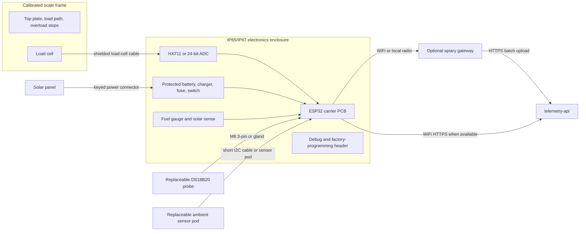
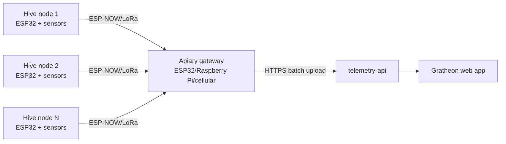

## Goal

The production phase converts the pilot design into hardware that Gratheon can sell and support. The priority changes from cheapest parts to repeatability, calibration, enclosure quality, supply-chain stability, and remote diagnostics.

This phase can still use ESP32-class hardware, but it should move toward pre-assembled wiring, a PCB or carrier board, a calibrated mechanical frame, and a clean pairing flow in the web app.

## Functionality

- Factory-calibrated load-cell frame or repeatable calibration process.
- Pre-flashed firmware with device identity and secure pairing.
- Battery and solar subsystem sized for months of operation.
- Waterproof connectors and strain relief for field servicing.
- Device health telemetry: battery, RSSI, firmware version, last seen, reset reason, and enclosure temperature where useful.
- Optional LoRa/ESP-NOW apiary gateway for multiple hives without WiFi.
- Optional cellular gateway or cellular device variant for remote single-hive deployments.
- Supportable replacement parts and documented mechanical tolerances.

## Production architecture

## Connector strategy

Production should use connectors to make field parts replaceable without opening solder joints. The exact connector family can change, but the interface count should be stable.

| Interface | Pins | Suggested connector | Signals | Service reason |
| --- | ---: | --- | --- | --- |
| Load cell | 4 or 6 | M12 4-pin/5-pin, sealed gland for early production | E+, E-, A+, A-, optional shield/sense | Load cell or frame can be replaced after mechanical damage. |
| DS18B20 internal probe | 3 | M8 3-pin or waterproof inline connector | 3.3 V, GND, 1-Wire data | Probe can be replaced if damaged by bees, tools, or moisture. |
| Ambient sensor pod | 4 | M8 4-pin or short sealed internal harness | 3.3 V, GND, SDA, SCL | Humidity sensor can be replaced when it drifts or corrodes. |
| Solar panel | 2 | Keyed waterproof 2-pin connector | Solar +, solar - | Prevents reversed polarity and simplifies seasonal replacement. |
| Battery pack | 2-3 | Internal keyed connector | Battery +, battery -, thermistor if used | Safe factory assembly and service swap. |
| Debug/programming | 4-6 | Internal JST or pogo pads | 3.3 V, GND, UART TX/RX, EN/BOOT | Factory flashing and support without exposing USB outdoors. |
| Gateway radio antenna | 1 | SMA/u.FL only if needed | RF | Keep only for LoRa/cellular variants. |

## Electrical design requirements

| Area | Requirement | Reason |
| --- | --- | --- |
| Grounding | Keep analog load-cell ground and digital ground controlled on PCB. | Reduces weight noise and support tickets. |
| Load-cell routing | Differential signal traces should be short, paired, and away from switching power. | Load-cell output is a low-level analog signal. |
| Protection | Add input protection on external sensor and power lines. | Outdoor cable runs can receive ESD and wiring mistakes. |
| Power switch | Provide a user-visible power/service switch or magnetic reed option. | Beekeeper needs a clear safe state during installation. |
| Fuse/protection | Battery and solar input need current limiting and reverse-polarity protection. | Reduces fire and support risk. |
| Battery telemetry | Include fuel gauge or calibrated voltage divider plus solar input sensing. | Enables proactive low-battery alerts. |
| Firmware identity | Store unique `deviceId`, firmware version, and hardware revision. | Required for pairing, diagnostics, and recalls. |
| Watchdog/reset reason | Report reset reason after every reboot. | Distinguishes brownout, crash, and planned firmware update. |

## Mechanical production requirements

The scale mechanics must be treated as a product subsystem, not as a generic bracket.

| Requirement | Practical implementation |
| --- | --- |
| Repeatable load path | Top plate should transfer hive weight through intended load-cell points only. |
| Overload protection | Add mechanical stops before the load cell reaches destructive deflection. |
| Side-load protection | Add guides or frame geometry that resist hive sliding without bypassing the load cell. |
| Water drainage | Avoid pockets around the load cell, bolts, and cable exits. |
| Corrosion resistance | Use aluminium, stainless, galvanized, or coated parts appropriate for wet apiaries. |
| Calibration access | Calibration should not require disassembling the frame. |
| Cable protection | Route load-cell cable through protected channels or clips away from hive tools and rodents. |
| Service labeling | Label frame orientation, max load, serial number, and calibration date. |

## Chip and connectivity recommendation

### Start with ESP32-WROOM DevKit

Use a standard ESP32-WROOM DevKit for lab and field MVP because it is cheap, familiar, Arduino-compatible, and already used by the prototype. It has enough RAM/CPU for local filtering, WiFi provisioning, TLS HTTP requests, and deep sleep.

### Production variants

| Variant | Use when | Recommendation |
| --- | --- | --- |
| ESP32-WROOM module | Base production node with WiFi in range | Default production MCU if field MVP is stable. |
| ESP32-C3 | Lower cost/power, single-core is enough | Good second board after firmware is stable. |
| ESP32-S3 | Need more RAM, USB, or future TinyML/audio experiments | Use for acoustic/edge ML prototypes, not base scale. |
| ESP32 + LoRa | Remote apiary with no WiFi but multiple hives nearby | Production gateway architecture. |
| ESP32 + SIM7080/SIM7000 LTE-M/NB-IoT | Single remote hive without WiFi/LoRa gateway | Later paid/field kit; raises cost and power complexity. |
| nRF52/STM32/RP2040 | Custom PCB or ultra-low-power redesign | Defer until there is field data from ESP32 MVP. |

Decision rule: **WiFi first, LoRa gateway second, cellular last**. Cellular is attractive commercially but too expensive and power-sensitive for a low-friction DIY launch.

## Production remote-apiary architecture

This keeps the first kit simple while preserving a path to remote apiaries: many cheap hive nodes, one internet-connected gateway.

## Production telemetry checklist

| Field | Required for base kit | Why |
| --- | --- | --- |
| `weightKg` | Yes | Main product value. |
| `temperatureCelsius` | Yes | Colony and sensor context. |
| `humidityPercent` | Yes | Moisture risk and ambient context. |
| `batteryVoltage` | Yes | Basic support signal. |
| `batteryPercent` | Recommended | Easier for beekeeper alerts. |
| `solarVoltage` | Recommended for solar SKU | Detects panel/cable failure. |
| `rssi` | Yes | Explains missing uploads and weak WiFi. |
| `firmwareVersion` | Yes | Support and rollout management. |
| `hardwareRevision` | Yes | Links telemetry to PCB and frame revision. |
| `resetReason` | Yes | Detects brownout and firmware crashes. |
| `calibrationId` | Recommended | Links data to factory or field calibration event. |

## Quality and acceptance tests

- Rain simulation or hose splash test appropriate to the claimed IP rating.
- 24-72 hour soak test with telemetry upload, sleep cycles, and battery logging.
- Known-weight calibration test at low, middle, and high expected hive loads.
- Corner-load test for frame repeatability.
- Cable pull/strain-relief inspection.
- Power reverse-polarity and low-battery behavior test.
- Pairing test from unboxed device to Gratheon hive dashboard.
- Firmware update or recovery test if OTA is supported.

## Research references

Research backing has moved to [🧪 Research references](../research-references.md). It links this production-kit scope to Gratheon's [Research](/research/) section and explains why multimodal sensing, gateway connectivity, calibrated mechanics, and serviceable outdoor hardware shape the production roadmap.

## Exit criteria

- Two or more identical units produce comparable weight trends after calibration.
- Device can be paired to a Gratheon hive without manual database edits.
- Support can see battery, RSSI, firmware version, last seen, and reset reason.
- Enclosure and connectors can survive realistic rain, UV, and service handling.
- Supply chain has at least two acceptable sources for each critical component.

## Bill of materials

The detailed purchase list is in [Phase 3 - Production BOM](bill-of-materials.md). It includes the field MVP components plus calibrated mechanical parts, a PCB/carrier board, waterproof connectors, solar sizing, and optional gateway connectivity.
