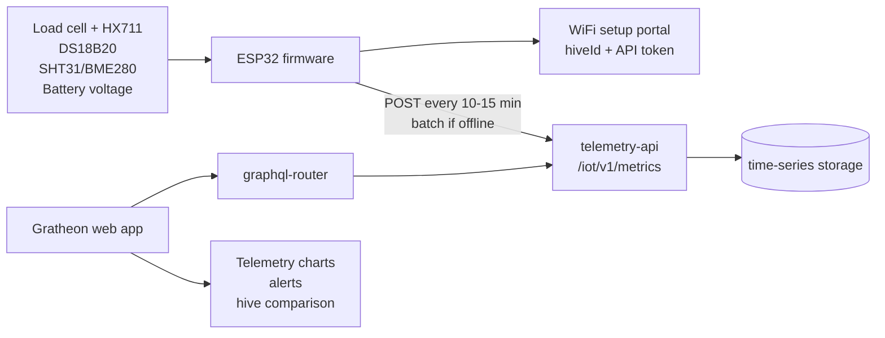

## Goal

The field MVP is the first useful outdoor version. It should be installable by a beekeeper with common tools and should avoid invasive electronics inside the colony. The product promise is simple: a DIY hive scale that streams weight, internal temperature, ambient humidity, battery status, and connectivity health into Gratheon.

This is the recommended public pilot scope.

## Functionality

- Measures hive weight for honey-flow, food-reserve, theft, storm, or handling events.
- Measures internal temperature with a waterproof DS18B20 probe.
- Measures ambient humidity and temperature with SHT31, SHTC3, or BME280 in a vented protected location.
- Measures battery voltage or battery state so the web app can warn before telemetry stops.
- Reports every 10-15 minutes by default.
- Batches readings when WiFi is weak and retries with stable `dedupeKey` values.
- Uses a simple weatherproof enclosure, cable glands, and external scale frame.
- Uses phone or web setup instead of an outdoor LCD.

## Bill of materials

The detailed purchase list is in [Phase 2 - Field MVP BOM](../components/mvp.md). It adds an IP65 box, cable glands, battery, optional solar charger, humidity sensor, and better field wiring to the lab electronics.

## Field MVP architecture

## API changes to consider after MVP

Not required for the first release, but useful for field reliability:

- Add `batteryVoltage`, `batteryPercent`, `solarVoltage`, `rssi`, and `firmwareVersion` fields.
- Add a device registry in the web app so a beekeeper can pair a physical device with a hive without manually copying `hiveId`.
- Add a “last seen” and “missing telemetry” alert using the latest timestamp per device/hive.
- Add calibration metadata: load-cell factor, tare date, and mechanical configuration.

## Research backing

The Field MVP keeps weight, temperature, humidity, battery, and connectivity first because local research pages show that these signals are practical and useful before adding heavier modalities:

- [Advances in Beehive Monitoring Systems: Low-Cost Integrating Sensor Technology for Improved Apiculture Management](../../../research/papers/Advances%20in%20Beehive%20Monitoring%20Systems%20Low-Cost%20Integrating%20Sensor%20Technology%20for%20Improved%20Apiculture%20Management.md) validates low-cost temperature, humidity, hive weight, and sound monitoring as practical modalities.
- [Analysis of Energy Consumption in a Precision Beekeeping System](../../../research/papers/Analysis%20of%20Energy%20Consumption%20in%20a%20Precision%20Beekeeping%20System.md) explains why field devices must be built around sleep cycles, radio duty cycle, and reduced edge processing.
