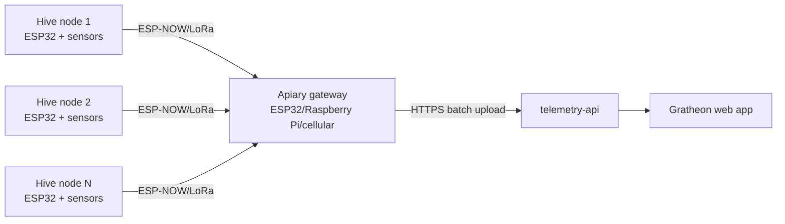

## Goal

The production phase converts the pilot design into hardware that Gratheon can sell and support. The priority changes from cheapest parts to repeatability, calibration, enclosure quality, supply-chain stability, and remote diagnostics.

This phase can still use ESP32-class hardware, but it should move toward pre-assembled wiring, a PCB or carrier board, a calibrated mechanical frame, and a clean pairing flow in the web app.

## Functionality

- Factory-calibrated load-cell frame or repeatable calibration process.
- Pre-flashed firmware with device identity and secure pairing.
- Battery and solar subsystem sized for months of operation.
- Waterproof connectors and strain relief for field servicing.
- Device health telemetry: battery, RSSI, firmware version, last seen, reset reason, and enclosure temperature where useful.
- Optional LoRa/ESP-NOW apiary gateway for multiple hives without WiFi.
- Optional cellular gateway or cellular device variant for remote single-hive deployments.
- Supportable replacement parts and documented mechanical tolerances.

## Bill of materials

The detailed purchase list is in [Phase 3 - Production BOM](../components/production.md). It includes the field MVP components plus calibrated mechanical parts, a PCB/carrier board, waterproof connectors, solar sizing, and optional gateway connectivity.

## Chip and connectivity recommendation

### Start with ESP32-WROOM DevKit

Use a standard ESP32-WROOM DevKit for lab and field MVP because it is cheap, familiar, Arduino-compatible, and already used by the prototype. It has enough RAM/CPU for local filtering, WiFi provisioning, TLS HTTP requests, and deep sleep.

### Production variants

| Variant | Use when | Recommendation |
| --- | --- | --- |
| ESP32-WROOM DevKit | Hobby DIY, WiFi in range, lowest support burden | Default for lab and MVP |
| ESP32-C3 | Lower cost/power, single-core is enough | Good second board after firmware is stable |
| ESP32-S3 | Need more RAM, USB, or future TinyML/audio experiments | Use for acoustic/edge ML prototypes, not base scale |
| ESP32 + LoRa | Remote apiary with no WiFi but multiple hives nearby | Production gateway architecture |
| ESP32 + SIM7080/SIM7000 LTE-M/NB-IoT | Single remote hive without WiFi/LoRa gateway | Later paid/field kit; raises cost and power complexity |
| nRF52/STM32/RP2040 | Custom PCB or ultra-low-power redesign | Defer until there is field data from ESP32 MVP |

Decision rule: **WiFi first, LoRa gateway second, cellular last**. Cellular is attractive commercially but too expensive and power-sensitive for a low-friction DIY launch.

## Production remote-apiary architecture

This keeps the first kit simple while preserving a path to remote apiaries: many cheap hive nodes, one internet-connected gateway.

## Research backing

- [A Smart Sensor-Based Measurement System for Advanced Bee Hive Monitoring](../../../research/papers/A%20Smart%20Sensor-Based%20Measurement%20System%20for%20Advanced%20Bee%20Hive%20Monitoring.md) validates the long-term multimodal direction with weight, sound, temperature, humidity, and CO₂.
- [Bee colony remote monitoring based on IoT using ESP-NOW protocol](../../../research/papers/Bee%20colony%20remote%20monitoring%20based%20on%20IoT%20using%20ESP-NOW%20protocol.md) supports the production gateway architecture for apiaries without WiFi.
