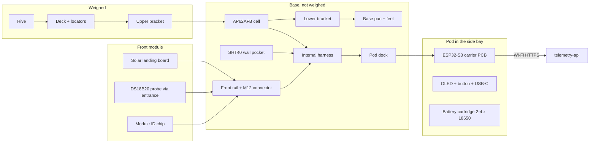

## Goal

The production kit is the version of the beehive scale that Gratheon can sell, calibrate, ship and support. Priorities shift from the cheapest parts to repeatable weighing, a sealed and serviceable enclosure, a stable supply chain and remote diagnostics. It builds on the [bench](phase-1-lab-validation/) and [field](phase-2-field-mvp/) prototypes (see [Earlier prototypes](prototypes.md)).

The same design has to work in three settings:

- **Stand-alone:** on the ground under any 506 × 450 mm hive, on batteries with a solar landing board, through snow, rain and inspections.
- **Robotic Beehive:** bolted into the plinth of the [Robotic Beehive](/products/robotic_beehive/), where the pod becomes the robot's always-on supervisor.
- **With the Entrance Observer:** the future [Entrance Observer](/docs/entrance-observer/) camera mounts on the same front rail as the landing board.

The 3D model on the [overview page](/docs/beehive-sensors/#model) shows every part described here.

## Design rules

1. **Everything electrical is on the base.** The base is the part that is not weighed. The pod, the front module, the connector and all wiring are fixed to it. Only the hive probe lead crosses to the hive, so nothing electrical has to be moved during an inspection.
2. **No cables outside the case.** The load cell, the front-module connector and the ambient sensor are wired inside the base. The only outside cables are a short plug under the landing board and the probe lead going into the entrance.
3. **Nothing sticks out.** The pod sits flush in the side of the base, under the deck overhang. Snow, a boot or a hive tool has nothing to catch or break off. The landing board is the only part in front, and bees need it anyway.
4. **One front interface.** Landing boards, the Entrance Observer and the Robotic Beehive harness all use the same rail and the same M12 connector.

## Functionality

- Hive weight every 10 minutes, 200 kg capacity (350 kg option).
- Brood-nest temperature from a DS18B20 probe pushed in through the entrance; ambient temperature and humidity from an SHT40 in the base wall.
- Battery %, voltage, charge source, Wi-Fi RSSI, firmware version and reset reason with every upload.
- **Button and display on the pod:** press to see weight, temperatures, battery and Wi-Fi for 15 s and send a reading now; hold 5 s for BLE setup from a phone.
- **Power:** solar landing board by default, optional second panel on the lid, USB-C charging on the pod face and a swappable battery cartridge.
- Uploads over Wi-Fi to `telemetry-api`, batched every 30 minutes. LoRa to an apiary gateway is an option.

## Architecture

## Mechanical design

The scale is a closed "lid over tray". The deck is a lid with a skirt, the base is a tray, and the only connection between them is one single-point load cell.

| Part | Design | Why |
| --- | --- | --- |
| Load cell | AP62AFB aluminium single-point cell, 200 kg (350 kg option), sold with two cast aluminium weighing brackets (≈ 341.8 × 254.2 mm) | A single-point cell is compensated for off-centre loads, so an off-centre hive still reads correctly. One cell means one calibration and one lead. |
| Deck | 18 mm film-faced birch plywood (anti-slip mesh face, as on trailer floors), 560 × 510 mm, 40 mm thermo-pine skirt, sealed edges | Stiff enough for a full hive plus a snow cap, and made by any joinery shop. The film face and sealed edges keep water out, so the weighed deck does not gain weight when it rains. |
| Base | 22 mm thermo-pine boards on a 12 mm exterior plywood floor, 504 × 454 × 60 mm, drain hole in each corner | The skirt overlaps the base walls by 6 mm with an 8 mm gap: a rain labyrinth with no contact, so nothing bypasses the cell. Water in the base does not matter; it is not weighed. |
| Pod bay | Rectangular cut in the right wall with a 3D-printed ASA sleeve: guides and the dock connector | The pod sits flush with the wall under the deck overhang. The woodwork is one straight cut. |
| Accessory rails | Aluminium angle rails on all four sides below the skirt; the M12 socket is under the front one, facing down | Front modules hook on at the front; the solar wing hooks on whichever side faces south. |
| Overload stops | M10 bolt in a threaded insert under each deck corner, set with a feeler gauge just below the deck | A leaning beekeeper, a dropped super or a heavy snow load lands on the stops, not on the cell. |
| Side bumpers | EPDM pads on the base walls, 4 mm free travel | Stop the deck sliding sideways, without taking load in normal use. |
| Hive locators | Four 3D-printed ASA corner blocks, 20 mm high | The hive goes back in the same place after every inspection, centred over the cell. |
| Feet | 4 × M10 levelling feet in threaded inserts, 400 × 300 mm pattern, bubble level in the front skirt | A level scale loads the cell straight. The pattern matches the Robotic Beehive deck pads. |
| Transport lock | Captive quarter-turn lock on the right (service) side, next to the pod, with a red mark on the skirt | Clamps the deck to the base for shipping or when moving a hive. It cannot be lost, everything the beekeeper touches is on one side, and the pod display warns if it is left locked. |

The scale stack is 112 mm high, plus 25 mm feet. **To verify on the delivered AP62AFB:** cell length and height, bracket hole pattern and thickness, rated deflection (this sets the overload-stop gap), and lead colours. The 3D model keeps these as parameters (`cell`, `bracket` in `scale-model.js`).

### Materials and manufacturing

The case is designed so that a local joinery shop and a 3D printer can make it, with only standard aluminium parts bought in.

| Material | Parts | How it is made |
| --- | --- | --- |
| Film-faced birch plywood, 18 mm and 12 mm | Deck, base floor | CNC-cut from sheet; edges sealed with paint; threaded inserts for the brackets, feet and stops |
| Thermo-pine (thermally modified pine), 20–22 mm | Deck skirt, base walls | Sawn, screwed and glued; no chemical preservatives, like the hive itself |
| 3D-printed ASA (UV-stable) | Pod shell and battery cartridge (pilot batches), bay sleeve, hive locators, sensor louvres, board and wing hinge brackets, probe socket, lock knob, cable clips | FDM printer, 0.2 mm layers; moulded later if volumes justify it |
| Aluminium | AP62AFB brackets (bought with the cell), accessory rails, overload-stop tubes | Bought in or cut from standard angle |

Wood on the weighed side is the one compromise: soaked wood is heavier. The film face and sealed edges keep water uptake to a few tens of grams. The app also tracks a slow tare drift and treats it separately from hive weight, as it does for snow.

### Snow and knocks

- A snow load on the deck and hive is weighed, which is correct: the app shows it as a separate, slow rise with a matching drop at thaw, instead of a false nectar flow. A snow load on the landing board is not weighed.
- A deep snow cover (up to 2 m) can load the deck and the landing board from above and the sides. The overload stops take vertical overload, and the bumpers take side load. The pod face is below the deck overhang and flush, so it has nothing that snow can bend.
- The landing board hinges down if something hits it or a heavy snow cap slides off it, instead of breaking. It clicks back up.
- The pod's USB-C flap and button are sealed to IP67, so the pod can sit under snow all winter.

## Front modules

| Module | What it is | Power | Status |
| --- | --- | --- | --- |
| **Solar landing board** (default) | 440 × 155 mm landing board that is a 2.5 W, 6 V ETFE solar panel with a textured, bee-safe surface, sloped 6° forward so rain and snow slide off. Carries the probe socket on its rear edge. Used when the entrance faces roughly south. | Charges the pod | Base kit |
| Solar wing | The same panel module on a wing bracket, hooked on the left, back or right rail, whichever faces south, tilted 50° for the low winter sun and so snow slides off. Its lead runs under the base to the landing board, which is then a plain board. | Charges the pod | Same part, other bracket |
| Plain landing board | Same size, white HDPE. Used with the lid panel, at sites without solar, and under the Entrance Observer camera, which needs an even, light background. | — | Accessory |
| Lid panel | The same class of panel on a bracket on the hive lid, for sites where the base is shaded. One lead, clipped down the front hive corner, plugs into the landing board's auxiliary input. | Charges the pod | Accessory |
| Entrance Observer | Camera arch over a plain landing board, on the same rail. It has its own compute and mains or PoE power, feeds the pod through the connector and exchanges readings over UART. | Powers the pod | Concept |
| Robotic Beehive harness | No landing board; the robot cabinet has its own entrance tunnels. The harness brings the robot's fused 5 V rail (fed by the roof panel) and the UART link to the Jetson. | Powers the pod | Robot |

**Solar placement.** Beekeepers usually point the entrance south or south-east, and then the landing board is the panel. When the entrance must face another way, the same panel hooks onto the side rail that faces south as a wing, and the landing board is a plain board. The lid is the fallback for shaded sites. In every case the panel lead ends at the landing board, and the only connector is the one under the front rail.

The landing board is at the level of the entrance, just below the deck, and reaches back to 4 mm from the deck skirt so bees walk straight in. It hangs on the base, so bees and snow on it are not weighed. It folds flat for shipping.

### Front-module connector (M12 8-pin, A-coded)

| Pin | Signal | Direction | Notes |
| ---: | --- | --- | --- |
| 1 | VIN | module → pod | 4.5–6.4 V from a panel, the robot rail or the Observer |
| 2 | GND | — | |
| 3 | 3V3_SW | pod → module | Switched 3.3 V for the probe and the ID chip, on only while measuring |
| 4 | 1-Wire | both | DS18B20 probe + DS28E07 module ID chip |
| 5 | UART TX | pod → module | 115200 baud, 3.3 V |
| 6 | UART RX | module → pod | |
| 7 | WAKE | module → pod | Open drain; a module can wake the pod (e.g. an Observer event) |
| 8 | Shield | — | Bonded to the base |

Each module stores its type, panel rating and serial number in its ID chip, so the pod and the app know what is fitted without any setup.

## Electronics pod

The pod is a 150 × 38 × 82 mm IP67 housing in honey-yellow ASA (3D printed for the pilot batch, injection moulded later). It slides into the side bay and mates with the dock connector; one quarter-turn latch holds it. It can be moved to another scale or into the Robotic Beehive.

| Block | Part | Notes |
| --- | --- | --- |
| MCU | ESP32-S3-MINI-1-N8 | Pre-certified Wi-Fi + BLE 5 module, native USB, about 8 µA in deep sleep, enough GPIO for the LoRa option and the front-module UART. |
| Weight ADC | HX711 | Same chip and firmware library as the prototypes. NAU7802 is the alternative if field noise is too high. |
| Input selector | LM66200 dual ideal diode | Combines front-module VIN and USB-C VBUS without back-feeding either. |
| Charger | BQ24074 | 4.35–6.4 V input with power path. Blocks charging below 0 °C via the pack NTC. |
| Fuel gauge | MAX17048 | Battery % without a sense resistor, about 3 µA in hibernate. |
| 3.3 V rail | TPS62840 buck | 60 nA quiescent current, 750 mA for Wi-Fi bursts. |
| Sensor rail | TPS22917 load switch | Powers the HX711, load-cell excitation, the probe and the OLED only when needed. |
| Display | 0.96″ OLED 128 × 64 (SSD1306) behind a window | Works down to −40 °C (e-paper does not refresh below 0 °C). On for 15 s per button press. |
| Button | Sealed IP67 tactile switch | Short press: show stats and send a reading. 5 s hold: BLE setup. Wakes the pod from deep sleep. |
| USB-C | Receptacle behind a rubber flap | Charge from any charger or power bank, flash firmware, read the service console. |
| Battery cartridge | 2–4 × 18650 in parallel (1S), keyed sled with NTC | Pull out and swap in a charged cartridge, or charge in place over USB-C. |
| Vent | ePTFE membrane | Lets the sealed pod breathe through day and night temperature swings. |

### Changing batteries

1. Press the button: the display shows battery % and the last reading. It also warns in the app at 20 %.
2. Pull the cartridge out of the pod face by its grip. The pod keeps its settings and logged readings in flash.
3. Slide in a charged cartridge. Or leave the cartridge in and connect a power bank to USB-C for a few hours.

No tools, no opening the hive, no disconnecting cables.

## Installation

1. Place the scale on firm, level ground, entrance side facing the flight path. Level it with the feet and the bubble level.
2. Turn the transport lock on the right side from the red mark to OPEN.
3. Unfold the landing board on the front rail and plug its M12 lead in underneath (it only fits one way). If the entrance does not face south, hook the solar wing on the side that does and plug its lead into the landing board.
4. Put the hive on the deck between the locators.
5. Push the temperature probe in through the entrance until the mark on the lead is at the landing board.
6. Hold the pod button for 5 s and pair the scale with the Gratheon app over BLE; enter Wi-Fi and choose the hive.

During an inspection nothing needs to be unplugged. The probe lead is flexible enough to stay in place when the bottom board is lifted; it can also be pulled out in one movement and pushed back in.

## Shipping

The scale ships assembled and calibrated, with the transport lock in, in one flat box of about 600 × 550 × 160 mm and 14 kg. The landing board is folded flat on top of the deck. The pod ships in its bay with the cartridge fitted; the cells ship at about 30 % charge, as Li-ion cells packed with equipment (UN3481). Feet are screwed in but set to their shortest length.

## Wiring and pin map

The production wiring diagram and the full ESP32-S3 pin map are on the [overview page](/docs/beehive-sensors/#wiring). The source YAML is `content/triangle/wire-diagram/beehive-scale-production.yaml`, rendered with [wire-diagram](https://github.com/tot-ra/wire-diagram).

## Energy budget

The default cadence is to weigh every 10 minutes and upload a batch every 30 minutes. Figures are design estimates to be replaced with measurements from the pilot units.

| State | Current | Duration | Per day |
| --- | ---: | ---: | ---: |
| Deep sleep (ESP32-S3, charger, gauge, buck) | 20 µA | 24 h | 0.48 mAh |
| Measure (sensor rail on, HX711 16 samples, DS18B20, SHT40) | 12 mA | 0.6 s × 144 | 0.29 mAh |
| Wi-Fi connect + HTTPS batch upload | 120 mA | 4 s × 48 | 6.4 mAh |
| Display on after a button press | 25 mA | 15 s × 1 | 0.1 mAh |
| Li-ion self-discharge | ≈ 2 % / month | per cell | 1.6 mAh per cell |

| Cells | Capacity (2.5 Ah each) | Usable (80 % depth, 70 % in winter) | Runtime without any charging |
| ---: | ---: | ---: | ---: |
| 2 | 5.0 Ah | 2.8 Ah | ≈ 9 months |
| 3 | 7.5 Ah | 4.2 Ah | ≈ 11 months |
| 4 | 10 Ah | 5.6 Ah | ≈ 13 months |

The 2.5 W landing board gives roughly 60–300 mAh on an overcast northern winter day when it is clear of snow, 5–20 times the daily need. Under snow it gives nothing, and the cells carry the pod through the winter. Uploads dominate the budget: uploading every 60 minutes, or over LoRa, roughly doubles the runtime.

## Robotic Beehive integration

| Interface | Contract |
| --- | --- |
| Mechanical | Remove the four levelling feet. The M10 holes (400 × 300 mm) bolt onto the plinth deck cross members, where the robot's rubber pads were. |
| Height | The hive deck rises by the scale stack height, 112 mm. The robot model derives every lift height from the hive base, so only one parameter changes. |
| Front module | None. The robot harness plugs into the M12 front-module connector: 5 V from the robot rail (fed by the roof panel and battery) on VIN, UART to the Jetson on pins 5/6, WAKE from the Jetson on pin 7. |
| Pod | Stays in the scale's side bay, reachable through the service door. With LoRa fitted it is the robot's always-on supervisor: it reads climate and weight and drives the motor watchdog relay K1. The fork load cells keep their own HX711 boards on spare GPIOs. |
| Data | During a lift, the drop in scale weight equals the lifted mass. The robot uses this to cross-check the fork load cells and to detect a stuck box. |

## Entrance Observer integration

The Entrance Observer is not designed yet. The scale fixes the interface it must use:

- It hooks onto the front rail (two hooks, one thumb screw) and replaces the landing board with its own plain board, so the camera always sees the same background at the same distance.
- It plugs into the M12 connector: it powers the pod (VIN), identifies itself (ID chip), and exchanges time and readings over UART. For example, the Observer's bee counts can be uploaded together with weight, and the pod's weight changes can trigger a camera clip.
- Its camera arch stands on the base, not on the deck, so its weight never reaches the load cell.
- In the Robotic Beehive, the Observer mounts on the cabinet's landing board instead, and talks to the pod over the robot network.

## Chip and connectivity choice

| Variant | Use when | Decision |
| --- | --- | --- |
| ESP32-S3-MINI-1 | Production pod, Wi-Fi in range | **Default.** Enough GPIO for LoRa, front-module UART and two I2C buses; native USB on the USB-C port; BLE setup. |
| ESP32-WROOM DevKit | Bench and field prototypes | Keep for [Lab bench wiring](/docs/beehive-sensors/lab-wiring/) and DIY builds. |
| ESP32-C3-MINI-1 | Cost-down Wi-Fi-only SKU | Too few GPIO for LoRa + sensors + display + front-module UART on one board. |
| + SX1262 LoRa | Apiary without Wi-Fi, Robotic Beehive supervisor | Footprint on every PCB, fitted per SKU. |
| + LTE-M modem | Single remote hive | Deferred; cost and power are too high for the base kit. |

Decision rule: **Wi-Fi first, LoRa gateway second, cellular last.** More background is on [Choice of processor chip](Choice%20of%20procesor%20chip.md).

## Telemetry fields

| Field | Base kit | Why |
| --- | --- | --- |
| `weightKg` | Yes | Main product value. |
| `temperatureCelsius` | Yes | Brood-nest temperature. |
| `humidityPercent`, ambient temperature | Yes | Weather context. |
| `batteryVoltage`, `batteryPercent`, `chargeSource` | Yes | Proactive battery alerts; shows whether solar or USB is charging. |
| `frontModule` | Yes | Which module is fitted (from its ID chip). |
| `rssi` | Yes | Explains missing uploads. |
| `firmwareVersion`, `hardwareRevision` | Yes | Support, rollout, pin map selection. |
| `resetReason` | Yes | Brownouts and crashes. |
| `calibrationId` | Yes | Links readings to the factory or field calibration. |

`telemetry-api` already accepts weight, temperature and humidity. The device-health fields still need to be added to the `/iot/v1/metrics` contract.

## Quality and acceptance tests

- Factory: flash over USB-C, 3-point calibration with known weights (0, 20, 100 kg), a corner-load test (same 20 kg on each corner within ±0.1 kg), seal check of the pod.
- IP67 test of the pod, including the USB-C flap and button, and a hose test of the assembled scale.
- Snow load: 100 kg/m² on the deck and landing board with the pod face covered.
- Cold start and display at −25 °C.
- 72-hour soak with uploads, sleep cycles and battery logging.
- Temperature drift: a constant load logged from −10 °C to +35 °C.
- Cartridge swap and USB-C charging while logging.
- Drop test of the packed scale with the transport lock closed.
- Wet-deck test: weight change of the deck after 24 h of simulated rain.
- Front-module test: landing board, plain board and a UART test jig on the M12 connector.
- Robotic Beehive fit check: bolt pattern, height and UART link on the robot bench rig.

## Exit criteria

- Two or more identical units produce comparable weight trends after calibration.
- A scale can be unpacked, installed and paired to a Gratheon hive in under 15 minutes.
- Support can see battery, charge source, RSSI, firmware version, last seen and reset reason.
- Enclosure and connectors survive rain, UV, a snowy winter and inspections for one season.
- Every critical part has at least two acceptable suppliers.
- The same scale, pod and connector work stand-alone, in the Robotic Beehive plinth and with an Entrance Observer test jig.

## Bill of materials

The parts list with quantities and cost estimates is in the [bill of materials](bill-of-materials.md). Research behind the sensor choices is in [🧪 Research references](research-references.md).
