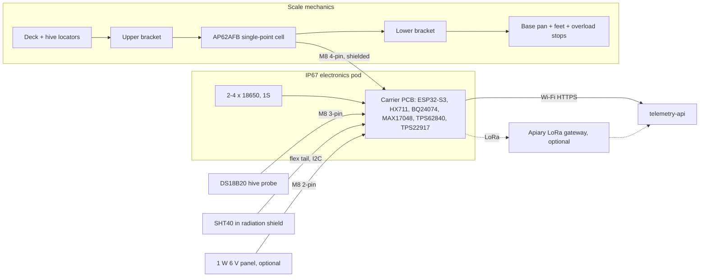

## Goal

The production kit is the version of the beehive scale that Gratheon can sell, calibrate, ship and support. Priorities shift from the cheapest parts to repeatable weighing, a sealed and serviceable enclosure, a stable supply chain and remote diagnostics. It builds on the [bench](phase-1-lab-validation/) and [field](phase-2-field-mvp/) prototypes (see [Earlier prototypes](prototypes.md)).

The same design has to work in two places:

- **Stand-alone:** on the ground under any 506 × 450 mm hive, running on batteries, optionally with solar.
- **Robotic Beehive:** bolted into the plinth of the [Robotic Beehive](/products/robotic_beehive/), with the electronics pod acting as the robot's always-on supervisor.

The 3D model on the [overview page](/docs/beehive-sensors/#model) shows every part described here.

## Functionality

- Hive weight every 10 minutes, 200 kg capacity (350 kg option).
- Brood-nest temperature (DS18B20 on the top bars), ambient temperature and humidity (SHT40).
- Battery %, voltage, charge state, Wi-Fi RSSI, firmware version and reset reason with every upload.
- Setup from a phone over BLE: hold the magnet on the pod, then enter Wi-Fi and pair the scale to a hive in the Gratheon app.
- Uploads over Wi-Fi to `telemetry-api`, batched every 30 minutes. LoRa to an apiary gateway is an option.
- Field-replaceable load cell, probe, panel and batteries. Nothing needs soldering in the field.

## Architecture

## Mechanical design

The scale is a closed "lid over tray". The deck is a lid with a skirt, the base is a tray, and the only connection between them is one single-point load cell.

| Part | Design | Why |
| --- | --- | --- |
| Load cell | AP62AFB aluminium single-point cell, 200 kg (350 kg option), sold with two cast aluminium weighing brackets (≈ 341.8 × 254.2 mm) | A single-point cell is compensated for off-centre loads, so a hive that sits slightly off-centre still reads correctly. One cell means one calibration and one cable. |
| Deck | 3 mm 5052 aluminium, 540 × 490 mm, 45 mm skirt, clear anodised, anti-slip ribs | Stiff enough to carry 120 kg on four corners of a bottom board. The skirt keeps rain and grass out. |
| Base pan | 2.5 mm 5052 aluminium, 524 × 474 × 60 mm, graphite powder coat, drain hole in each corner | The skirt overlaps the base wall by 17 mm with a 5 mm gap: a rain labyrinth with no contact, so nothing bypasses the cell. |
| Overload stops | M10 bolt under each deck corner, set with a feeler gauge just below the deck | A beekeeper leaning on a corner, or a dropped super, lands on the stops, not on the cell. |
| Side bumpers | EPDM pads on the base wall, 3 mm free travel | Stop the deck sliding sideways in wind or when a box is dragged, without taking load in normal use. |
| Hive locators | Four 25 mm corner angles | The hive goes back in the same spot after every inspection, centred over the cell. |
| Feet | 4 × M10 levelling feet, 400 × 300 mm pattern, bubble level in the front skirt | A level scale loads the cell straight and keeps frames plumb. The pattern matches the Robotic Beehive deck pads. |
| Pod dock | Two aluminium rails on the back wall, click-in latch, one locking screw | The pod lives at the back, where the beekeeper stands, away from the flight path at the front. |

Height of the scale stack is 88 mm (plus 25 mm feet). A lower design is possible with a flatter cell, but the AP62AFB kit is available now and brackets are included.

**To verify on the delivered AP62AFB:** cell length and height, bracket hole pattern, bracket thickness, rated deflection (sets the overload-stop gap), lead colours and cable length. The 3D model keeps these as parameters (`cell`, `bracket` in `scale-model.js`) so the drawings follow the measured part.

## Electronics pod

The pod is a 150 × 38 × 90 mm IP67 housing in honey-yellow ASA (3D printed for the pilot batch, injection moulded later). Batteries sit on the left, the carrier PCB on the right.

| Block | Part | Notes |
| --- | --- | --- |
| MCU | ESP32-S3-MINI-1-N8 | Pre-certified Wi-Fi + BLE 5 module, native USB for factory flashing, about 8 µA in deep sleep, enough GPIO for the LoRa option and the robot UART. |
| Weight ADC | HX711 | Same chip and firmware library as the prototypes. The load switch powers it only during a reading. NAU7802 (I2C) is the drop-in alternative if field noise is too high. |
| Charger | BQ24074 | Solar input 4.35–6.4 V with power path. Its TS pin reads the pack NTC and blocks charging below 0 °C, which Li-ion cells need. |
| Fuel gauge | MAX17048 | Battery % without a sense resistor, about 3 µA in hibernate. |
| 3.3 V rail | TPS62840 buck | 60 nA quiescent current, 750 mA for Wi-Fi bursts, 100 % mode near an empty cell. |
| Sensor rail | TPS22917 load switch | Cuts the HX711, load-cell excitation and DS18B20 between readings. |
| Battery | 2–4 × 18650 in parallel (1S), keyed holder with NTC | Parallel cells need no balancing and share one charger. Ship 2 cells for a Wi-Fi hive near a house, 4 cells for remote hives. |
| User interface | Status LED behind a light pipe, reed switch for a magnet | No buttons or USB ports that could leak. |
| Connectors | M8 A-coded panel sockets, facing down and back under a drip hood | Load cell 4-pin, probe 3-pin, solar 3-pin (two contacts used). |
| Vent | ePTFE membrane | Lets the sealed pod breathe through day and night temperature swings. |

## Connector pinout

| Port | Connector | Pin 1 | Pin 2 | Pin 3 | Pin 4 |
| --- | --- | --- | --- | --- | --- |
| Load cell | M8 4-pin female, shielded | E+ | A+ | E− | A− |
| Hive probe | M8 3-pin female | 3V3_SW | — | GND | DQ |
| Solar / 5 V in | M8 3-pin female (2 used) | IN+ | — | GND | — |

Shields go to the M8 housing and to PCB ground at one point only. Wire colours on bought-in cells vary, so the harness is labelled by M8 pin, not by colour.

## Wiring and pin map

The production wiring diagram and the full ESP32-S3 pin map are on the [overview page](/docs/beehive-sensors/#wiring). The source YAML is `content/triangle/wire-diagram/beehive-scale-production.yaml`, rendered with [wire-diagram](https://github.com/tot-ra/wire-diagram).

## Energy budget

The default cadence is to weigh every 10 minutes and upload a batch every 30 minutes. Figures are design estimates and must be replaced with measured values from the pilot units.

| State | Current | Duration | Per day |
| --- | ---: | ---: | ---: |
| Deep sleep (ESP32-S3, charger, gauge, buck) | 20 µA | 24 h | 0.48 mAh |
| Measure (sensor rail on, HX711 16 samples, DS18B20, SHT40) | 12 mA | 0.6 s × 144 | 0.29 mAh |
| Wi-Fi connect + HTTPS batch upload | 120 mA | 4 s × 48 | 6.4 mAh |
| Li-ion self-discharge | ≈ 2 % / month | per cell | 1.6 mAh per cell |

| Cells | Capacity (2.5 Ah each) | Usable (80 % depth, 70 % in winter) | Runtime without solar |
| ---: | ---: | ---: | ---: |
| 2 | 5.0 Ah | 2.8 Ah | ≈ 9 months |
| 3 | 7.5 Ah | 4.2 Ah | ≈ 11 months |
| 4 | 10 Ah | 5.6 Ah | ≈ 13 months |

A 1 W panel gives roughly 30–150 mAh on an overcast northern winter day (unless snow covers it), which is 2–10 times the daily need, so the solar SKU runs all year. Uploads dominate the budget. Uploading every 60 minutes, or over LoRa, roughly doubles the runtime.

## Robotic Beehive integration

| Interface | Contract |
| --- | --- |
| Mechanical | Remove the four levelling feet. The M10 holes (400 × 300 mm) bolt onto the plinth deck cross members, where the robot's rubber pads were. |
| Height | The hive deck rises by the scale stack height, 88 mm. The robot model derives every lift height from the hive base, so only one parameter changes. |
| Power | The robot's fused 5 V rail goes into the solar M8 port. The charger keeps the cells topped up as a backup supply. |
| Supervisor role | The pod with LoRa fitted reads climate and weight, drives the motor watchdog relay K1 and talks to the Jetson over UART (IO43/IO44). The fork load cells keep their own HX711 boards on spare GPIOs. |
| Data | During a lift, the drop in scale weight equals the lifted mass. The robot uses this to cross-check the fork load cells and to detect a stuck box. |

## Chip and connectivity choice

| Variant | Use when | Decision |
| --- | --- | --- |
| ESP32-S3-MINI-1 | Production pod, Wi-Fi in range | **Default.** Enough GPIO for the LoRa option and robot UART, native USB, BLE setup. |
| ESP32-WROOM DevKit | Bench and field prototypes | Keep for [Lab bench wiring](/docs/beehive-sensors/lab-wiring/) and DIY builds. |
| ESP32-C3-MINI-1 | Cost-down Wi-Fi-only SKU | Possible later; too few GPIO for LoRa + sensors + robot UART on one board. |
| + SX1262 LoRa | Apiary without Wi-Fi, Robotic Beehive supervisor | Footprint on every PCB, fitted per SKU. |
| + LTE-M modem | Single remote hive | Deferred; cost and power are too high for the base kit. |

Decision rule: **Wi-Fi first, LoRa gateway second, cellular last.** More background is on [Choice of processor chip](Choice%20of%20procesor%20chip.md).

## Telemetry fields

| Field | Base kit | Why |
| --- | --- | --- |
| `weightKg` | Yes | Main product value. |
| `temperatureCelsius` | Yes | Brood-nest temperature. |
| `humidityPercent`, ambient temperature | Yes | Weather context. |
| `batteryVoltage`, `batteryPercent`, `charging` | Yes | Proactive battery alerts. |
| `rssi` | Yes | Explains missing uploads. |
| `firmwareVersion`, `hardwareRevision` | Yes | Support, rollout, pin map selection. |
| `resetReason` | Yes | Brownouts and crashes. |
| `calibrationId` | Yes | Links readings to the factory or field calibration. |

`telemetry-api` already accepts weight, temperature and humidity. The device-health fields still need to be added to the `/iot/v1/metrics` contract.

## Quality and acceptance tests

- Factory: flash over pogo pads, 3-point calibration with known weights (0, 20, 100 kg), a corner-load test (same 20 kg on each corner within ±0.1 kg), seal check of the pod.
- IP67 test of the pod and a hose test of the assembled scale.
- 72-hour soak with uploads, sleep cycles and battery logging.
- Temperature drift: a constant load logged from −10 °C to +35 °C.
- Cable pull test on the gland and each M8 plug.
- Reverse polarity and undervoltage on the solar/5 V input.
- Pairing from an unboxed unit to a hive dashboard in under 5 minutes.
- Robotic Beehive fit check: bolt pattern, height and UART link on the robot bench rig.

## Exit criteria

- Two or more identical units produce comparable weight trends after calibration.
- A scale can be paired to a Gratheon hive without manual database edits.
- Support can see battery, RSSI, firmware version, last seen and reset reason.
- Enclosure and connectors survive rain, UV and service handling for one season.
- Every critical part has at least two acceptable suppliers.
- The same pod works stand-alone and in the Robotic Beehive plinth.

## Bill of materials

The parts list with quantities and cost estimates is in the [bill of materials](bill-of-materials.md). Research behind the sensor choices is in [🧪 Research references](research-references.md).
