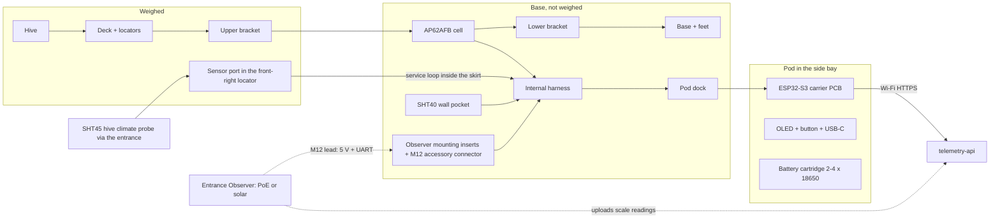

## Goal

The production kit is the version of the beehive scale that Gratheon can sell, calibrate, ship and support. Priorities shift from the cheapest parts to repeatable weighing, a sealed and serviceable enclosure, a stable supply chain and remote diagnostics. It builds on the [bench](phase-1-lab-validation/) and [field](phase-2-field-mvp/) prototypes (see [Earlier prototypes](prototypes.md)).

The same scale works in three settings:

- **Stand-alone:** on the ground under any 506 × 450 mm hive, on batteries, through snow, rain and inspections.
- **With the Entrance Observer:** the [Entrance Observer](/docs/entrance-observer/) bolts to the front of the scale base, powers the scale and uploads its readings. The Observer brings the landing board and the solar power (a solar roof and an optional external panel), so the scale has neither.
- **Robotic Beehive:** bolted into the plinth of the [Robotic Beehive](/products/robotic_beehive/), where the pod becomes the robot's always-on supervisor.

The 3D model on the [overview page](/docs/beehive-sensors/#model) shows every part described here; tick *With Entrance Observer* to see the two together.

## Design rules

1. **Everything electrical is on the base.** The base is the part that is not weighed. The pod, the accessory connector and all wiring are fixed to it. Only the hive climate probe reaches into the hive, so nothing electrical has to be moved during an inspection.
2. **No cables outside the case.** The load cell, the accessory connector, the ambient sensor and the sensor port are wired inside the base and the skirt. Stand-alone, the only thing outside is the probe lead in its groove at the entrance.
3. **Nothing sticks out.** The pod sits flush in the side of the base, under the deck overhang. Snow, a boot or a hive tool has nothing to catch or break off.
4. **One job per product.** The scale weighs and measures the hive climate on a battery. The Entrance Observer owns the entrance: landing board, porch, gate, camera and solar power. Together they share one M12 lead.
5. **Shared hardware principles.** The scale follows the [hardware design principles](../hardware-design-principles.md) of all Gratheon hardware: wood first (birch plywood and thermo-pine), aluminium where it carries load, plastic only for the sealed pod and small parts, A2 stainless fasteners, one tool, every part replaceable.

## Functionality

- Hive weight every 10 minutes, 200 kg capacity (350 kg option).
- **Hive climate:** brood-nest temperature and hive humidity from one SHT45 probe pushed in through the entrance; ambient temperature and humidity from an SHT40 in the base wall.
- Battery %, voltage, power source, tilt, Wi-Fi RSSI, firmware version and reset reason with every upload. A sudden tilt raises a tipped-hive alert.
- **Button and display on the pod:** press to see weight, temperatures, humidity, battery and Wi-Fi for 15 s and send a reading now; hold 5 s for BLE setup from a phone.
- **Power:** a swappable cartridge of 2–4 × 18650 cells, charged over USB-C on the pod face. With an Entrance Observer or in the Robotic Beehive, the pod runs from their 5 V and the cells are only a backup.
- Uploads over Wi-Fi to `telemetry-api`, batched every 30 minutes. With an Entrance Observer, the readings go through the Observer's link instead. LoRa to an apiary gateway is an option.

## Architecture

```mermaid
flowchart LR
    subgraph Weighed[Weighed]
        hive[Hive] --> deck[Deck + locators] --> top[Upper bracket]
        port[Sensor port in the front-right locator]
    end
    subgraph Base[Base, not weighed]
        cell[AP62AFB cell] --> low[Lower bracket] --> pan[Base + feet]
        harness[Internal harness]
        dock[Pod dock]
        rail[Observer mounting inserts + M12 accessory connector]
        sht[SHT40 wall pocket]
    end
    top --> cell
    subgraph Pod[Pod in the side bay]
        pcb[ESP32-S3 carrier PCB]
        face[OLED + button + USB-C]
        cart[Battery cartridge 2-4 x 18650]
    end
    probe[SHT45 hive climate probe via the entrance] --> port
    port -- service loop inside the skirt --> harness
    cell --> harness
    sht --> harness
    rail --> harness --> dock --> pcb
    eo[Entrance Observer: PoE or solar] -. M12 lead: 5 V + UART .-> rail
    pcb -- Wi-Fi HTTPS --> telemetry[telemetry-api]
    eo -. uploads scale readings .-> telemetry
```

## Mechanical design

The scale is a closed "lid over tray". The deck is a lid with a skirt, the base is a tray, and the only connection between them is one single-point load cell.

| Part | Design | Why |
| --- | --- | --- |
| Load cell | AP62AFB aluminium single-point cell, 200 kg (350 kg option), sold with two cast aluminium weighing brackets (≈ 341.8 × 254.2 mm) | A single-point cell is compensated for off-centre loads, so an off-centre hive still reads correctly. One cell means one calibration and one lead. |
| Deck | 18 mm film-faced birch plywood (anti-slip mesh face, as on trailer floors), 560 × 510 mm, 40 mm thermo-pine skirt, sealed edges | Stiff enough for a full hive plus a snow cap, and made by any joinery shop. The film face and sealed edges keep water out, so the weighed deck does not gain weight when it rains. |
| Base | 22 mm thermo-pine boards on a 12 mm exterior plywood floor, 504 × 454 × 60 mm, drain hole in each corner | The skirt overlaps the base walls by 6 mm with an 8 mm gap: a rain labyrinth with no contact, so nothing bypasses the cell. Water in the base does not matter; it is not weighed. |
| Pod bay | Rectangular cut in the right wall with a 3D-printed ASA sleeve: guides and the dock connector | The pod sits flush with the wall under the deck overhang. The woodwork is one straight cut. |
| Observer mounting points | Two M6 threaded inserts in the front wall of the base, under the deck edge, 434 mm apart | The Entrance Observer frame bolts to them with two printed risers and thumbscrews, so it is carried by the base and never weighed. Stand-alone, the front is plain wood. |
| Accessory connector | M12 socket recessed into the underside of the front wall, facing down, with a dust cap | Protected by the wall itself; nothing hangs below the edge. |
| Sensor port | The front-right hive locator is a larger printed block with the probe socket, next to the entrance corner | The probe plugs in right beside the entrance. The socket's lead drops through the deck and runs in a slack service loop inside the skirt to the base harness. |
| Probe groove | Printed clip-in groove along the front strip of the deck, from the sensor port to the entrance | Holds the probe lead flat and tidy; under an Entrance Observer the porch floor covers it. |
| Overload stops | M10 bolt in a threaded insert under each deck corner, set with a feeler gauge just below the deck | A leaning beekeeper, a dropped super or a heavy snow load lands on the stops, not on the cell. |
| Side bumpers | EPDM pads on the base walls, 4 mm free travel | Stop the deck sliding sideways, without taking load in normal use. |
| Hive locators | Three 3D-printed ASA corner blocks, 20 mm high, plus the sensor port on the fourth corner | The hive goes back in the same place after every inspection, centred over the cell. |
| Feet | 4 × M10 levelling feet in threaded inserts, 400 × 300 mm pattern | A level scale loads the cell straight. The pattern matches the Robotic Beehive deck pads. |
| Tilt sensor | LIS2DH12 accelerometer on the pod board (the pod sits fixed in the base) | Replaces a bubble level: the pod display shows the tilt while you set the feet, and every upload reports it, so the app can warn when a hive has been tipped over or the scale has sunk into soft ground. |
| Transport lock | Captive quarter-turn lock on the right (service) side, next to the pod, with a red mark on the skirt | Clamps the deck to the base for shipping or when moving a hive. It cannot be lost, everything the beekeeper touches is on one side, and the pod display warns if it is left locked. |

The scale stack is 112 mm high, plus 25 mm feet. **To verify on the delivered AP62AFB:** cell length and height, bracket hole pattern and thickness, rated deflection (this sets the overload-stop gap), and lead colours. The 3D model keeps these as parameters (`cell`, `bracket` in `scale-model.js`).

The service loop is the one cable that crosses from the weighed deck to the base. It is a soft, flat 4-core lead in a 40 mm loop, so the force it passes is a few grams, constant, and removed by the tare. It is checked in the corner-load test.

### Materials and manufacturing

The case is designed so that a local joinery shop and a 3D printer can make it, with only standard aluminium parts bought in.

| Material | Parts | How it is made |
| --- | --- | --- |
| Film-faced birch plywood, 18 mm and 12 mm | Deck, base floor | CNC-cut from sheet; edges sealed with paint; threaded inserts for the brackets, feet and stops |
| Thermo-pine (thermally modified pine), 20–22 mm | Deck skirt, base walls | Sawn, screwed and glued; no chemical preservatives, like the hive itself |
| 3D-printed ASA (UV-stable) | Pod shell and battery cartridge (pilot batches), bay sleeve, hive locators, sensor port, probe groove, sensor louvres, lock knob | FDM printer, 0.2 mm layers; moulded later if volumes justify it |
| Aluminium | AP62AFB brackets (bought with the cell), overload-stop tubes | Bought with the cell or cut from standard tube |

Wood on the weighed side is the one compromise: soaked wood is heavier. The film face and sealed edges keep water uptake to a few tens of grams. The app also tracks a slow tare drift and treats it separately from hive weight, as it does for snow.

### Snow and knocks

- A snow load on the deck and hive is weighed, which is correct: the app shows it as a separate, slow rise with a matching drop at thaw, instead of a false nectar flow. Snow on an Entrance Observer is carried by the base and not weighed.
- A deep snow cover (up to 2 m) can load the deck from above and the sides. The overload stops take vertical overload, and the bumpers take side load. The pod face is below the deck overhang and flush, so it has nothing that snow can bend.
- The pod's USB-C flap and button are sealed to IP67, so the pod can sit under snow all winter. The battery lasts the winter without charging.

## Hive climate probe

| | |
| --- | --- |
| Sensor | Sensirion SHT45: ±0.1 °C, ±1 % RH |
| Housing | 6 mm stainless tube with a vented tip and an ePTFE membrane, so propolis and wax cannot clog the sensor |
| Lead | 1 m semi-rigid flat 4-core (3.3 V, GND, SDA, SCL), 2.5 mm thick, with a mark at the entrance position |
| Where it sits | Pushed in through the entrance until the mark is at the entrance edge; the tip rests on the floor under the brood frames |
| Connection | Plugs into the sensor port in the front-right locator; the lead lies in the probe groove along the deck |

**Stand-alone:** the lead leaves the sensor port, lies in the groove along the front strip of the deck and enters the entrance at its right corner. About 10 cm of lead is visible, all of it in the groove.

**With an Entrance Observer:** the Observer's porch sits over the entrance and its floor covers the groove. The lead enters the entrance under the porch roof, at its right side wall, out of the camera view. The Observer porch floor has a 3 mm notch at its back right corner for the lead (an interface requirement for the Observer).

During an inspection the probe stays in place when the boxes above are lifted. If the bottom board itself comes off, the probe unplugs from the port in one movement.

## Accessory connector (M12 8-pin, A-coded)

| Pin | Signal | Direction | Notes |
| ---: | --- | --- | --- |
| 1 | VIN | accessory → pod | 5 V (4.5–6.4 V) from the Entrance Observer or the robot rail |
| 2 | GND | — | |
| 3 | 3V3_SW | pod → accessory | Switched 3.3 V, on only while measuring |
| 4 | 1-Wire | both | Reserved for accessory identification |
| 5 | UART TX | pod → accessory | 115200 baud, 3.3 V: readings, time sync, commands |
| 6 | UART RX | accessory → pod | |
| 7 | WAKE | accessory → pod | Open drain; the accessory can wake the pod (e.g. an Observer event) |
| 8 | Shield | — | Bonded to the base |

The Entrance Observer's M12 accessory port has the same pinout. A dust cap closes the socket on a stand-alone scale.

## Entrance Observer integration

The [Entrance Observer](/docs/entrance-observer/) is designed to stand on the scale. The two products split the work:

| | Scale | Entrance Observer |
| --- | --- | --- |
| Measures | Weight, hive temperature and humidity, ambient climate | Bees in and out, pollen, varroa, hornets, robbing; controls the gate |
| Landing board | None | Its own: thermo-pine with a grey insert, painted in the hive colour |
| Power | Batteries stand-alone; 5 V from the Observer when fitted | PoE, 12–24 V DC, or the solar roof (14 W) with an optional external panel |
| Upload | Wi-Fi stand-alone; through the Observer when fitted | Ethernet or Wi-Fi |

- **Mount.** The Observer's wall frame stands on two printed risers, each bolted to a threaded insert in the scale's front wall with one M6 thumbscrew, 2 mm clear of the hive. The porch bridges over the deck with a brush seal. Frame, roof, snow and bees on the board are carried by the scale base and never weighed.
- **One lead.** A short M12 lead joins the socket under the foot of the Observer's right upright to the scale's accessory connector. It runs under the front edge of the base, out of sight.
- **Power.** The Observer supplies 5 V; the scale cells stay charged as a backup. A scale without its own solar is therefore normal: an Observer site brings PoE or solar anyway.
- **Data.** The scale sends weight, temperatures and humidity over UART; the Observer uploads them with its own data and keeps the scale clock in sync. A falling weight together with robbing traffic is a stronger robbing signal for the gate.
- **Probe.** The probe lead enters under the porch, as described above.

## Electronics pod

The pod is a 150 × 38 × 76 mm IP67 housing in honey-yellow ASA (3D printed for the pilot batch, injection moulded later). It slides into the side bay and mates with the dock connector; one quarter-turn latch holds it. It can be moved to another scale or into the Robotic Beehive.

| Block | Part | Notes |
| --- | --- | --- |
| MCU | ESP32-S3-MINI-1-N8 | Pre-certified Wi-Fi + BLE 5 module, native USB, about 8 µA in deep sleep, enough GPIO for the LoRa option and the accessory UART. |
| Weight ADC | HX711 | Same chip and firmware library as the prototypes. NAU7802 is the alternative if field noise is too high. |
| Input selector | LM66200 dual ideal diode | Combines accessory VIN and USB-C VBUS without back-feeding either. |
| Charger | BQ24074 | Charges the cells from USB-C or the accessory 5 V. Blocks charging below 0 °C via the pack NTC. |
| Fuel gauge | MAX17048 | Battery % without a sense resistor, about 3 µA in hibernate. |
| 3.3 V rail | TPS62840 buck | 60 nA quiescent current, 750 mA for Wi-Fi bursts. |
| Sensor rail | TPS22917 load switch | Powers the HX711, load-cell excitation, the probe and the OLED only when needed. |
| Tilt sensor | LIS2DH12 accelerometer | On the always-on I2C bus, about 2 µA; its interrupt wakes the pod if the scale is knocked or tipped. |
| Display | 0.96″ OLED 128 × 64 (SSD1306) behind a window | Works down to −40 °C (e-paper does not refresh below 0 °C). On for 15 s per button press. |
| Button | Sealed IP67 tactile switch | Short press: show stats and send a reading. 5 s hold: BLE setup. Wakes the pod from deep sleep. |
| USB-C | Receptacle behind a rubber flap | Charge from any charger or power bank, flash firmware, read the service console. |
| Battery cartridge | 2–4 × 18650 in parallel (1S), keyed sled with NTC | Pull out and swap in a charged cartridge, or charge in place over USB-C. |
| Vent | ePTFE membrane | Lets the sealed pod breathe through day and night temperature swings. |

### Changing batteries

1. Press the button: the display shows battery % and the last reading. The app also warns at 20 %.
2. Pull the cartridge out of the pod face by its grip. The pod keeps its settings and logged readings in flash.
3. Slide in a charged cartridge. Or leave the cartridge in and connect a power bank to USB-C for a few hours.

No tools, no opening the hive, no disconnecting cables. With an Entrance Observer, there is nothing to change.

## Installation

1. Place the scale on firm ground, entrance side facing the flight path. Press the pod button and adjust the feet until the display shows the scale is level.
2. Turn the transport lock on the right side from the red mark to OPEN.
3. Put the hive on the deck between the locators; its front-right corner goes against the sensor port.
4. Push the climate probe in through the entrance until the mark on the lead is at the entrance edge, press the lead into the groove and plug it into the sensor port.
5. Hold the pod button for 5 s and pair the scale with the Gratheon app over BLE; enter Wi-Fi and choose the hive.
6. With an Entrance Observer: bolt its two risers to the inserts in the scale's front wall (two thumbscrews), then plug the Observer's M12 lead into the accessory connector (remove the dust cap). The scale then pairs through the Observer.

During an inspection nothing needs to be unplugged.

## Shipping

The scale ships assembled and calibrated, with the transport lock in, in one flat box of about 600 × 550 × 160 mm and 14 kg. The probe ships coiled in the box. The pod ships in its bay with the cartridge fitted; the cells ship at about 30 % charge, as Li-ion cells packed with equipment (UN3481). Feet are screwed in but set to their shortest length.

## Wiring and pin map

The production wiring diagram and the full ESP32-S3 pin map are on the [overview page](/docs/beehive-sensors/#wiring). The source YAML is `content/triangle/wire-diagram/beehive-scale-production.yaml`, rendered with [wire-diagram](https://github.com/tot-ra/wire-diagram).

## Energy budget

The default cadence is to weigh every 10 minutes and upload a batch every 30 minutes. Figures are design estimates to be replaced with measurements from the pilot units.

| State | Current | Duration | Per day |
| --- | ---: | ---: | ---: |
| Deep sleep (ESP32-S3, charger, gauge, buck) | 20 µA | 24 h | 0.48 mAh |
| Measure (sensor rail on, HX711 16 samples, SHT45, SHT40) | 12 mA | 0.6 s × 144 | 0.29 mAh |
| Wi-Fi connect + HTTPS batch upload | 120 mA | 4 s × 48 | 6.4 mAh |
| Display on after a button press | 25 mA | 15 s × 1 | 0.1 mAh |
| Li-ion self-discharge | ≈ 2 % / month | per cell | 1.6 mAh per cell |

| Cells | Capacity (2.5 Ah each) | Usable (80 % depth, 70 % in winter) | Runtime |
| ---: | ---: | ---: | ---: |
| 2 | 5.0 Ah | 2.8 Ah | ≈ 9 months |
| 3 | 7.5 Ah | 4.2 Ah | ≈ 11 months |
| 4 (default) | 10 Ah | 5.6 Ah | ≈ 13 months |

A 4-cell cartridge lasts a full season including winter; one swap or USB-C charge a year. Uploads dominate the budget: uploading every 60 minutes, or over LoRa, roughly doubles the runtime. With an Entrance Observer the pod does not use Wi-Fi at all and runs from the Observer's 5 V.

## Robotic Beehive integration

| Interface | Contract |
| --- | --- |
| Mechanical | Remove the four levelling feet. The M10 holes (400 × 300 mm) bolt onto the plinth deck cross members, where the robot's rubber pads were. |
| Height | The hive deck rises by the scale stack height, 112 mm. The robot model derives every lift height from the hive base, so only one parameter changes. |
| Accessory connector | The robot harness plugs in: 5 V from the robot rail (fed by the roof panel and battery) on VIN, UART to the Jetson on pins 5/6, WAKE from the Jetson on pin 7. |
| Pod | Stays in the scale's side bay, reachable through the service door. With LoRa fitted it is the robot's always-on supervisor: it reads climate and weight and drives the motor watchdog relay K1. The fork load cells keep their own HX711 boards on spare GPIOs. |
| Data | During a lift, the drop in scale weight equals the lifted mass. The robot uses this to cross-check the fork load cells and to detect a stuck box. |

## Chip and connectivity choice

| Variant | Use when | Decision |
| --- | --- | --- |
| ESP32-S3-MINI-1 | Production pod, Wi-Fi in range | **Default.** Enough GPIO for LoRa, the accessory UART and two I2C buses; native USB on the USB-C port; BLE setup. |
| ESP32-WROOM DevKit | Bench and field prototypes | Keep for [Lab bench wiring](/docs/beehive-sensors/lab-wiring/) and DIY builds. |
| ESP32-C3-MINI-1 | Cost-down Wi-Fi-only SKU | Too few GPIO for LoRa + sensors + display + accessory UART on one board. |
| + SX1262 LoRa | Apiary without Wi-Fi, Robotic Beehive supervisor | Footprint on every PCB, fitted per SKU. |
| + LTE-M modem | Single remote hive | Deferred; cost and power are too high for the base kit. |

Decision rule: **Wi-Fi first, LoRa gateway second, cellular last.** More background is on [Choice of processor chip](Choice%20of%20procesor%20chip.md).

## Telemetry fields

| Field | Base kit | Why |
| --- | --- | --- |
| `weightKg` | Yes | Main product value. |
| `temperatureCelsius`, `humidityPercent` | Yes | Brood-nest temperature and hive humidity from the probe. |
| Ambient temperature and humidity | Yes | Weather context. |
| `batteryVoltage`, `batteryPercent`, `powerSource` | Yes | Battery alerts; shows whether the pod runs on cells, USB-C or an Observer. |
| `tiltDegrees` | Yes | Tipped-hive alert (storm, bear, theft) and a scale that has sunk into soft ground. |
| `rssi` | Yes | Explains missing uploads. |
| `firmwareVersion`, `hardwareRevision` | Yes | Support, rollout, pin map selection. |
| `resetReason` | Yes | Brownouts and crashes. |
| `calibrationId` | Yes | Links readings to the factory or field calibration. |

`telemetry-api` already accepts weight, temperature and humidity. The device-health fields still need to be added to the `/iot/v1/metrics` contract.

## Quality and acceptance tests

- Factory: flash over USB-C, 3-point calibration with known weights (0, 20, 100 kg), a corner-load test (same 20 kg on each corner within ±0.1 kg) with the probe plugged in, seal check of the pod.
- IP67 test of the pod, including the USB-C flap and button, and a hose test of the assembled scale.
- Snow load: 100 kg/m² on the deck with the pod face covered.
- Cold start and display at −25 °C.
- 72-hour soak with uploads, sleep cycles and battery logging.
- Temperature drift: a constant load logged from −10 °C to +35 °C.
- Cartridge swap and USB-C charging while logging.
- Drop test of the packed scale with the transport lock closed.
- Wet-deck test: weight change of the deck after 24 h of simulated rain.
- Probe: propolis and wax exposure over a season; humidity reading against a reference.
- Accessory test: Entrance Observer on the scale (clearance to the hive, lead, power, UART) and a UART test jig on the M12 connector.
- Robotic Beehive fit check: bolt pattern, height and UART link on the robot bench rig.

## Exit criteria

- Two or more identical units produce comparable weight trends after calibration.
- A scale can be unpacked, installed and paired to a Gratheon hive in under 15 minutes.
- Support can see battery, power source, RSSI, firmware version, last seen and reset reason.
- Enclosure and connectors survive rain, UV, a snowy winter and inspections for one season.
- Every critical part has at least two acceptable suppliers.
- The same scale, pod and connector work stand-alone, with an Entrance Observer and in the Robotic Beehive plinth.

## Bill of materials

The parts list with quantities and cost estimates is in the [bill of materials](bill-of-materials.md). Research behind the sensor choices is in [🧪 Research references](research-references.md).
