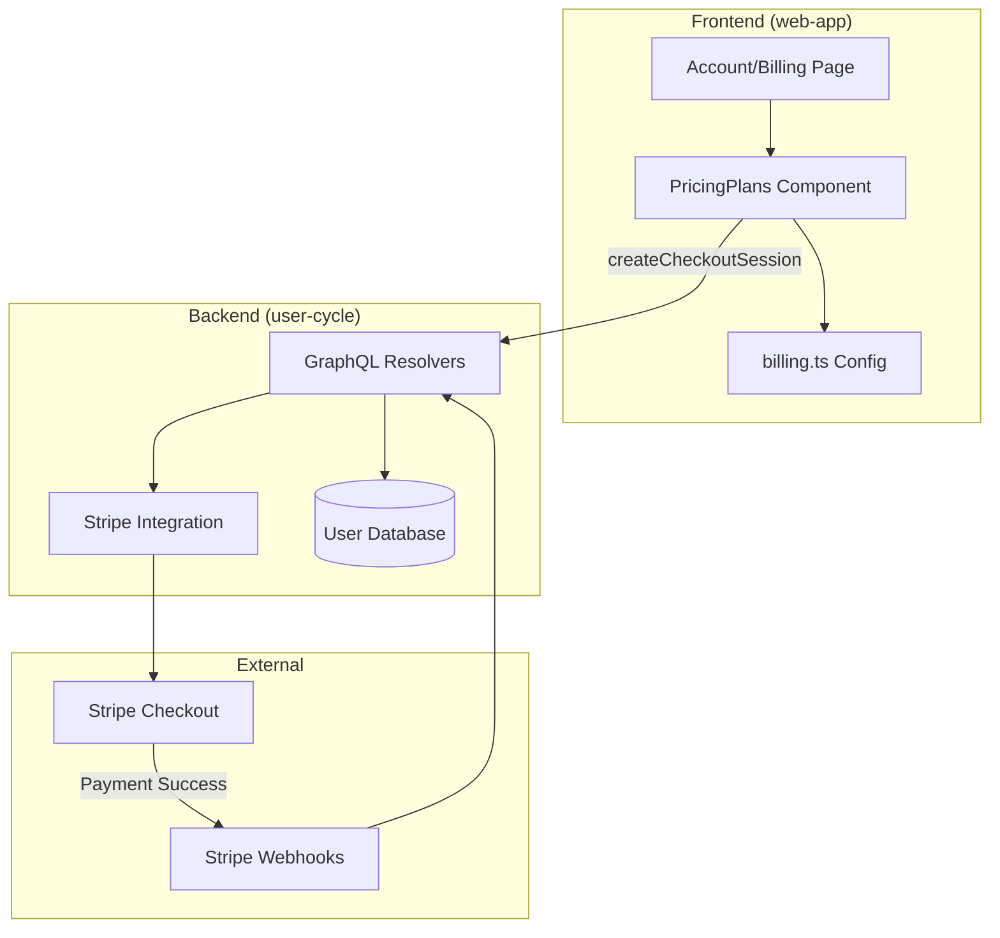
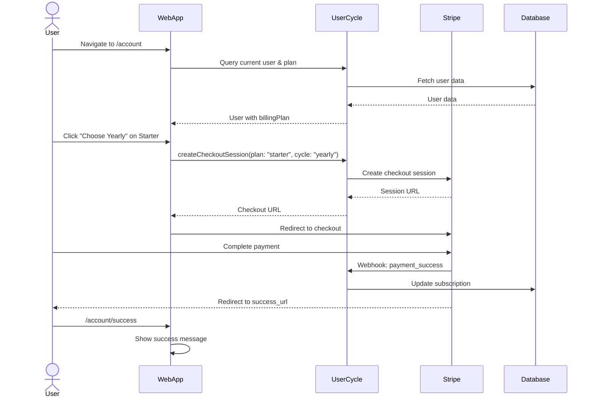
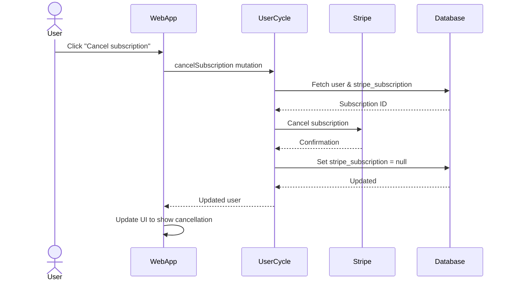

# Billing System Documentation

## Overview

The billing system in Gratheon enables users to subscribe to different pricing tiers (Free, Starter, Professional) and manage their subscriptions. The system is implemented across three repositories:
- **web-app**: Frontend user interface for billing management
- **user-cycle**: Backend GraphQL API and Stripe integration
- **website**: Public-facing pricing page

## Architecture

### System Components



## Pricing Tiers

### Free (Hobbyist)
- **Price**: Free forever
- **Features**:
  - Up to 3 hives
  - 10 frames per hive max
  - Worker bee detection
  - Queen detection
  - Public hive sharing
  - Treatment diary
- **Limitations**:
  - Low-priority AI processing
  - 1 year image retention

### Starter
- **Monthly**: €22/month
- **Yearly**: €12/month (€144/year) - **Save 45%**
- **Features**:
  - Up to 20 hives
  - 30 frames per hive
  - Cell analysis
  - Varroa counting (bottom board)
  - Hive placement planner
  - Inspection management
  - AI beekeeping assistant
- **Limitations**:
  - 1 user account
  - 2 year image retention

### Professional
- **Monthly**: €55/month
- **Yearly**: €33/month (€396/year) - **Save 40%**
- **Features**:
  - Up to 150 hives
  - Unlimited frames
  - Telemetry storage
  - Timeseries data analytics
  - Colony comparison
  - Unlimited inspections
  - Up to 20 user accounts
- **Limitations**:
  - 10 min telemetry resolution
  - 3 year image retention
- **Status**: In Development

### Flexible (Addon)
- **Price**: €100 one-time (1000 tokens, valid 1 year)
- **Purpose**: Pay-per-use infrastructure features
- **Features**:
  - Video processing & storage
  - IoT telemetry rate limits
  - SMS alerts
  - Webhook integrations
  - Extra capacity beyond tier limits
- **Status**: In Development (not shown in web-app billing selection)

### Enterprise
- **Price**: Custom pricing
- **Features**:
  - Custom integrations
  - On-premise deployment
  - 24/7 priority support
  - Advanced security
  - Unlimited scale
- **Contact**: enterprise@gratheon.com

## Implementation Details

### Frontend (web-app)

#### Configuration (`src/config/billing.ts`)
Defines all billing tiers with:
- Tier names and colors
- Monthly/yearly pricing
- Savings percentages
- Stripe price IDs

```typescript
export const BILLING_TIERS = {
  free: { name: 'Free', color: '#f0f0f0', textColor: '#666' },
  starter: {
    name: 'Starter',
    color: '#FFD900',
    monthly: { price: 22, currency: 'EUR', stripePrice: 'price_starter_monthly' },
    yearly: { 
      price: 12, 
      pricePerYear: 144, 
      currency: 'EUR', 
      savings: '45%', 
      stripePrice: 'price_starter_yearly' 
    }
  },
  // ... more tiers
}
```

#### Components

**`src/page/accountEdit/billing/index.tsx`**
- Main billing page wrapper
- Shows subscription status
- Displays expiration dates
- Cancel subscription button
- Embeds PricingPlans component

**`src/page/accountEdit/billing/pricingPlans.tsx`**
- 3-column layout: Free, Starter, Professional
- Monthly/yearly toggle per tier
- Stripe checkout integration
- Current plan indication
- Error handling

**`src/page/accountEdit/billing/pricingPlans.css`**
- Responsive grid layout
- Tier-specific colors
- Hover effects
- Mobile-responsive

### Backend (user-cycle)

#### GraphQL Schema (`schema.graphql`)
```graphql
type User {
  billingPlan: String
  hasSubscription: Boolean
  isSubscriptionExpired: Boolean
  date_expiration: DateTime
}

type BillingHistoryEvent {
  id: Int!
  userId: Int!
  eventType: String!
  billingPlan: String
  amount: Float
  currency: String
  details: String
  createdAt: String!
}

type Query {
  billingHistory: [BillingHistoryEvent]
}

type Mutation {
  createCheckoutSession(plan: String, cycle: String): URL
  cancelSubscription: CancelSubscriptionResult
}
```

#### Billing History

The billing history feature tracks all billing-related events for a user:

**Event Types**:
- `registration` - User account created
- `purchase` - Tier subscription purchased
- `cancellation` - Subscription cancelled by user
- `system_downgrade` - Auto-downgraded to free tier (e.g., payment failure)
- `upgrade` - Plan upgraded
- `downgrade` - Plan downgraded

**Model** (`src/models/billingHistory.ts`):
```typescript
export const billingHistoryModel = {
  async getByUserId(userId: number): Promise<BillingHistoryEvent[]> {
    // Fetch all events for user, ordered by createdAt DESC
  },
  
  async addRegistration(userId: number, plan: string) {
    // Track when user registers
  },
  
  async addPurchase(userId: number, plan: string, amount: number, currency: string) {
    // Track tier purchase
  },
  
  async addCancellation(userId: number, previousPlan: string) {
    // Track cancellation
  },
  
  async addSystemDowngrade(userId: number, reason: string) {
    // Track auto-downgrade to free tier
  }
}
```

**Database Table** (`billing_history`):
- `id`: Auto-increment primary key
- `user_id`: Foreign key to account table
- `event_type`: ENUM('registration', 'purchase', 'cancellation', 'system_downgrade', 'upgrade', 'downgrade')
- `billing_plan`: ENUM('free', 'starter', 'professional', 'addon', 'enterprise')
- `amount`: Decimal (payment amount)
- `currency`: VARCHAR (e.g., 'EUR')
- `details`: TEXT (JSON string with additional info)
- `created_at`: Timestamp

**UI Display**:
The billing history is shown as a timeline in the web-app `/account` page:
- Registration date
- Tier purchases with amounts
- Cancellations
- System changes (e.g., auto-downgrade on payment failure)

This replaces the need for explicit expiration warning messages - users can see their full billing timeline.

#### Resolvers (`src/resolvers.ts`)

**`createCheckoutSession`**
- Validates user authentication
- Maps plan/cycle to Stripe price ID
- Creates Stripe checkout session
- Returns checkout URL
- Supports modes: 'subscription' (starter, professional) or 'payment' (addon)

```typescript
createCheckoutSession: async (parent, { plan, cycle }, ctx) => {
  if (!ctx.uid) return err(error_code.AUTHENTICATION_REQUIRED);
  
  const user = await userModel.getById(ctx.uid);
  let priceId = getPriceIdForPlan(plan, cycle);
  let mode = plan === 'addon' ? 'payment' : 'subscription';
  
  const session = await stripe.checkout.sessions.create({
    customer_email: user.email,
    mode: mode,
    line_items: [{ price: priceId, quantity: 1 }],
    success_url: `${appUrl}/account/success`,
    cancel_url: `${appUrl}/account/cancel`,
    metadata: { plan, cycle }
  });
  
  return session.url;
}
```

**`cancelSubscription`**
- Cancels Stripe subscription
- Updates user database
- Returns updated user object

#### Configuration (`src/config/config.default.ts`)
```typescript
stripe: {
  secret: 'sk_test_...',
  webhook_secret: 'whsec_...',
  plans: {
    starter: {
      monthly: 'price_starter_monthly_placeholder',
      yearly: 'price_starter_yearly_placeholder'
    },
    professional: {
      monthly: 'price_professional_monthly_placeholder',
      yearly: 'price_professional_yearly_placeholder'
    },
    addon: {
      oneTime: 'price_addon_onetime_placeholder'
    }
  }
}
```

### Website (Public Pricing)

**`src/components/CustomPricingPage.js`**
- Public pricing page
- Shows all tiers: Hobbyist, Starter, Flexible, Professional, Enterprise
- Detailed feature lists
- Addon calculator (in development)
- Links to registration/sales

## User Flow

### Subscription Purchase Flow



### Subscription Cancellation Flow



## Database Schema

### account table (in user-cycle MySQL)
- `id`: Primary key
- `email`: User email
- `stripe_subscription`: Stripe subscription ID (nullable)
- `billing_plan`: ENUM('free', 'starter', 'professional', 'addon', 'enterprise') - Default: 'free'
- `date_expiration`: Subscription expiration date
- `date_added`: Account creation date

### billing_history table (in user-cycle MySQL)
- `id`: Auto-increment primary key
- `user_id`: Foreign key to account table
- `event_type`: ENUM('registration', 'purchase', 'cancellation', 'system_downgrade', 'upgrade', 'downgrade')
- `billing_plan`: ENUM('free', 'starter', 'professional', 'addon', 'enterprise')
- `amount`: DECIMAL(10,2) - Payment amount (nullable)
- `currency`: VARCHAR(3) - e.g., 'EUR' (nullable)
- `details`: TEXT - JSON string with additional information (nullable)
- `created_at`: TIMESTAMP - Default: CURRENT_TIMESTAMP

**Migration Files**:
- `migrations/023-create-billing-history.sql` - Creates table and backfills from account data
- `migrations/024-update-billing-plan-enum.sql` - Updates enum values from old ('base', 'pro') to new ('starter', 'professional')

## Stripe Integration

### Price IDs (Production)
Must be configured in `user-cycle/src/config/config.default.ts`:
- `price_starter_monthly`: Starter monthly plan
- `price_starter_yearly`: Starter yearly plan
- `price_professional_monthly`: Professional monthly plan
- `price_professional_yearly`: Professional yearly plan
- `price_addon_onetime`: Flexible addon one-time payment

### Webhooks
Configure in Stripe Dashboard:
- `checkout.session.completed`: Handle successful payments
- `customer.subscription.deleted`: Handle cancellations
- `customer.subscription.updated`: Handle plan changes

Webhook endpoint: `https://app.gratheon.com/webhooks/stripe`

## Environment Variables

### user-cycle
- `STRIPE_SECRET_KEY`: Stripe API secret key
- `STRIPE_WEBHOOK_SECRET`: Stripe webhook signing secret
- `JWT_KEY`: Session token signing key
- `MYSQL_HOST`, `MYSQL_USER`, `MYSQL_PASSWORD`, `MYSQL_DATABASE`: Database config

### web-app
- `VITE_API_URL`: GraphQL API endpoint (points to user-cycle)

## Security Considerations

1. **Authentication**: All billing mutations require valid JWT token in context
2. **CSRF Protection**: GraphQL mutations use POST with proper CORS
3. **Webhook Verification**: Stripe webhook signatures must be validated
4. **Price Integrity**: Prices defined server-side, not client-side
5. **Session Security**: Checkout sessions expire in 24 hours

## Testing

### Manual Testing Checklist
- [ ] Free tier displays correctly
- [ ] Starter monthly/yearly selection works
- [ ] Professional monthly/yearly selection works
- [ ] Stripe checkout redirects properly
- [ ] Success page shows after payment
- [ ] Cancel page shows if user abandons checkout
- [ ] Subscription cancellation works
- [ ] Expired subscription shows warning
- [ ] Current plan badge displays correctly

### Stripe Test Cards
- Success: `4242 4242 4242 4242`
- Decline: `4000 0000 0000 0002`
- 3D Secure: `4000 0027 6000 3184`

## Known Issues & Future Improvements

### Completed Features
- ✅ Billing history tracking (registration, purchase, cancellation events)
- ✅ Auto-downgrade to free tier on payment failure
- ✅ No hard paywalls - users maintain app access
- ✅ Updated pricing structure (45% yearly discount for Starter, 40% for Professional)
- ✅ Clean tier selection UI with current plan indicator
- ✅ Database enum migration (from 'base'/'pro' to 'starter'/'professional')

### Current Work In Progress
- 🚧 Billing history timeline UI in web-app
- 🚧 Remove flexible tier from web-app selection (keep on website only)
- 🚧 Feature-level access control (replacing hard paywalls)
- 🚧 Improve tier selection visual design

### Planned Features
- Subscription upgrade/downgrade flow
- Usage tracking for Flexible addon
- Invoice history in account page
- Payment method management
- Multi-currency support
- Enterprise custom contracts
- Prorated billing for plan changes
- Subscription renewal reminders

### Feature-Level Blocking Strategy

Future implementation will check features individually:

```typescript
// Example feature check
const { hasAccess, requiredTier } = useFeatureAccess('cell-analysis')

if (!hasAccess) {
  return (
    <UpgradePrompt 
      feature="Cell Analysis" 
      requiredTier={requiredTier}
      description="Analyze honeycomb cells and track resources"
    />
  )
}
```

Benefits:
- Users discover features naturally
- Contextual upgrade prompts show value
- Better UX than blocking entire app
- Clear feature-to-tier mapping

## Deployment Notes

### web-app
1. Build: `npm run build`
2. Environment: Set `VITE_API_URL` to production user-cycle URL
3. Deploy static files to CDN/hosting

### user-cycle
1. Set production Stripe keys in config
2. Configure Stripe webhook URL
3. Deploy GraphQL service
4. Verify database migrations

### website
1. Update pricing page if tiers change
2. Rebuild Docusaurus: `npm run build`
3. Deploy static site

## Support & Troubleshooting

### Common Issues

**"Checkout session could not be created"**
- Check Stripe API keys are correct
- Verify price IDs exist in Stripe Dashboard
- Check server logs for API errors

**"Subscription has expired"**
- User needs to renew subscription
- Check `date_expiration` in database
- Verify Stripe subscription status

**Webhook not firing**
- Verify webhook URL in Stripe Dashboard
- Check webhook secret is correct
- Inspect Stripe webhook logs

## Contact

- Technical Issues: Create issue in respective repo
- Billing Support: support@gratheon.com
- Enterprise Sales: enterprise@gratheon.com

