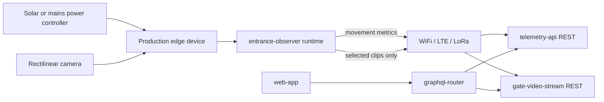

This page compares future hardware paths for a production Entrance Observer that should keep the same user-facing functionality as the current Jetson Orin prototype:

- capture hive entrance video;
- detect and track bees locally;
- send direction-aware bee traffic telemetry to Gratheon;
- upload selected clips for playback, audits, and model improvement;
- operate reliably in an outdoor apiary with weak network connectivity;
- reduce energy enough to support solar-powered autonomous deployments.

## Recommendation summary

Use **Jetson Orin Nano** as the reference development platform until model quality and tracking behavior are stable, but do **not** assume it is the best production device. The production decision must be based on four independent axes:

1. **AI efficiency for our model** - FPS per watt and count accuracy for the current custom bee detector/tracker.
2. **Video compression** - preferably hardware H.265/HEVC for selected diagnostic clips.
3. **Energy profile** - average Wh/day with night sleep, event-triggered upload, and cellular modem duty cycling.
4. **Connectivity mode** - WiFi for urban/apiary-with-internet mode, LTE/GSM or LoRa telemetry mode for field deployments.

The likely production path is:

1. **Now - reference platform:** Jetson Orin Nano Super Developer Kit for model iteration and debugging.
2. **Next - cost-down AI prototype:** Raspberry Pi 5 + AI HAT+ 26 TOPS with the same `entrance-observer` API contract.
3. **Next - bandwidth/solar prototype:** evaluate a platform with hardware H.265 encode, or add an external camera/encoder module, because Jetson Orin Nano does not include NVENC.
4. **Later - two product SKUs:** an urban WiFi/video SKU and a field solar telemetry-first SKU.

## Current model and workload

The current `entrance-observer` repository gives us a concrete workload to benchmark instead of comparing theoretical TOPS only.

| Workload item | Current state | Production implication |
| --- | --- | --- |
| Detector | Current checkpoint is a YOLOv8n-derived custom bee detector trained as one class (`bee`) from `weights/best.pt`; README calls it YOLO 11 custom bee weights. Checkpoint metadata: `imgsz=640`, 129 layers, 3,011,043 parameters, 8.2 GFLOPs, about 6 MB `.pt`. | This is a small detector and a good candidate for TensorRT and HailoRT conversion. Benchmark the exact model, not generic YOLO marketing numbers. |
| Tracker | Ultralytics `model.track(..., persist=True)` with track history. | Production benchmark must include detection + tracking + counting, not detector-only FPS. |
| Count logic | Line or rectangle crossing, producing `bees_in`, `bees_out`, `detected_bees`, `net_flow`, speed metrics, interactions, and track history. | Telemetry payload is tiny. Full video is optional and should not be required for field mode. |
| Capture defaults | Runtime defaults are 640x480@30 FPS; README also mentions tested 1280x720@15 FPS over USB2 on Jetson Orin Nano. | Use 720p/15 FPS and 640x480/30 FPS as first benchmark points. |
| Upload video defaults | Detection upload video defaults to 320x240, chunk length defaults to 20s in code, README examples mention 30-60s. | Upload clips should be downscaled and capped in FPS. Raw capture resolution should be independent from upload resolution. |
| Bandwidth optimization already present | Skips video upload when no bees were incoming/outgoing. Night sleep defaults to 22:00-06:00 / day 06:00-22:00. | Field mode should extend this: upload telemetry always, upload video only on sampled events/anomalies/manual request. |

## AI efficiency benchmark plan for our model

We need to pull AI efficiency from actual device measurements. The table below defines what to measure and how the result should be used.

| Metric | How to measure | Why it matters | Production target |
| --- | --- | --- | --- |
| Detector + tracker FPS | Run the same representative video set through `entrance-observer`, including `model.track`, overlays off, telemetry on. | Generic TOPS does not include tracker overhead. | Sustained FPS above the minimum needed for reliable bee crossing direction. Start target: 15 FPS at 720p or 30 FPS at 640x480. |
| FPS/W | Measure wall power with a USB-C/PoE inline meter while processing fixed clips. | Solar sizing depends on real power, not board TDP. | Prefer at least 2x better FPS/W than Jetson reference before switching production platform. |
| Joules per 20s chunk | Power meter Wh delta while processing one chunk. | Directly maps to energy per observation window. | Optimize chunk scheduling and sleep around this number. |
| Count accuracy per watt | Compare `bees_in/out` against labelled clips and divide by average system watts. | A fast but inaccurate low-power system is not useful. | Select lowest Wh/day device that meets product accuracy tolerance. |
| CPU headroom | Track CPU load while camera capture, AI, telemetry, video encode, and upload run together. | H.265 software encode can starve tracking/upload on small boards. | Keep enough headroom for watchdog, retry queue, modem, and local web UI. |
| Thermal stability | Run 4-8h in enclosure-like temperature. | Solar field units will be sealed and hot. | No thermal throttling that changes count accuracy. |

### Expected AI efficiency by platform

This is a decision-support table, not a substitute for benchmarks on our clips.

| Platform | AI runtime for our detector | Expected efficiency | Main risk for our model | Decision |
| --- | --- | --- | --- | --- |
| Jetson Orin Nano Super | TensorRT/CUDA via Ultralytics export path | High AI headroom, moderate-to-high system power | Great AI but weak video-encoding story because Orin Nano lacks NVENC. | Keep as reference and premium dev platform. |
| Raspberry Pi 5 + AI HAT+ 26 TOPS | ONNX/TFLite to HailoRT | Likely best cost/power candidate if conversion succeeds | Hailo compiler/operator support and tracker CPU overhead. | Build next prototype. |
| Raspberry Pi 5 + AI HAT+ 13 TOPS | HailoRT | Lower power/cost, less headroom | May be too tight for robust tracking at target FPS. | Test only after 26 TOPS works. |
| RK3588 NPU board | RKNN | Potentially low cost and decent power | Tooling/operator support and maintainability. | Third priority after Hailo. |
| Coral TPU | TFLite Edge TPU | Very low power for supported models | Current YOLO-style model may require major conversion/simplification. | Only for a simplified telemetry-only model. |
| MCU/NPU smart camera | Vendor-specific | Could be best long-term solar option | High integration cost and model lock-in. | Research after dataset/model stabilizes. |

## Video encoding and bandwidth

The product should not stream continuous video. It should upload telemetry continuously and upload short clips only for debugging, user review, model improvement, or anomalies.

Important hardware finding: **Jetson Orin Nano does not have the NVIDIA NVENC engine**. NVIDIA documents software encode for Orin Nano. That means Jetson Orin Nano is excellent for AI, but not automatically excellent for low-power H.265/H.264 video compression.

### Codec strategy

| Mode | Video behavior | Codec target | Network assumption | Product use |
| --- | --- | --- | --- | --- |
| Urban WiFi mode | Upload selected detection clips; allow higher sampling. | H.265 preferred, H.264 acceptable. | WiFi or Ethernet available. | User playback, model QA, installation debugging. |
| Field LTE/GSM mode | Upload telemetry always; upload only low-res sampled clips or anomalies. | H.265 strongly preferred if hardware encode exists. | Metered mobile data. | Remote apiary monitoring without high data bills. |
| LoRa telemetry mode | No video upload by default; only movement buckets and health. | None, video stored locally if storage exists. | LoRaWAN/private LoRa or very constrained link. | Solar autonomous telemetry-only deployment. |
| Service visit mode | Store full-quality clips locally for later download. | Any local efficient format. | Technician has local WiFi/USB access. | Model retraining and diagnostics without cellular data. |

### Encoding comparison

| Platform | Hardware H.265 encode suitability | Impact on Entrance Observer |
| --- | --- | --- |
| Jetson Orin Nano | Poor for hardware encode: no NVENC. H.264 software encode is documented by NVIDIA. H.265 software encode would add CPU/power load. | Use for AI reference, but avoid relying on it for solar video-heavy deployments. Upload smaller/fewer clips or pair with an external encoder/camera. |
| Jetson Orin NX / AGX Orin class | Better candidate because higher Orin families include NVENC-class hardware encode support. | More expensive, but better for a premium video SKU if we need local AI + efficient video compression. |
| Raspberry Pi 5 + Hailo | AI accelerator separate from video pipeline. H.265 encode support must be verified for the exact camera/OS pipeline. | Good cost-down AI candidate, but video encode must be benchmarked independently. |
| RK3588 board | Often attractive for media pipelines with hardware codecs and integrated NPU. | Worth testing if Hailo conversion fails or if H.265 is more important than AI headroom. |
| IP camera module with onboard H.265 | Camera handles video encode; edge device handles AI from decoded frames or secondary stream. | Strong option for bandwidth but can complicate frame access, latency, power, and enclosure integration. |

### Bandwidth policy

| Policy | Urban WiFi default | Field solar default |
| --- | --- | --- |
| Telemetry | Upload every chunk or every 1-5 minutes. | Upload every chunk summary or batch every 5-15 minutes. |
| Clip resolution | 640x480 or 720p for selected clips. | 320x240 or 480p only when needed. |
| Clip FPS | 10-15 FPS enough for review. | 2-10 FPS depending on event severity. |
| Clip trigger | Movement present, user debug, random QA sampling. | Anomaly, large traffic change, manual request, low-rate sampling. |
| Local retention | 1-7 days depending on storage. | 7-30 days if storage allows, delete oldest first. |
| Upload retry | Immediate when connected. | Batch and backoff to protect modem energy/data. |

## Energy and solar autonomy

Solar autonomy should be designed around **average Wh/day**, not peak watts. The current app already sleeps at night and skips empty video uploads; production should deepen this into explicit power modes.

### Power modes

| Mode | Camera | AI | Network | Video upload | Purpose |
| --- | --- | --- | --- | --- | --- |
| Active observation | On | On | WiFi/LTE on or periodic | Selected clips | Daytime bee traffic monitoring. |
| Telemetry-only active | On or low FPS | On at reduced FPS | Periodic | Off | Field mode when energy/data budget is low. |
| Idle/day low traffic | Low FPS or periodic sampling | Burst only | Off except heartbeat | Off | Save power during low traffic. |
| Night sleep | Off | Off | Off except optional heartbeat | Off | Bees are not visible and app already supports night sleep. |
| Maintenance | On | On | Local WiFi AP / SSH | Optional | Installation and service visit. |

### Solar sizing checklist

| Design input | Why it matters | Initial target to validate |
| --- | --- | --- |
| Average active watts | Dominates panel and battery size. | Measure per platform with camera + AI + telemetry. |
| Active hours/day | Bee activity is daytime, not 24h. | Start with 16h active, 8h night sleep from current defaults; tune by season/location. |
| Sleep watts | Solar autonomy fails if standby is too high. | Target sub-watt sleep for field SKU if hardware supports it. |
| Modem burst watts | LTE can spike current during attach/upload. | Use supercapacitor/battery sizing and batch uploads. |
| Worst-case sunless days | Determines battery. | 2-3 days for hobby/urban, 5+ days for remote paid field units. |
| Winter solar insolation | Estonia/northern climates are harsh. | Field SKU may need aggressive telemetry-only winter mode. |

### Energy-oriented hardware ranking

| Candidate | AI | Video encode | Connectivity | Solar fit | Notes |
| --- | --- | --- | --- | --- | --- |
| Raspberry Pi 5 + AI HAT+ 26 TOPS | Good if Hailo conversion works | Must verify H.265/H.264 encode path | WiFi built in, LTE/LoRa via USB/HAT | Medium-good | Best near-term cost-down prototype. Need careful power tuning. |
| Jetson Orin Nano | Excellent AI headroom | Weak H.265 story due no NVENC | WiFi/Ethernet/LTE USB | Medium-poor for video-heavy solar | Good reference, not ideal for autonomous video. |
| RK3588 board | Medium AI | Potentially strong media codecs | WiFi/LTE/LoRa varies | Medium-good | More integration risk, but attractive if video encode is central. |
| Hailo/vision processor smart camera | Good for fixed model | Often onboard H.265 | Ethernet/WiFi/LTE varies | Good | Best long-term integrated product direction if vendor lock-in is acceptable. |
| Telemetry-only MCU + LoRa plus local camera storage | Minimal AI unless using tiny model | No cloud video | LoRa | Excellent | Use only if bee counts can be produced by a simplified low-power model or external event sensor. |

## Connectivity variants

We likely need two product modes because bandwidth and power requirements are very different.

### Urban WiFi/video SKU

| Component | Recommendation | Why |
| --- | --- | --- |
| Network | WiFi 5/6 or Ethernet; optional local AP setup mode. | Cheap, higher bandwidth, easier debugging. |
| Uploads | Telemetry + selected video clips. | Supports user playback and model QA. |
| Compute | Jetson Orin Nano for dev/premium, Pi 5 + Hailo for production cost-down. | AI quality first, then cost. |
| Storage | 128-256 GB NVMe or high-endurance SD/eMMC. | Local clip retention and retry queue. |
| Power | Mains/USB-C/PoE preferred. | Video uploads and local UI are less constrained. |

### Field solar telemetry SKU

| Component | Recommendation | Why |
| --- | --- | --- |
| Network | LTE-M/NB-IoT/4G for telemetry and rare clips; LoRa/LoRaWAN for telemetry-only deployments. | Remote apiaries often lack WiFi. |
| Uploads | Telemetry always, clips rarely. | Saves data and energy. |
| Compute | Lowest-power platform that passes count accuracy. Hailo 26 TOPS or integrated smart camera first. | Solar budget is the product constraint. |
| Storage | Local ring buffer for clips and JSONL telemetry. | Upload only when network/energy allows. |
| Power | Solar panel + MPPT charger + LiFePO4 battery + load switch/watchdog. | Safer chemistry and better field autonomy. |
| Firmware policy | Batch telemetry, modem off between uploads, adaptive FPS, winter/low-battery mode. | Energy autonomy requires software control, not just bigger battery. |

## Camera and optics

The current USB 4K camera is useful for prototyping, but production should avoid fisheye optics. The README explicitly notes that dual CSI cameras could work, but optics quality was insufficient because of too much fisheye.

### Camera requirements

| Requirement | Target | Why |
| --- | --- | --- |
| Lens type | Rectilinear, not fisheye; horizontal FOV roughly 45-80 degrees depending on mounting distance. | Bee movement direction and size should not distort heavily near edges. |
| Focus | Manual lock or reliable autofocus with fixed focus after setup. | Autofocus hunting can break detection. |
| Sensor | Good daylight dynamic range; global shutter is a plus but not mandatory for first product. | Entrances have shadows, sun patches, and fast motion. |
| Resolution | Capture 720p-1080p for AI; 4K only if needed for future Varroa/parasite detail. | 4K increases bandwidth, storage, and compute. |
| Interface | USB UVC for prototype, CSI/MIPI or industrial USB for production. | UVC is easy; CSI is lower integration and cable complexity once fixed. |
| Weather | Separate optical window, gasket, anti-glare angle, replaceable cover. | Outdoor lens covers get dirty, wet, and scratched. |

### Camera options

| Option | Pros | Cons | Fit |
| --- | --- | --- | --- |
| Current MOKOSE 4K USB + manual varifocal lens | Good prototype control, Linux UVC, adjustable FOV, not fisheye if lens is chosen well. | Bulky, retail BOM cost, USB cable/weatherproofing. | Keep for reference and model data collection. |
| Raspberry Pi Camera Module 3 standard 75 degree | Cheap, 12MP IMX708, autofocus, HDR, official ecosystem, not the 120 degree wide version. | Smaller sensor/lens, CSI cable/enclosure work, avoid Wide variant for distortion. | Good Pi/Hailo production prototype. |
| Raspberry Pi HQ camera + C/CS lens | Better optics control, interchangeable lenses, can choose rectilinear lens. | Larger and more expensive than Camera Module 3. | Best Pi-based image quality prototype. |
| Industrial UVC camera with C/CS mount | Good Linux compatibility and optics; can use locked focus/iris. | More expensive. | Good premium production candidate. |
| H.265 IP camera module | Onboard compression and weatherproof camera variants exist. | AI frame access/latency can be harder; may force network camera pipeline. | Good for video-centric SKU, risky for tight AI loop. |
| Wide/fisheye CSI camera | Large scene coverage. | Distortion hurts counting and tracking at entrance edges. | Avoid unless calibrated and undistorted before inference. |

## Enclosure, cover, and product components

A production unit is not just compute + camera. Outdoor reliability will be driven by enclosure, optics window, condensation control, power, and serviceability.

### Recommended enclosure concept

Use a **UV-stabilized polycarbonate or ASA outdoor enclosure** with gasketed lid, cable glands, and a replaceable optical window. Target **IP65 minimum** for rain/dust; use **IP67** only if submersion risk exists because it increases design complexity and condensation risk.

| Component | Recommendation | Notes |
| --- | --- | --- |
| Main enclosure | UV-stabilized polycarbonate/ASA, IP65 or better, light color. | Light color reduces solar heating. Polycarbonate is impact resistant. |
| Optical window | Replaceable flat acrylic/polycarbonate or glass window, tilted slightly downward. | Flat and angled window reduces distortion and rain/glare. Avoid curved dome unless optically corrected. |
| Lens hood | Small hood or shade above optical window. | Reduces rain drops and direct sun reflections. |
| Cable entry | IP-rated cable glands and strain relief. | USB/CSI/power/network cables fail first outdoors. |
| Condensation | Vent membrane plus desiccant service pack. | Fully sealed boxes still breathe with temperature changes. |
| Thermal path | Heat spreader or metal backplate for compute, avoid direct sun. | Needed for Jetson/Hailo inside sealed box. |
| Mount | Adjustable bracket with locking angle and hive adapter plate. | Camera alignment is critical for tracking regions. |
| Serviceability | External status LED, QR/device ID label, removable cover/window. | Field support must be possible without opening electronics every time. |

### Product BOM blocks

| Block | Urban WiFi/video SKU | Field solar telemetry SKU |
| --- | --- | --- |
| Compute | Jetson Orin Nano or Pi 5 + Hailo. | Pi 5 + Hailo or lower-power integrated vision module if benchmark passes. |
| Camera | Rectilinear USB/CSI camera, 720p-1080p AI capture. | Rectilinear CSI/industrial camera, lower FPS, strong daylight performance. |
| Network | WiFi/Ethernet. | LTE-M/NB-IoT/4G or LoRa telemetry, modem power switching. |
| Storage | NVMe/high-endurance SD, larger retention. | Smaller high-endurance storage, ring buffer. |
| Power | USB-C mains or PoE. | Solar panel, MPPT, LiFePO4 battery, fuse, load switch. |
| Enclosure | IP65 with optical window and cable glands. | IP65/IP67 class, vent membrane, better thermal and condensation handling. |
| Software mode | Higher video sampling, easy remote debugging. | Telemetry-first, adaptive FPS, rare video upload, aggressive sleep. |

## Production architecture target

The cloud APIs should stay the same regardless of edge hardware. Production hardware should only replace the edge implementation behind the existing contracts.

Keep these interface boundaries stable:

| Boundary | Production requirement |
| --- | --- |
| Camera to edge app | Abstract capture source so USB UVC, CSI camera, IP camera, and Pi camera can be swapped. |
| Model runtime | Abstract inference backend so TensorRT, HailoRT, ONNX Runtime, RKNN, or vendor smart-camera runtime can be selected per device. |
| Metrics upload | Keep the same `telemetry-api` schema for bee movement buckets. |
| Video upload | Keep `gate-video-stream` upload/playback optional and event-triggered. |
| Device management | Keep device ID, hive ID, health telemetry, logs, update state, energy state, and network state independent from hardware vendor. |
| Connectivity profile | Support WiFi/video and field telemetry profiles with the same app contract. |

## Evaluation plan

### 1. Freeze benchmark input

Create a representative video set from the Jetson prototype:

- sunny, cloudy, rain, and low-light entrances;
- high and low bee traffic;
- clean and dirty cover/lens states;
- at least one hive with challenging shadows or reflections;
- at least one clip captured through the candidate product optical window.

### 2. Define acceptance metrics

Minimum production acceptance should include:

| Metric | Target |
| --- | --- |
| Bee movement count error | Within product-defined tolerance versus labelled clips. |
| Direction accuracy | High enough to distinguish entrance vs exit trends reliably. |
| Sustained FPS | Enough for the entrance geometry and bee speed, measured at target resolution. |
| FPS/W and Wh/day | Low enough for solar sizing in field SKU. |
| Video bytes/event | Low enough for LTE monthly budget when clips are enabled. |
| Offline operation | Buffer telemetry and selected clips during network loss. |
| Serviceability | Remote logs, health checks, watchdog, reproducible OS image, and local maintenance mode. |

### 3. Port the model/runtime

- Export current `weights/best.pt` from the reference pipeline to ONNX.
- Convert and benchmark TensorRT on Jetson as the reference optimized runtime.
- Convert and benchmark HailoRT for Raspberry Pi AI HAT+ 26 TOPS.
- Test hardware/video encode paths separately from AI runtime.
- Only evaluate RKNN/Coral after the Hailo path is measured.

### 4. Compare total assembled cost

Do not compare only board prices. Include:

- compute board and accelerator;
- camera and lens;
- hardware encoder or camera encoder if needed;
- storage;
- power supply and protection;
- networking/modem/antenna;
- solar panel, MPPT, and battery for field SKU;
- enclosure, optical window, seals, vents, and cables;
- assembly and flashing time;
- expected support burden.

## Decision matrix for production

| If benchmark result is... | Choose... | Reason |
| --- | --- | --- |
| Hailo 26 TOPS matches Jetson count accuracy/FPS and video encode is acceptable | Raspberry Pi 5 + AI HAT+ 26 TOPS | Best near-term cost-efficient path. |
| Hailo matches AI but video encode is weak | Pi/Hailo + lower video policy or external/on-camera H.265 | Keep low AI cost while solving bandwidth separately. |
| Jetson is much more accurate or easier to maintain | Jetson Orin for early production | Ship reliability first, continue cost-down in parallel. |
| Video upload becomes central product requirement | Jetson Orin NX/AGX or media-focused platform with hardware H.265 | Orin Nano lacks NVENC; don't force software encode into solar product. |
| Field solar budget cannot support SBC-class compute | Telemetry-first SKU with aggressive duty cycling or integrated vision processor | Product may need two hardware classes. |
| Simple model is sufficient after field validation | Evaluate RK3588/Coral/integrated smart camera | Potential cost-down only after model is proven small. |

## Open questions

- What is the minimum acceptable FPS and resolution for reliable bee direction tracking?
- Does the product require video playback in field mode, or is telemetry enough?
- What monthly data budget is acceptable for LTE deployments?
- How many sunless days should the solar SKU survive in target countries?
- Should production hardware support one entrance only, or multiple cameras/entrances per device?
- Is night or low-light observation required, and if yes, what illumination is acceptable near bees?
- Should the production kit be DIY, pre-assembled Gratheon hardware, or both?

## Sources checked

- Current `entrance-observer` README and source: custom YOLO 11 bee detector, tracking/counting metrics, 640x480 defaults, 320x240 detection upload defaults, night sleep, skip empty uploads.
- NVIDIA Jetson Orin Nano Super Developer Kit product page: $249 class device and 67 TOPS marketing specification.
- NVIDIA Jetson Linux documentation: Jetson Orin Nano does not have NVENC and uses software encode guidance.
- NVIDIA Jetson power/performance documentation: Orin power management and sleep states.
- Raspberry Pi AI Kit page: 13 TOPS Hailo-8L module, now replaced for new customers by Raspberry Pi AI HAT+.
- Raspberry Pi AI HAT+ announcement: 13 TOPS Hailo-8L at $70 and 26 TOPS Hailo-8 at $110, with PCIe Gen 3.0 mode.
- Raspberry Pi Camera Module 3 page: 12MP IMX708, autofocus, HDR, 75 degree standard / 120 degree wide options, 1080p50 and 720p120.
- Hailo-8 M.2 product page: 26 TOPS AI acceleration module class.
- Radxa ROCK 5 documentation: RK3588 SBC family for lower-cost NPU experiments.
- Google Coral documentation: Edge TPU platform for very-low-power edge AI, but with constrained model support.
- Waveshare SIM7600G-H docs: LTE/GNSS modem class for Jetson/Raspberry Pi style edge devices.
- Outdoor enclosure references: IP65/IP67 polycarbonate/UV-stabilized enclosures and the design trade-off between weather resistance, heat, and condensation.
