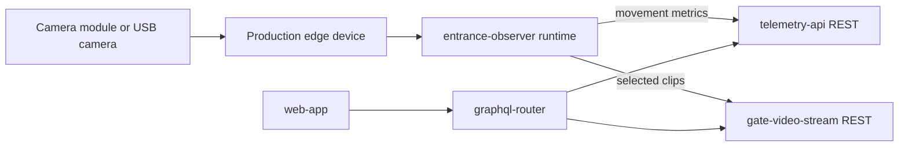

This page compares future hardware paths for a production Entrance Observer that should keep the same user-facing functionality as the current Jetson Orin prototype:

- capture hive entrance video;
- detect and track bees locally;
- send direction-aware bee traffic telemetry to Gratheon;
- upload selected clips for playback, audits, and model improvement;
- operate reliably in an outdoor apiary with weak network connectivity.

## Recommendation summary

Use **Jetson Orin Nano** as the reference development platform until model quality and throughput are stable. In parallel, prototype **Raspberry Pi 5 + Raspberry Pi AI HAT+ 26 TOPS (Hailo-8)** as the main cost-reduction candidate.

The likely production path is:

1. **Now - reference platform:** Jetson Orin Nano Super Developer Kit for fast model iteration and debugging.
2. **Next - cost-down prototype:** Raspberry Pi 5 + AI HAT+ 26 TOPS with a fixed camera module and the same API contract.
3. **Later - production design:** custom carrier/enclosure around either a Hailo-based module or a Jetson production module, selected by measured model accuracy, FPS, power, and total assembled cost.

## Candidate comparison

| Option | AI capability | Approx. compute hardware cost | Strengths | Risks | Fit for Entrance Observer |
| --- | ---: | ---: | --- | --- | --- |
| Jetson Orin Nano Super Developer Kit | Up to 67 TOPS class, CUDA/TensorRT | $249 dev kit | Best development velocity, mature NVIDIA vision stack, enough headroom for heavier models and multi-stage pipelines. | Higher cost and power than the minimum needed for a single camera. Developer kit is not final production hardware. | Best reference platform and premium/industrial option. |
| Raspberry Pi 5 + AI HAT+ 26 TOPS | 26 TOPS Hailo-8 | Pi 5 + $110 HAT+ plus storage/cooling | Lower cost, good availability, low power, official Pi camera/software ecosystem, strong path to community DIY kits. | Requires Hailo model conversion and validation; less flexible than CUDA for arbitrary model changes. | Best cost-efficient production candidate if the model runs accurately on Hailo. |
| Raspberry Pi 5 + AI HAT+/AI Kit 13 TOPS | 13 TOPS Hailo-8L | Pi 5 + lower-cost Hailo accelerator | Cheaper than 26 TOPS, still integrated with Pi camera stack. | May be too tight for robust detection/tracking at useful FPS or with multiple models. The older AI Kit is no longer the recommended new purchase path. | Good low-cost experiment, but only production-fit if measured FPS/accuracy are sufficient. |
| RK3588 boards, e.g. Radxa ROCK 5 class | Around 6 TOPS NPU | Often lower than Jetson | Attractive board cost, integrated NPU, multiple camera/display interfaces. | Software ecosystem and model tooling are more fragmented; NPU operator support can constrain model choice. | Worth evaluating after the Hailo path, mainly for aggressive cost-down. |
| Google Coral Edge TPU USB/M.2 | About 4 TOPS per accelerator | Low accelerator cost when available | Very low power and proven TensorFlow Lite path. | Limited model/operator support and lower TOPS; availability has historically varied. | Not ideal for the current tracker unless the model is simplified heavily. |
| Cloud-only processing | Server GPU | Low edge hardware, high recurring cost | Simplifies edge device and enables heavy models. | High bandwidth, latency, privacy, and recurring video processing/storage cost; weak fit for remote apiaries. | Use only as fallback/reprocessing, not as the default product architecture. |
| Phone-based observer | Mobile NPU/GPU varies | Customer-provided phone | Camera, screen, battery, modem, and app update channel are built in. | Too much device variability, weatherproofing and mounting problems, OS lifecycle limitations. | Useful demo path, not reliable production hardware. |

## Why Raspberry Pi 5 + Hailo is the main cost-down candidate

Raspberry Pi's AI Kit/HAT+ ecosystem is designed for camera-connected edge inference. The retired AI Kit page documents a 13 TOPS Hailo-8L module integrated with Raspberry Pi 5 camera software, while Raspberry Pi announced the AI HAT+ line with both 13 TOPS and 26 TOPS variants. The 26 TOPS Hailo-8 option gives a better chance of matching the current Jetson prototype while reducing BOM and power.

The critical technical question is not theoretical TOPS. It is whether our specific detector/tracker can be converted and run with acceptable:

- bee detection precision/recall;
- direction classification accuracy;
- frames per second at target resolution;
- latency under outdoor lighting variation;
- CPU load left for video buffering, uploads, health checks, and remote diagnostics.

## Production architecture target

The cloud APIs should stay the same regardless of edge hardware. Production hardware should only replace the edge implementation behind the existing contracts.

Keep these interface boundaries stable:

| Boundary | Production requirement |
| --- | --- |
| Camera to edge app | Abstract capture source so USB UVC, CSI camera, and Pi camera can be swapped. |
| Model runtime | Abstract inference backend so TensorRT, HailoRT, ONNX Runtime, or RKNN can be selected per device. |
| Metrics upload | Keep the same `telemetry-api` schema for bee movement buckets. |
| Video upload | Keep the same `gate-video-stream` upload/playback contract for clips. |
| Device management | Keep device ID, hive ID, health telemetry, logs, and update state independent from hardware vendor. |

## Evaluation plan

### 1. Freeze benchmark input

Create a representative video set from the Jetson prototype:

- sunny, cloudy, rain, and low-light entrances;
- high and low bee traffic;
- clean and dirty cover/lens states;
- at least one hive with challenging shadows or reflections.

### 2. Define acceptance metrics

Minimum production acceptance should include:

| Metric | Target |
| --- | --- |
| Bee movement count error | Within product-defined tolerance versus labelled clips. |
| Direction accuracy | High enough to distinguish entrance vs exit trends reliably. |
| Sustained FPS | Enough for the entrance geometry and bee speed, measured at target resolution. |
| Offline operation | Buffer telemetry and selected clips during network loss. |
| Power | Low enough for outdoor enclosure thermals and future solar/battery options. |
| Serviceability | Remote logs, health checks, watchdog, and reproducible OS image. |

### 3. Port the model/runtime

- Export the reference model from the Jetson pipeline to ONNX where possible.
- Convert and benchmark TensorRT on Jetson as the reference optimized runtime.
- Convert and benchmark HailoRT for Raspberry Pi AI HAT+.
- Only evaluate RKNN/Coral after the Hailo path is measured.

### 4. Compare total assembled cost

Do not compare only board prices. Include:

- compute board and accelerator;
- camera and lens;
- storage;
- power supply and protection;
- networking;
- enclosure, mounting, seals, and cables;
- assembly and flashing time;
- expected support burden.

## Decision matrix for production

| If benchmark result is... | Choose... | Reason |
| --- | --- | --- |
| Hailo 26 TOPS matches Jetson accuracy/FPS | Raspberry Pi 5 + AI HAT+ 26 TOPS | Best cost-efficient path with official ecosystem and lower power. |
| Hailo works but has tight headroom | Keep Jetson Orin Nano for early production, continue model compression | Avoid shipping unreliable counts while improving model/runtime. |
| Model needs CUDA-specific operators or heavier pipeline | Jetson Orin production module/carrier | Higher BOM, but lower engineering risk and better model flexibility. |
| Simple model is sufficient after field validation | Evaluate RK3588 or Coral | Potential cost-down only after model is proven small. |
| Network is strong and edge cost must be minimal | Hybrid/cloud fallback for selected customers | Still avoid default cloud-only due to bandwidth and recurring cost. |

## Open questions

- What is the minimum acceptable FPS and resolution for reliable bee direction tracking?
- Should production hardware support one entrance only, or multiple cameras/entrances per device?
- Is night or low-light observation required, and if yes, what illumination is acceptable near bees?
- How much local video retention is required when the apiary is offline?
- Should the production kit be a DIY kit, a pre-assembled Gratheon device, or both?

## Sources checked

- NVIDIA Jetson Orin Nano Super Developer Kit product page: $249 class device and 67 TOPS marketing specification.
- Raspberry Pi AI Kit page: 13 TOPS Hailo-8L module, now replaced for new customers by Raspberry Pi AI HAT+.
- Raspberry Pi AI HAT+ announcement/search result: 13 TOPS and 26 TOPS variants, with 26 TOPS Hailo-8 at $110.
- Hailo-8 M.2 product page: 26 TOPS AI acceleration module class.
- Radxa ROCK 5 documentation: RK3588 SBC family for lower-cost NPU experiments.
- Google Coral documentation: Edge TPU platform for very-low-power edge AI, but with more constrained model support.
