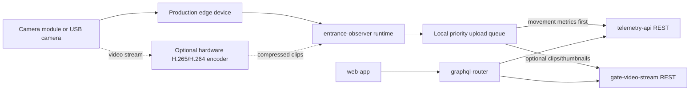

This page compares future hardware paths for a production Entrance Observer that should keep the same user-facing functionality as the current Jetson Orin prototype:

- capture hive entrance video;
- detect and track bees locally;
- send direction-aware bee traffic telemetry to Gratheon;
- upload selected clips for playback, audits, and model improvement;
- operate reliably in an outdoor apiary with weak network connectivity;
- reduce energy far enough that a solar-powered version becomes possible.

## Recommendation summary

Use **Jetson Orin Nano** as the reference development platform until model quality and throughput are stable. In parallel, prototype **Raspberry Pi 5 + Raspberry Pi AI HAT+ 26 TOPS (Hailo-8)** as the main cost-reduction and lower-power candidate.

For production, split the product into two connectivity/energy profiles instead of forcing one device to do everything:

1. **Urban / powered / WiFi model** - edge AI + selected H.265/H.264 video clip upload + web playback. This can use mains power or a larger solar kit.
2. **Field / solar / telemetry model** - edge AI + telemetry over LTE-M/NB-IoT/GSM or LoRaWAN, with no routine video upload. It uploads only small thumbnails, health pings, and occasional diagnostic clips when cellular bandwidth/power allow it.

The likely production path is:

1. **Now - reference platform:** Jetson Orin Nano Super Developer Kit for fast model iteration and debugging.
2. **Next - cost-down prototype:** Raspberry Pi 5 + AI HAT+ 26 TOPS with a fixed non-fisheye camera module and the same API contract.
3. **Parallel video-encoder prototype:** evaluate a board/camera path with hardware H.265/HEVC encoding because Jetson Orin Nano lacks NVENC and Raspberry Pi/Hailo should not spend solar energy on CPU HEVC encoding.
4. **Later - production design:** custom carrier/enclosure around either a Hailo-based module, a Jetson Orin NX class module, or an SoC with integrated NPU + VPU, selected by measured accuracy, FPS/W, encoder efficiency, total assembled cost, and support burden.

## What our current model pipeline needs

Current `entrance-observer` behavior from the implementation:

| Area | Current state | Production implication |
| --- | --- | --- |
| Detector | Custom **YOLO 11 bee detector** loaded from `weights/best.pt`. The current model has one `bee` class, `imgsz=640`, **129 layers**, **3,011,043 parameters**, **8.2 GFLOPs**, and a **5.95 MB** `.pt` file. | The first Hailo/RKNN/Coral test should target this exact detector, not a generic benchmark model. |
| Tracker/counting | `model.track(...)` plus line/rectangle crossing logic for `bees_in`, `bees_out`, `detected_bees`, `net_flow`, speed and interaction metrics. | The detector FPS alone is not enough. Benchmark full detect + track + encode + upload loop. |
| Default video capture | App defaults include 640x480 capture, 30 FPS, 20s chunks. README also notes tested 1280x720 @ 15 FPS on USB2 with Jetson Orin Nano. | Production should define 2-3 fixed profiles instead of arbitrary user values. |
| Detection upload video | Defaults to 320x240 detection overlay video. Upload FPS can be capped by `upload_max_fps`. | This is already a good low-bandwidth lever. H.265 helps only if encode energy is low. |
| Upload policy | Skips video upload when there are no incoming/outgoing bees. | Keep and expand this. For field mode, default to no video upload. |
| Energy policy | Night mode sleeps from 22:00 to 06:00 by default. | Extend to solar-aware duty cycling based on battery state, season, and light. |

## AI efficiency for our model

We do **not** yet have a measured FPS/W table for the custom Gratheon model across candidate hardware. The table below is the decision framework and expected fit. Production choice should be based on measured values from the exact `weights/best.pt` model and the full tracking pipeline.

| Candidate | AI accelerator | Expected model path | Expected efficiency for our small YOLO detector | Main blocker to verify |
| --- | ---: | --- | --- | --- |
| Jetson Orin Nano Super Dev Kit | Up to 67 TOPS marketing class | PyTorch/Ultralytics now, then ONNX -> TensorRT | Strong developer baseline. Enough headroom for heavier models and future behavior models, but board-level power is higher than ideal for solar. | No NVENC. Full-loop power while detecting + software encoding can be too high for compact solar. |
| Raspberry Pi 5 + AI HAT+ 26 TOPS | Hailo-8, 26 TOPS | PyTorch -> ONNX -> Hailo Dataflow Compiler -> HailoRT | Best first cost/power candidate if YOLO 11 converts cleanly. Hailo is efficient for quantized CNN detection. | Conversion/operator compatibility, quantization accuracy, and tracking CPU overhead. |
| Raspberry Pi 5 + AI HAT+ 13 TOPS | Hailo-8L, 13 TOPS | Same as above, smaller/lower-FPS profile | Possible for telemetry-only field mode if target FPS is modest and model stays small. | Tight headroom, especially if future model adds behavior/varroa/pose detection. |
| Jetson Orin NX production module | CUDA/TensorRT + NVENC | ONNX -> TensorRT, hardware encode through NVENC | Higher BOM but best premium path: strong AI and hardware H.265/H.264 encode in one module family. | Cost and power, but may still be easier than combining Pi/Hailo with external encoder. |
| RK3588 class board | ~6 TOPS NPU + VPU | ONNX -> RKNN, H.265 through SoC VPU | Attractive if cost/solar dominate and model can be simplified. Integrated VPU is useful for clips. | NPU tooling/operator support and support burden. Needs real field validation before production. |
| Coral Edge TPU | ~4 TOPS | TFLite Edge TPU compiled model | Very low power, but likely only suitable for simplified detector or sparse frame sampling. | Model conversion/operator support and too little headroom for robust tracking. |

### Required benchmark metrics

Add a benchmark harness before making the production hardware decision. Measure the full pipeline, not only neural network inference:

| Metric | How to measure | Target use |
| --- | --- | --- |
| Detector FPS | Run exact model on fixed clips at 640x480 and 1280x720. | Decide if hardware can keep up with bee speed. |
| Pipeline FPS | Capture/decode -> infer -> track -> draw overlay -> encode. | Real user behavior and crash risk. |
| FPS/W | Pipeline FPS divided by wall power at the device input. | Solar sizing and heat design. |
| Joule per 20s chunk | Energy used to process one default chunk. | Battery model. |
| Wh/day | Daytime operation with night sleep and real traffic. | Solar panel and battery sizing. |
| Bytes/event | Telemetry bytes, thumbnail bytes, clip bytes per bee activity event. | Network plan and backend storage. |
| Count error | Compare `bees_in/out` against labelled clips. | Product accuracy. |
| Upload success under poor network | Run with packet loss/low bandwidth. | Field reliability. |

## Video encoding and bandwidth

The user-facing goal is video review, but the product goal is reliable bee traffic telemetry. Video should be treated as diagnostic/training evidence, not the always-on data path.

Important hardware finding: **Jetson Orin Nano does not have NVIDIA NVENC**. NVIDIA documents software encoding for Orin Nano. This makes Orin Nano excellent for AI development, but not ideal if production requires low-energy H.265/HEVC clip encoding. Orin NX/AGX class modules have NVENC, while many lower-cost SoCs such as RK3588 include a hardware VPU. Raspberry Pi 5 + Hailo accelerates AI, not necessarily HEVC encoding; avoid assuming the Hailo path solves video compression.

| Mode | Codec/upload policy | Bandwidth | Energy | Recommended use |
| --- | --- | --- | --- | --- |
| Telemetry only | JSON metrics over REST/MQTT-like transport | Very low | Very low | Default for solar/field mode. |
| Telemetry + thumbnail | Metrics plus JPEG/WebP thumbnail around events | Low | Low | Good compromise for field diagnostics. |
| Low-res detection clips | 320x240 overlay video, low FPS cap, upload only when movement happened | Medium | Medium | Urban WiFi and debugging. Already close to current app defaults. |
| H.264 clips | Hardware H.264 if available, otherwise software | Medium | Medium/high if software | Works on more devices and browsers than H.265. |
| H.265/HEVC clips | Hardware HEVC only | Lower bandwidth for similar quality | Low only with hardware encoder; high with software | Use for production only on hardware with real HEVC encode support or a camera module/IP camera that outputs HEVC. |
| Raw/high-res clips | High resolution, high FPS upload | Very high | Very high | Avoid except lab/retraining capture sessions. |

### Production video recommendations

1. Keep **event-based upload**: no movement means no video upload.
2. Add **field mode**: upload telemetry only by default, store local clips for a short retention window, and upload diagnostic clips only on request or when solar/battery budget allows.
3. Add **H.265 only when hardware encoding exists**. Do not use CPU x265 on solar devices except for rare offline/background compression.
4. Consider **dual stream**: run inference on higher-quality local frames, upload a separate low-res overlay stream.
5. If using Jetson Orin Nano, prefer low-res H.264/mp4v or external/camera-side encoding rather than CPU HEVC.
6. If video upload is a core production feature, evaluate **Jetson Orin NX** or an SoC/camera module with hardware HEVC encoder before committing to Raspberry Pi + Hailo.

## Connectivity profiles

The product should have two variants because connectivity changes both network and power design.

| Variant | Connectivity | What it uploads | Power posture | Hardware implications | Best customer |
| --- | --- | --- | --- | --- | --- |
| Urban WiFi | WiFi or Ethernet | Telemetry + selected clips + live local UI | Can assume mains or larger solar | WiFi module, optional Ethernet, higher storage, clip upload enabled | Backyard/urban beekeeper, research apiary with infrastructure. |
| Field GSM/LTE | LTE Cat-1/Cat-4 today, LTE-M/NB-IoT where available | Telemetry, health pings, thumbnails, rare clips | Solar-oriented | SIM module, external antenna, retry queue, aggressive upload policy | Remote apiaries with cellular coverage. |
| Field LoRaWAN | LoRaWAN | Telemetry only, no video | Best low-power link | Separate MCU or LoRa concentrator workflow, compact binary payloads | Remote apiaries with LoRaWAN coverage or private gateway. |
| Hybrid gateway | Local WiFi/LoRa from many hives to one cellular gateway | Telemetry from many devices, occasional clips from selected devices | Efficient at apiary scale | One powered gateway, cheaper hive observer nodes | Commercial apiary with many hives in one location. |

### Connectivity design notes

- LoRaWAN cannot carry video. Use it only for aggregate movement metrics and health status.
- GSM/LTE can carry occasional clips, but clip upload should be rate-limited and battery-aware.
- WiFi model can keep the current `gate-video-stream` video upload behavior.
- Field models need a local persistent queue: telemetry first, thumbnail second, video last.
- All variants should keep the same cloud-side API contracts: `telemetry-api` for movement metrics and `gate-video-stream` only when video exists.

## Solar power and autonomy

Solar feasibility depends on average Wh/day, not peak TOPS. The current app already helps by sleeping at night and skipping empty video uploads. Production should make this explicit.

| Load source | Effect on solar design | Mitigation |
| --- | --- | --- |
| Continuous camera + AI inference | Main energy cost during daylight hours. | Lower FPS, region-of-interest crop, process every Nth frame when traffic is low, sleep at night. |
| CPU video encoding | Can dominate energy if hardware encoder is absent. | Use hardware encoder, low-res clips, thumbnails, or telemetry-only mode. |
| Cellular modem | High peaks during attach/upload. | Batch telemetry, short upload windows, good antenna, store-and-forward. |
| WiFi | Lower cost where infrastructure exists, but can still be wasteful if weak signal. | Prefer external antenna or Ethernet in urban installs. |
| Storage writes | Moderate but continuous if saving all video. | Store only event clips, cap retention, delete uploaded clips. |
| Cold/heat | Reduces battery capacity and may throttle compute. | Oversize battery, ventilated/shaded enclosure, thermal pads/heatsink. |

### Solar sizing method

Use this formula during field tests:

```text
Wh/day = (active_hours * active_power_W) + (sleep_hours * sleep_power_W) + upload_energy_Wh
battery_Wh = Wh/day * autonomy_days / usable_depth_of_discharge
panel_W = Wh/day / (peak_sun_hours * charge_efficiency)
```

Example design targets to validate:

| Profile | Compute target | Video target | Solar implication |
| --- | --- | --- | --- |
| Urban WiFi | Continuous daylight detection | Event clips allowed | Mains preferred; solar possible with larger panel/battery. |
| Field cellular | Daylight detection, lower FPS when idle | Telemetry + thumbnails, rare clips | Feasible if average power is kept low and modem uploads are batched. |
| Field LoRaWAN | Sparse/low-FPS detection or periodic observation windows | No clips | Most feasible for full autonomy. |

## Candidate comparison

| Option | AI capability | Video encode fit | Approx. compute hardware cost | Strengths | Risks | Fit for Entrance Observer |
| --- | ---: | --- | ---: | --- | --- | --- |
| Jetson Orin Nano Super Developer Kit | Up to 67 TOPS class, CUDA/TensorRT | **Weak for production HEVC**: no NVENC, software encode | $249 dev kit | Best development velocity, mature NVIDIA vision stack, enough headroom for heavier models and multi-stage pipelines. | Higher board power; software encoding can hurt bandwidth/solar goals; dev kit is not final production hardware. | Best reference platform and premium prototype. Not the best solar video platform. |
| Jetson Orin NX module/carrier | Strong CUDA/TensorRT | **Strong**: NVENC H.264/H.265 class path | Higher than Orin Nano | Combines AI and hardware video encode in NVIDIA ecosystem. | Cost, carrier design, power. | Best premium production candidate if video clips are a must-have. |
| Raspberry Pi 5 + AI HAT+ 26 TOPS | 26 TOPS Hailo-8 | AI HAT does not solve encode; use low-res clips or external/camera-side encoder | Pi 5 + $110 HAT+ plus storage/cooling | Lower cost, good availability, lower power than Jetson class, official Pi camera ecosystem. | Hailo conversion; HEVC encode path must be proven separately. | Best cost-efficient candidate for telemetry-first production. |
| Raspberry Pi 5 + AI HAT+/AI Kit 13 TOPS | 13 TOPS Hailo-8L | Same caveat as 26 TOPS | Lower than 26 TOPS HAT+ | Cheaper, lower-power experiment. | May be too tight for robust detection/tracking. | Possible field telemetry-only candidate if benchmarks pass. |
| RK3588 boards, e.g. Radxa ROCK 5 class | Around 6 TOPS NPU | **Strong on paper** due to integrated VPU/HEVC class encode | Often lower than Jetson | Attractive board cost, integrated NPU + video processing. | Software ecosystem and NPU model tooling are fragmented. | Worth evaluating for aggressive cost-down with clips. |
| Google Coral Edge TPU USB/M.2 | About 4 TOPS | Depends on host | Low accelerator cost when available | Very low-power inference. | Model/operator support and low headroom. | Not ideal unless model is simplified and video is telemetry-only. |
| Camera-side H.265 IP/USB module + edge AI host | AI on host, encode in camera/module | **Strong if camera outputs HEVC** | Variable | Offloads compression from compute board. | Integration complexity, latency, control of exposure/focus, weatherproof lens path. | Good option if we keep Pi/Hailo but need efficient clips. |
| Cloud-only processing | Server GPU | Edge only uploads video | Low edge hardware, high recurring cost | Simplifies edge device and enables heavy models. | Bandwidth, latency, privacy, recurring cost. | Use only as fallback/reprocessing, not default. |
| Phone-based observer | Mobile NPU/GPU varies | Phone encoder is strong | Customer-provided phone | Camera, modem, battery, screen built in. | Device variability, weatherproofing, OS lifecycle. | Demo path, not reliable production hardware. |

## Product variants to design

| Variant | Compute | Camera | Connectivity | Video policy | Power | Recommended next action |
| --- | --- | --- | --- | --- | --- | --- |
| Reference dev kit | Jetson Orin Nano | Current 4K USB camera + manual lens | WiFi/Ethernet | Upload selected low-res clips | Mains | Keep for model quality and dataset generation. |
| Urban production | Pi 5 + AI HAT+ 26 TOPS or Orin NX | Fixed non-fisheye CSI/USB camera | WiFi/Ethernet | H.264/H.265 clips if hardware encode exists | Mains or large solar | Benchmark Pi/Hailo first; choose Orin NX if video encode is mandatory. |
| Field cellular | Pi 5 + AI HAT+ 13/26 TOPS or lower-power NPU SoC | Fixed non-fisheye CSI camera | LTE-M/NB-IoT/Cat-1/Cat-4 | Telemetry + thumbnails, rare clips | Solar | Build battery-aware uploader and measure Wh/day. |
| Field LoRaWAN | Low-power NPU or split MCU + AI module | Fixed camera, possibly lower FPS | LoRaWAN | Telemetry only | Solar | Define compact movement payload and gateway strategy. |
| Multi-hive gateway | One stronger edge gateway + cheaper camera nodes | Cameras per hive | Local WiFi/LoRa to gateway, gateway cellular | Gateway uploads clips/telemetry | Solar/mains at gateway | Evaluate if apiaries usually have many hives close together. |

## Camera and optics

The current README explicitly notes that dual CSI cameras were tried but optics were not sufficient because of excessive fisheye. Production should use a camera/lens combination selected for entrance geometry, not generic wide-angle modules.

| Camera option | Pros | Cons | Recommendation |
| --- | --- | --- | --- |
| Current MOKOSE 4K USB UVC + manual varifocal lens | Good prototype quality, adjustable FOV, easy Linux debugging. | Higher cost/size, USB cable/weatherproofing, manual focus/zoom variability. | Keep for lab/reference and early pilots. |
| Raspberry Pi Camera Module 3 standard lens | 12MP Sony IMX708, autofocus, HDR mode, 75° diagonal FOV, 1080p50/720p120, low cost. | CSI cable/enclosure integration; standard lens still may be wider than ideal depending on distance. | Best first Pi/Hailo camera candidate. Use **standard**, not Wide, to avoid fisheye-like geometry. |
| Raspberry Pi Camera Module 3 Wide | 120° FOV captures more scene. | Too wide for bee counting, more distortion, smaller bee pixels. | Avoid unless enclosure geometry forces very close camera placement. |
| Raspberry Pi High Quality Camera / IMX477 with C/CS lens | Interchangeable lens, better optics control, can choose 6mm/8mm/12mm non-fisheye lens. | Higher cost and mechanical complexity. | Best optics path if Camera Module 3 standard is not sharp enough. |
| Industrial global-shutter USB/CSI camera | Better motion capture for fast bees. | Cost and integration complexity. | Consider if motion blur causes count errors. |
| H.265 IP camera module | Camera-side compression, weatherproof options. | Harder to integrate local inference unless raw/RTSP latency is acceptable; may over-compress small bees. | Consider only for video-heavy urban variant. |

### Lens/FOV rule of thumb

Avoid fisheye and ultra-wide lenses. We need enough pixels per bee and low geometric distortion near the counting line/rectangle.

| Requirement | Target |
| --- | --- |
| Lens type | Rectilinear/non-fisheye. |
| FOV | Narrow enough that the entrance fills most of the frame. Prefer standard or varifocal lens over 120° wide modules. |
| Focus | Fixed once installed; lock focus mechanically or use controlled autofocus only during setup. |
| Resolution | Capture enough detail locally; upload can be lower resolution. |
| Shutter | Prefer short exposure to reduce motion blur; add illumination only if bee-safe and required. |
| Cover window | Flat optical window, not curved dome, because domes add distortion/reflections. |

## Enclosure, cover, and product mechanics

For production, the enclosure must protect electronics while keeping the optical path clean and undistorted.

| Component | Recommendation | Why |
| --- | --- | --- |
| Main enclosure | UV-stabilized polycarbonate or ASA/PC-ABS, outdoor-rated IP65 minimum; IP67 only if submersion/splash conditions require it. | IP65 is usually enough for rain/dust and easier to vent than IP67. UV stability matters outdoors. |
| Camera window | Flat replaceable optical acrylic/polycarbonate or glass window with gasket. Add anti-reflective/anti-scratch option if budget allows. | Avoid curved domes/fisheye effects. Replaceable window handles scratches/propolis/dirt. |
| Sun/rain hood | Small hood above lens/window. | Reduces glare, direct rain, and water drops on the optical path. |
| Venting | Hydrophobic vent membrane. | Reduces condensation while keeping water ingress low. |
| Cable entry | IP-rated cable glands and strain relief. | Prevents water ingress and field failures. |
| Mounting | Adjustable bracket with lockable angle and hive-specific adapter plate. | Camera alignment is part of accuracy. |
| Thermal path | Metal heat spreader or external heatsink path for AI board; shade from direct sun. | Solar enclosure heat can throttle inference. |
| Service access | Separate sealed electronics bay and camera/window service path. | Beekeepers need to clean lens/window without exposing electronics. |

## Production architecture target

The cloud APIs should stay the same regardless of edge hardware. Production hardware should only replace the edge implementation behind the existing contracts.



Keep these interface boundaries stable:

| Boundary | Production requirement |
| --- | --- |
| Camera to edge app | Abstract capture source so USB UVC, CSI camera, Pi camera, and RTSP/IP camera can be swapped. |
| Model runtime | Abstract inference backend so TensorRT, HailoRT, ONNX Runtime, RKNN, or TFLite can be selected per device. |
| Video encoder | Abstract writer so OpenCV, GStreamer, hardware VPU/NVENC, or camera-side HEVC can be selected. |
| Metrics upload | Keep the same `telemetry-api` schema for bee movement buckets. |
| Video upload | Keep the same `gate-video-stream` upload/playback contract for clips. |
| Upload queue | Prioritize telemetry, then thumbnails, then video. Make upload policy connectivity- and battery-aware. |
| Device management | Keep device ID, hive ID, health telemetry, logs, and update state independent from hardware vendor. |

## Evaluation plan

### 1. Freeze benchmark input

Create a representative video set from the Jetson prototype:

- sunny, cloudy, rain, and low-light entrances;
- high and low bee traffic;
- clean and dirty cover/lens states;
- at least one hive with challenging shadows or reflections;
- clips captured with the target non-fisheye camera candidate.

### 2. Define acceptance metrics

Minimum production acceptance should include:

| Metric | Target |
| --- | --- |
| Bee movement count error | Within product-defined tolerance versus labelled clips. |
| Direction accuracy | High enough to distinguish entrance vs exit trends reliably. |
| Sustained pipeline FPS | Enough for entrance geometry and bee speed, measured at target resolution. |
| Offline operation | Buffer telemetry and selected clips during network loss. |
| Power | Low enough for outdoor enclosure thermals and future solar/battery options. |
| Encoding | Hardware H.265/H.264 path if video upload is enabled in production. |
| Serviceability | Remote logs, health checks, watchdog, and reproducible OS image. |

### 3. Port the model/runtime

- Export the reference model from the Jetson pipeline to ONNX where possible.
- Convert and benchmark TensorRT on Jetson as the reference optimized runtime.
- Convert and benchmark HailoRT for Raspberry Pi AI HAT+.
- Benchmark a video encoder path separately: OpenCV mp4v/avc1, GStreamer, NVENC/VPU if available, camera-side H.265 if used.
- Only evaluate RKNN/Coral after the Hailo path is measured.

### 4. Compare total assembled cost

Do not compare only board prices. Include:

- compute board and accelerator;
- camera and lens;
- hardware video encoder if separate;
- storage;
- power supply, solar charge controller, battery, and protection;
- WiFi/cellular/LoRa module and antennas;
- enclosure, optical window, mounting, seals, and cables;
- assembly and flashing time;
- expected support burden.

## Decision matrix for production

| If benchmark result is... | Choose... | Reason |
| --- | --- | --- |
| Hailo 26 TOPS matches Jetson accuracy/FPS and telemetry-only is acceptable | Raspberry Pi 5 + AI HAT+ 26 TOPS | Best cost-efficient path with official ecosystem and lower power. |
| Hailo matches AI but video clips are required | Pi/Hailo + camera-side/hardware encoder, or Jetson Orin NX | Hailo solves AI, not video compression. |
| Hailo works but has tight headroom | Keep Jetson Orin Nano for early production, continue model compression | Avoid shipping unreliable counts while improving model/runtime. |
| Model needs CUDA-specific operators or heavier pipeline | Jetson Orin production module/carrier | Higher BOM, but lower engineering risk and better model flexibility. |
| Solar field mode is the top requirement | Telemetry-first Pi/Hailo 13/26 TOPS or lower-power NPU SoC | Video upload must be optional or rare. |
| Low-cost clips are required and RKNN accuracy is acceptable | RK3588 class board | Integrated NPU + VPU may be cost-efficient, but tooling risk is higher. |
| Network is strong and edge cost must be minimal | Hybrid/cloud fallback for selected customers | Still avoid default cloud-only due to bandwidth and recurring cost. |

## Open questions

- What is the minimum acceptable FPS and resolution for reliable bee direction tracking with the final lens/FOV?
- Should production hardware support one entrance only, or multiple cameras/entrances per device?
- Is night or low-light observation required, and if yes, what illumination is acceptable near bees?
- How many days of autonomy are required: 1, 3, 7, or more cloudy days?
- Which field network is most realistic for target customers: GSM/LTE, LTE-M/NB-IoT, LoRaWAN, or local gateway?
- How much local video retention is required when the apiary is offline?
- Should the production kit be a DIY kit, a pre-assembled Gratheon device, or both?

## Sources checked

- `entrance-observer` README and source code: YOLO 11 custom bee detector, one `bee` class, `imgsz=640`, 129 layers, 3,011,043 parameters, 8.2 GFLOPs, `weights/best.pt` about 5.95 MB, 640x480/30 FPS defaults, 320x240 detection upload defaults, skip upload when no bees move, night sleep default 22:00-06:00.
- NVIDIA Jetson Orin Nano Super Developer Kit product page: $249 class device and 67 TOPS marketing specification.
- NVIDIA Jetson Linux Developer Guide: Orin Nano software encode note, stating Jetson Orin Nano does not have NVENC.
- NVIDIA Jetson power/performance documentation: Jetson Orin family power management and power modes.
- Raspberry Pi AI Kit page: 13 TOPS Hailo-8L module, now replaced for new customers by Raspberry Pi AI HAT+.
- Raspberry Pi AI HAT+ announcement: 13 TOPS Hailo-8L at $70 and 26 TOPS Hailo-8 at $110, PCIe Gen 3 mode, multiple real-time networks.
- Raspberry Pi Camera Module 3 product page: Sony IMX708 12MP, autofocus, HDR, 75° standard / 120° wide variants, 1080p50 and 720p120.
- Hailo-8 M.2 product page: 26 TOPS AI acceleration module class.
- Radxa ROCK 5 documentation: RK3588 SBC family for lower-cost NPU experiments.
- Waveshare SIM7600G-H documentation: cellular/GNSS module class for field connectivity experiments.
- Outdoor enclosure references: IP65/IP67, UV-stabilized polycarbonate, clear covers, gaskets, and waterproof cable entry requirements.
