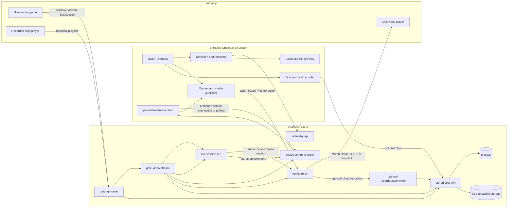

# On-demand entrance video streaming

## Context

The current Entrance Observer video path is storage-first:

1. `entrance-observer` captures camera frames on the Jetson device.
2. The edge app creates short video chunks, including optional detection overlays.
3. Chunks are uploaded through `gate-video-stream` GraphQL.
4. `gate-video-stream` writes temporary files, normalizes MP4/WebM with ffmpeg, stores segments in S3-compatible object storage, and records streams/segments in MySQL.
5. `web-app` reads `videoStreams` through `graphql-router` and plays HLS playlists served by `gate-video-stream`.

This works for debugging, training data, and historical playback, but it is too heavy as the default way to look at a live hive entrance. It spends edge CPU, cloud CPU, upload bandwidth, S3 storage, and DB writes even when nobody is watching.

The desired user experience is different: when a beekeeper opens a particular hive/section in `web-app`, they should be able to start a higher-quality live view on demand. `web-app` has no access to the Jetson device and should not try to reach private URLs such as `http://jetson-orin:3030`. Live video, session control, authentication, NAT traversal, and optional recording should go through the cloud-deployed `gate-video-stream` service. Permanent recording, S3 storage, and encoding for later playback should remain optional.

## Decision

Expand `gate-video-stream` into the single Gratheon video gateway for both stored clips and on-demand live entrance streams.

`gate-video-stream` should own:

- user-facing GraphQL operations for starting/stopping live sessions, exposed through `graphql-router`
- device-facing control channel for `entrance-observer`
- media relay integration or embedded relay endpoints
- optional recording of live sessions into the existing S3/HLS storage model
- stored stream/segment listing for historical playback

Default mode should become telemetry-first and storage-light:

- Continuous data: bee movement telemetry, camera/device health, and low-rate preview snapshots if needed.
- On-demand data: high-quality live media only while a user is actively viewing a hive section.
- Optional persistent data: selected live sessions or anomaly clips can be recorded into the existing `gate-video-stream` storage model.

## Proposed architecture



`liveApi`, `control`, `relay`, and `storedApi` are logical modules. They can start as code inside the existing `gate-video-stream` repository and deployment. If the load later requires separation, they can be split behind the same `video.gratheon.com` boundary without changing the product API.

## Session lifecycle

1. `web-app` renders a hive or box page and knows the selected `boxId`/section.
2. User clicks `Watch live` or the page auto-starts live view only after user intent, depending on product decision.
3. `web-app` calls GraphQL through `graphql-router`, for example `startEntranceLiveStream(boxId, qualityProfile)`.
4. `graphql-router` verifies authentication and forwards to `gate-video-stream`.
5. `gate-video-stream` verifies that the user owns or can access the box, then creates a short-lived session with:
   - `sessionId`
   - `boxId`
   - authorized user/device identity
   - expiry time
   - playback endpoint or WebRTC signaling data for `web-app`
   - publisher endpoint or relay credentials for `entrance-observer`
   - requested quality profile
   - `recordingMode`: `off`, `manual`, `onDemand`, or `event`
6. `entrance-observer` receives the session request through its outbound connection to `gate-video-stream`. This can be polling for MVP, then WebSocket or MQTT for lower latency.
7. `entrance-observer` starts a high-quality media publisher only for that session and connects outbound to `gate-video-stream` or its configured relay.
8. `web-app` attaches a player to the playback endpoint returned by `gate-video-stream`.
9. When the user leaves the section, closes the player, or the session expires, `web-app` sends `stopEntranceLiveStream(sessionId)` or `gate-video-stream` times it out.
10. `gate-video-stream` sends `STOP_STREAM` to the device control channel and closes relay resources.
11. `entrance-observer` stops publishing and returns to telemetry-only mode.

## Why use `gate-video-stream` as the gateway

Using `gate-video-stream` keeps the architecture simpler because:

- `web-app` already uses the video service boundary for entrance video playback.
- `graphql-router` already federates `gate-video-stream` GraphQL fields such as `videoStreams`.
- The existing service already knows the S3/HLS storage model for historical clips.
- Live session recording can reuse the same stream/segment concepts instead of duplicating metadata elsewhere.
- User-facing video permissions can be consolidated in one backend.
- `web-app` never needs direct device access, and Jetson only needs outbound access to one cloud video service.

The recommended boundary is therefore `web-app` -> `graphql-router` -> `gate-video-stream` for all video actions, and `entrance-observer` -> `gate-video-stream` for device video/control actions.

## Media transport recommendation

### Recommended first implementation: WebRTC through `gate-video-stream`

WebRTC is the best fit for user-initiated live viewing because it provides:

- Low latency for camera aiming, diagnostics, and live inspection.
- Browser-native playback in `web-app`.
- NAT traversal through STUN/TURN without exposing Jetson devices directly to the internet.
- Adaptive bitrate and packet loss handling.
- Optional data channels later for status/control messages.

`gate-video-stream` can integrate a managed SFU/relay, run a self-hosted component such as LiveKit, Janus, mediasoup, or use a Pion-based relay module. The important architectural point is that both the Jetson and the browser connect outbound to `gate-video-stream` or to relay endpoints issued by `gate-video-stream`.

### Acceptable MVP alternative: RTMP/SRT uplink with HLS/LL-HLS downlink

If WebRTC integration on Jetson is too complex for the first field iteration, use a more pipeline-friendly uplink:

- Jetson publishes H.264/H.265 over SRT or RTMP to an endpoint issued by `gate-video-stream`.
- `gate-video-stream` transpackages to LL-HLS or HLS for browser playback.
- Latency is higher than WebRTC, but operational debugging can be simpler with ffmpeg/GStreamer.

This is acceptable for observation, but less ideal for interactive camera calibration.

### Keep local MJPEG only for local device UI

The existing `/video_feed` and `/video_feed_yolo` MJPEG endpoints are useful for LAN/local setup pages, but should not become the cloud live-streaming protocol. MJPEG is bandwidth-heavy, has no adaptive bitrate, and does not solve NAT traversal or cloud authorization.

## Quality profiles

Quality should be session-based, not a global upload setting. Example profiles:

| Profile | Purpose | Resolution/FPS | Notes |
| --- | --- | --- | --- |
| `preview` | Quick hive page glance | 480p, 5-10 FPS | Low bandwidth, can start automatically after user intent. |
| `inspect` | User actively watches entrance | 720p, 15-30 FPS | Default live mode. |
| `diagnostic` | Camera alignment/model debugging | 1080p or camera-native, 15-30 FPS | Time-limited, may require mains power/good network. |
| `model-debug` | Overlay detections and tracks | 720p, 10-15 FPS | Can stream overlay or separate metadata channel. |

Detection overlays should preferably be sent as metadata or rendered at the edge into a secondary stream only when requested. Do not permanently encode overlays into all video by default.

## Recording modes

Permanent video storage should become an option layered on top of live streaming, not the default transport.

| Mode | Behavior | Storage path |
| --- | --- | --- |
| `off` | Live stream is relayed only and discarded. | No S3 writes. |
| `manual` | User clicks `Record this session`. | `gate-video-stream` records from relay or asks edge to upload selected segment. |
| `event` | Edge records around anomalies or high-confidence events. | Existing chunk upload remains useful. |
| `sampled` | Small scheduled samples for model evaluation. | Low quota, explicit retention. |
| `always` | Continuous storage for lab/test setups only. | Existing S3/HLS path, quota controlled. |

The existing `uploadGateVideo` mutation and S3-backed HLS playback should stay for `manual`, `event`, `sampled`, and lab `always` modes.

## API changes

### GraphQL control plane in `gate-video-stream`

Add user-facing GraphQL operations to `gate-video-stream` and expose them through `graphql-router`:

```graphql
type EntranceLiveStreamSession {
  id: ID!
  boxId: ID!
  status: EntranceLiveStreamStatus!
  playbackUrl: URL
  signalingToken: String
  expiresAt: DateTime!
  qualityProfile: String!
  recordingMode: String!
}

enum EntranceLiveStreamStatus {
  REQUESTED
  DEVICE_OFFLINE
  STARTING
  ACTIVE
  STOPPING
  STOPPED
  FAILED
}

type Mutation {
  startEntranceLiveStream(boxId: ID!, qualityProfile: String, recordingMode: String): EntranceLiveStreamSession!
  stopEntranceLiveStream(sessionId: ID!): Boolean!
  keepEntranceLiveStreamAlive(sessionId: ID!): EntranceLiveStreamSession!
}

type Query {
  entranceLiveStreamSession(boxId: ID!): EntranceLiveStreamSession
}
```

### Device control API in `gate-video-stream`

`entrance-observer` needs a cloud control channel to `gate-video-stream`. Prefer an outbound persistent connection from device to cloud so field routers do not need inbound rules.

Minimum commands from `gate-video-stream` to device:

- `START_STREAM(sessionId, boxId, qualityProfile, relayCredentials, recordingMode)`
- `STOP_STREAM(sessionId)`
- `UPDATE_QUALITY(sessionId, qualityProfile)`
- `HEALTH_CHECK`

Minimum device messages back to `gate-video-stream`:

- `DEVICE_ONLINE(boxId, cameraStatus, appVersion)`
- `STREAM_STARTING(sessionId)`
- `STREAM_ACTIVE(sessionId, fps, bitrate, resolution, encoder)`
- `STREAM_FAILED(sessionId, errorCode, message)`
- `STREAM_STOPPED(sessionId, reason)`

Device status should include camera availability, current publisher state, current bitrate/FPS, encoder type, network quality, and last error.

### `gate-video-stream` internal modules

`gate-video-stream` should add logical modules rather than a separate service for the first implementation:

- `liveSessionModel`: session rows, TTL, status transitions, ownership checks.
- `deviceControl`: outbound device connections or polling inbox.
- `relayProvider`: WebRTC/SRT/RTMP endpoint allocation and token issuance.
- `liveRecorder`: optional recording from relay to the existing segment pipeline.
- `storedStreams`: current stream/segment/S3/HLS behavior.

This keeps deployment simple while leaving room to split heavy relay workloads later.

## `web-app` changes

- Add a live camera card to the hive/box section UI, near the existing gate box stream playback.
- Use only `graphql-router`/`gate-video-stream` APIs. Do not call Jetson local URLs from the browser.
- Show device status before starting: online/offline, last telemetry time, camera status.
- Start stream only on explicit user intent for the MVP.
- Stop stream on page unload, tab hidden timeout, route change, and inactive player timeout.
- Display quality selector and session timer.
- Provide `Record` button only if the user's plan and device allow storage.
- Keep the existing stored video player for historical clips.

## `entrance-observer` changes

- Keep telemetry and local detection running as now.
- Add a `gate-video-stream` control client for stream commands.
- Add a media publisher pipeline separate from current chunk uploader.
- Connect outbound to the endpoint and credentials issued by `gate-video-stream`.
- Use hardware encoding where available. On Jetson Orin Nano, verify available encoder support in the deployed JetPack/L4T stack and prefer GStreamer pipelines over Python frame-by-frame JPEG encoding.
- Keep local ring buffer for optional event/manual recording.
- Make `upload_videos_enabled` default toward optional/event-driven rather than default-on continuous chunk upload.

## Security and privacy

- The browser must never connect directly to a private device URL such as `http://jetson-orin:3030` outside local setup mode.
- All live sessions must be user-authorized by box/hive ownership in `gate-video-stream`.
- Session credentials must be short-lived and scoped to one `boxId` and one stream session.
- Devices should initiate outbound connections only.
- Recording must be explicit, quota-controlled, and visible to the user.
- Retention policy must differ for live-only sessions and recorded clips.

## Observability

Track per session in `gate-video-stream`:

- start reason and user action
- selected quality profile
- device command latency
- media startup latency
- publisher FPS/bitrate/resolution
- relay egress bitrate
- dropped frames / packet loss
- device CPU/GPU/temperature if available
- stop reason
- recording bytes written, if any

These metrics should be available for support and cost control.

## Migration plan

1. **Add device status in `gate-video-stream`** - let `entrance-observer` report online/camera state for a `boxId`, and let `web-app` read it through GraphQL.
2. **Add session control API** - create `gate-video-stream` GraphQL mutations and a device-facing command inbox without changing current uploads.
3. **Prototype media path** - validate Jetson camera to browser through `gate-video-stream` with one quality profile. Prefer WebRTC, use SRT/RTMP plus HLS only if it speeds up field validation.
4. **Add web-app live card** - start/stop stream from a hive section and enforce idle timeout.
5. **Separate recording option** - add `Record` flow that writes selected live sessions or edge clips into existing `gate-video-stream` storage.
6. **Change defaults** - make permanent clip upload optional/event-driven, not always-on.
7. **Optimize quality profiles** - tune hardware encoding, bitrate, overlays, and network fallback.
8. **Deprecate storage-first live UX** - keep stored clips for history/training, but use on-demand stream for live viewing.

## Open questions

- Which relay implementation should `gate-video-stream` integrate first: managed LiveKit Cloud, self-hosted LiveKit, Janus, mediasoup, or a custom Pion module?
- Should the device control channel start as polling for reliability and simplicity, then move to WebSocket/MQTT?
- Should the first stream include detection overlays in the video, or send detections as timed metadata to render in `web-app`?
- What default idle timeout is acceptable: 2, 5, or 10 minutes?
- Should automatic start happen when opening a hive section, or only after pressing `Watch live`?
- What plan/quota should enable recording and high-quality diagnostic mode?

## Recommendation summary

Build live viewing as on-demand sessions owned by `gate-video-stream`. `web-app` should request and play live streams only through `graphql-router` and `gate-video-stream`; it should not access Jetson directly. `entrance-observer` should keep outbound-only control and media connections to `gate-video-stream`. Keep current S3/HLS uploads as the historical recording path, but do not use permanent upload as the default way to view a live entrance. This reduces default bandwidth and storage costs, keeps the product architecture simpler, and preserves optional recordings for verification, support, and model improvement.
