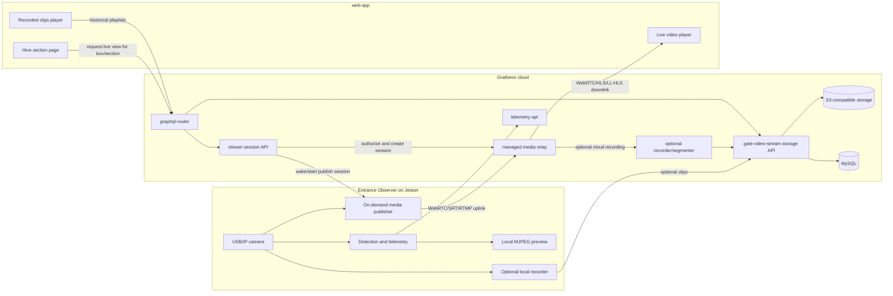

# On-demand entrance video streaming

## Context

The current Entrance Observer video path is storage-first:

1. `entrance-observer` captures camera frames on the Jetson device.
2. The edge app creates short video chunks, including optional detection overlays.
3. Chunks are uploaded through `gate-video-stream` GraphQL.
4. `gate-video-stream` writes temporary files, normalizes MP4/WebM with ffmpeg, stores segments in S3-compatible object storage, and records streams/segments in MySQL.
5. `web-app` reads `videoStreams` through `graphql-router` and plays HLS playlists served by `gate-video-stream`.

This works for debugging, training data, and historical playback, but it is too heavy as the default way to look at a live hive entrance. It spends edge CPU, cloud CPU, upload bandwidth, S3 storage, and DB writes even when nobody is watching.

The desired user experience is different: when a beekeeper opens a particular hive/section in `web-app`, they should be able to start a higher-quality live view on demand. The live stream should pass through a cloud-deployed Gratheon service for authentication, routing, NAT traversal, and observability. Permanent recording, S3 storage, and encoding for later playback should remain optional.

## Decision

Use an on-demand live streaming control plane plus a short-lived media relay path, while keeping the existing clip upload/HLS/S3 path as an optional recording mode.

Default mode should become telemetry-first and storage-light:

- Continuous data: bee movement telemetry, camera/device health, and low-rate preview snapshots if needed.
- On-demand data: high-quality live media only while a user is actively viewing a hive section.
- Optional persistent data: selected live sessions or anomaly clips can be recorded into the existing `gate-video-stream` storage model.

## Proposed architecture



## Session lifecycle

1. `web-app` renders a hive or box page and knows the selected `boxId`/section.
2. User clicks `Watch live` or the page auto-starts live view only after user intent, depending on product decision.
3. `web-app` calls GraphQL, for example `startEntranceLiveStream(boxId, qualityProfile)`.
4. `graphql-router` verifies that the user owns or can access the box and forwards the request to the stream session service.
5. The stream session service creates a short-lived session with:
   - `sessionId`
   - `boxId`
   - authorized user/device identity
   - expiry time
   - media relay endpoint and ICE/STUN/TURN or protocol credentials
   - requested quality profile
   - `recordingMode`: `off`, `manual`, `onDemand`, or `event`
6. `entrance-observer` receives the session request by polling, WebSocket, MQTT, or a persistent outbound control connection.
7. `entrance-observer` starts a high-quality media publisher only for that session.
8. `web-app` attaches a player to the returned playback endpoint.
9. When the user leaves the section, closes the player, or the session expires, `web-app` sends `stopEntranceLiveStream(sessionId)` or the server times it out.
10. `entrance-observer` stops publishing and returns to telemetry-only mode.

## Media transport recommendation

### Recommended first implementation: WebRTC

WebRTC is the best fit for user-initiated live viewing because it provides:

- Low latency for camera aiming, diagnostics, and live inspection.
- Browser-native playback in `web-app`.
- NAT traversal through STUN/TURN without exposing Jetson devices directly to the internet.
- Adaptive bitrate and packet loss handling.
- Optional data channels later for status/control messages.

The cloud service can use a managed SFU/relay, or a lightweight self-hosted component such as LiveKit, Janus, mediasoup, or Pion-based service. The important architectural point is that the Jetson initiates outbound connections, and the browser also connects outbound to the relay. No inbound port on the apiary network should be required.

### Acceptable alternative: SRT/RTMP uplink with HLS/LL-HLS downlink

If WebRTC integration on Jetson is too complex for the first field iteration, use a more pipeline-friendly uplink:

- Jetson publishes H.264/H.265 over SRT or RTMP to the cloud.
- Cloud transpackages to LL-HLS or HLS for browser playback.
- Latency is higher than WebRTC, but operational debugging can be simpler with ffmpeg/GStreamer.

This is acceptable for observation, but less ideal for interactive camera calibration.

### Keep local MJPEG only for local device UI

The existing `/video_feed` and `/video_feed_yolo` MJPEG endpoints are useful for LAN/local setup pages, but should not become the cloud live-streaming protocol. MJPEG is bandwidth-heavy, has no adaptive bitrate, and does not solve NAT traversal or cloud authorization.

## Quality profiles

Quality should be session-based, not a global upload setting. Example profiles:

| Profile | Purpose | Resolution/FPS | Notes |
| --- | --- | --- | --- |
| `preview` | Quick hive page glance | 480p, 5-10 FPS | Low bandwidth, can start automatically after user intent. |
| `inspect` | User actively watches entrance | 720p, 15-30 FPS | Default live mode. |
| `diagnostic` | Camera alignment/model debugging | 1080p or camera-native, 15-30 FPS | Time-limited, may require mains power/good network. |
| `model-debug` | Overlay detections and tracks | 720p, 10-15 FPS | Can stream overlay or separate metadata channel. |

Detection overlays should preferably be sent as metadata or rendered at the edge into a secondary stream only when requested. Do not permanently encode overlays into all video by default.

## Recording modes

Permanent video storage should become an option layered on top of live streaming, not the default transport.

| Mode | Behavior | Storage path |
| --- | --- | --- |
| `off` | Live stream is relayed only and discarded. | No S3 writes. |
| `manual` | User clicks `Record this session`. | Relay or edge sends selected segment to `gate-video-stream`. |
| `event` | Edge records around anomalies or high-confidence events. | Existing chunk upload remains useful. |
| `sampled` | Small scheduled samples for model evaluation. | Low quota, explicit retention. |
| `always` | Continuous storage for lab/test setups only. | Existing S3/HLS path, quota controlled. |

The existing `uploadGateVideo` mutation and S3-backed HLS playback should stay for `manual`, `event`, `sampled`, and lab `always` modes.

## API changes

### GraphQL control plane

Add user-facing GraphQL operations through `graphql-router`:

```graphql
type EntranceLiveStreamSession {
  id: ID!
  boxId: ID!
  status: EntranceLiveStreamStatus!
  playbackUrl: URL
  signalingToken: String
  expiresAt: DateTime!
  qualityProfile: String!
  recordingMode: String!
}

enum EntranceLiveStreamStatus {
  REQUESTED
  DEVICE_OFFLINE
  STARTING
  ACTIVE
  STOPPING
  STOPPED
  FAILED
}

type Mutation {
  startEntranceLiveStream(boxId: ID!, qualityProfile: String, recordingMode: String): EntranceLiveStreamSession!
  stopEntranceLiveStream(sessionId: ID!): Boolean!
  keepEntranceLiveStreamAlive(sessionId: ID!): EntranceLiveStreamSession!
}

type Query {
  entranceLiveStreamSession(boxId: ID!): EntranceLiveStreamSession
}
```

### Device control API

`entrance-observer` needs a cloud control channel. Prefer an outbound persistent connection from device to cloud so field routers do not need inbound rules.

Minimum commands:

- `START_STREAM(sessionId, boxId, qualityProfile, relayCredentials, recordingMode)`
- `STOP_STREAM(sessionId)`
- `UPDATE_QUALITY(sessionId, qualityProfile)`
- `HEALTH_CHECK`

Device status should include camera availability, current publisher state, current bitrate/FPS, encoder type, network quality, and last error.

### `gate-video-stream` evolution

`gate-video-stream` can either remain the storage/HLS service and delegate live relay to a new service, or be expanded into a broader video gateway. The cleaner split is:

- `entrance-live-stream` or `stream-session-service`: session lifecycle, authorization, signaling, relay integration.
- `gate-video-stream`: historical video storage, HLS playlist generation, S3-backed segments, recording ingestion.

If operational simplicity is more important than service boundaries, both can be deployed together behind `video.gratheon.com`, but the APIs should still separate live sessions from stored streams.

## `web-app` changes

- Add a live camera card to the hive/box section UI, near the existing gate box stream playback.
- Show device status before starting: online/offline, last telemetry time, camera status.
- Start stream only on explicit user intent for the MVP.
- Stop stream on page unload, tab hidden timeout, route change, and inactive player timeout.
- Display quality selector and session timer.
- Provide `Record` button only if the user's plan and device allow storage.
- Keep the existing stored video player for historical clips.

## `entrance-observer` changes

- Keep telemetry and local detection running as now.
- Add a cloud control client for stream commands.
- Add a media publisher pipeline separate from current chunk uploader.
- Use hardware encoding where available. On Jetson Orin Nano, verify available encoder support in the deployed JetPack/L4T stack and prefer GStreamer pipelines over Python frame-by-frame JPEG encoding.
- Keep local ring buffer for optional event/manual recording.
- Make `upload_videos_enabled` default toward optional/event-driven rather than default-on continuous chunk upload.

## Security and privacy

- The browser must never connect directly to a private device URL such as `http://jetson-orin:3030` outside local setup mode.
- All live sessions must be user-authorized by box/hive ownership.
- Session credentials must be short-lived and scoped to one `boxId` and one stream session.
- Devices should initiate outbound connections only.
- Recording must be explicit, quota-controlled, and visible to the user.
- Retention policy must differ for live-only sessions and recorded clips.

## Observability

Track per session:

- start reason and user action
- selected quality profile
- startup latency
- publisher FPS/bitrate/resolution
- relay egress bitrate
- dropped frames / packet loss
- device CPU/GPU/temperature if available
- stop reason
- recording bytes written, if any

These metrics should be available for support and cost control.

## Migration plan

1. **Document and expose device status** - ensure web-app can tell whether an Entrance Observer is online for a given `boxId`.
2. **Add session control API** - create GraphQL mutations and a device-facing control channel without changing current uploads.
3. **Prototype WebRTC relay** - validate Jetson camera to browser through cloud relay with one quality profile.
4. **Add web-app live card** - start/stop stream from a hive section and enforce idle timeout.
5. **Separate recording option** - add `Record` flow that writes selected live sessions or edge clips into existing `gate-video-stream` storage.
6. **Change defaults** - make permanent clip upload optional/event-driven, not always-on.
7. **Optimize quality profiles** - tune hardware encoding, bitrate, overlays, and network fallback.
8. **Deprecate storage-first live UX** - keep stored clips for history/training, but use on-demand stream for live viewing.

## Open questions

- Which relay implementation should be used first: managed LiveKit Cloud, self-hosted LiveKit, Janus, mediasoup, or a custom Pion service?
- Should the device control channel be WebSocket, MQTT, or reuse an existing event infrastructure?
- Should the first stream include detection overlays in the video, or send detections as timed metadata to render in `web-app`?
- What default idle timeout is acceptable: 2, 5, or 10 minutes?
- Should automatic start happen when opening a hive section, or only after pressing `Watch live`?
- What plan/quota should enable recording and high-quality diagnostic mode?

## Recommendation summary

Build live viewing as on-demand WebRTC sessions through a cloud relay. Keep current `gate-video-stream` S3/HLS uploads as the historical recording path, but do not use permanent upload as the default way to view a live entrance. This reduces default bandwidth and storage costs, improves latency for real-time inspection, and keeps optional recordings available for verification, support, and model improvement.
