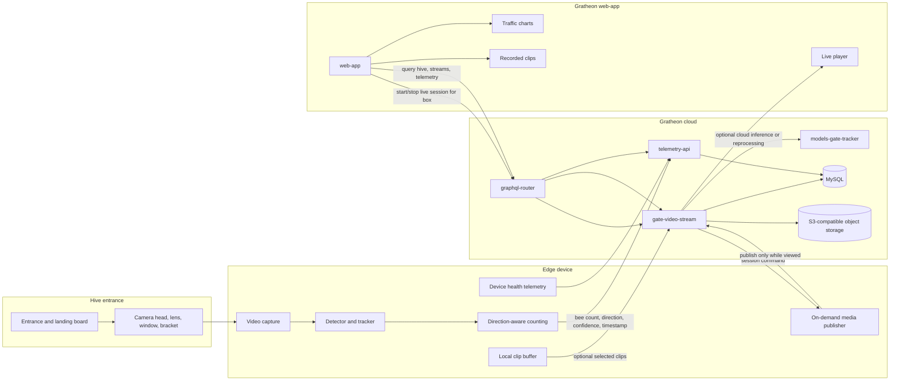

Entrance Observer is the edge vision component that watches a hive entrance, detects bee movement, and sends bee traffic telemetry plus optional video evidence to Gratheon's web platform.

Live viewing should be on-demand, initiated from `web-app` when a user opens or starts viewing a particular hive section. `web-app` has no direct access to the edge device, so live sessions should be started and played through `gate-video-stream` via `graphql-router`. Permanent video upload and S3-backed playback remain optional recording modes, not the default way to inspect a live entrance. See [On-demand entrance video streaming](On-demand%20entrance%20video%20streaming.md) for the target architecture.

For the product-level overview, see [Entrance Observer](../../products/entrance_observer/entrance_observer.md). Captured metrics connect to [hive telemetry storage](../../products/web_app/pro-tier/hive-telemetry-storage.md) and [timeseries analytics](../../products/web_app/pro-tier/timeseries-data-analytics.md).

## Product direction

Entrance Observer should grow through three clear hardware phases. The docs are now grouped by phase first, because each phase needs both a product description and a bill of materials:

1. **[Phase 1 - Lab validation](phase-1-lab-validation/)** - prove camera capture, model behavior, telemetry upload, and on-demand live-session control on a developer bench.
2. **[Phase 2 - Field MVP](phase-2-field-mvp/)** - deploy a weather-protected pilot device at a real hive entrance and measure reliability, count quality, energy, and bandwidth.
3. **[Phase 3 - Production kit](phase-3-production-kit/)** - convert the proven design into a repeatable, supportable, sellable device or set of SKUs.

This split keeps the first build fast and debuggable while still showing the path to a finished Gratheon product. The current prototype target is **NVIDIA Jetson Orin Nano Super Developer Kit** with a USB UVC camera. Jetson runs the [`entrance-observer`](https://github.com/Gratheon/entrance-observer) edge application locally so the apiary does not need to stream continuous raw video to the cloud.

## Phase overview

| Phase | Goal | Primary user | Target cost | Product description | BOM |
| --- | --- | --- | ---: | --- | --- |
| Phase 1 - Lab | Fast bench prototype for camera, model, telemetry, and live-session validation | Developer, ML engineer, contributor | €550-650 with current Jetson stack | [Product description](phase-1-lab-validation/product-description.md) | [Bill of materials](phase-1-lab-validation/bill-of-materials.md) |
| Phase 2 - Field MVP | Weather-protected pilot device for one real hive entrance | Pilot beekeeper, field tester, support engineer | €650-1000+ depending on enclosure, power, and network | [Product description](phase-2-field-mvp/product-description.md) | [Bill of materials](phase-2-field-mvp/bill-of-materials.md) |
| Phase 3 - Production | Repeatable camera/edge-AI kit or SKU family | Paying customer, reseller, managed apiary, support team | To be selected from field data | [Product description](phase-3-production-kit/product-description.md) | [Bill of materials](phase-3-production-kit/bill-of-materials.md) |

## System connection model

The hardware should be described as connected subsystems, not as a loose parts list. This makes camera geometry, power, network, service, and cloud boundaries explicit.

## Current approach assessment

| Area | Current state | Gap | Recommended change |
| --- | --- | --- | --- |
| Documentation grouping | Older docs had a single prototype BOM and a separate future-alternatives page. | Readers had to infer which parts belong to lab, field MVP, or production. | Use phase-first folders: each phase contains its product description and bill of materials. |
| Edge compute | Jetson Orin Nano Super Developer Kit is the current reference. | Good for model iteration, but expensive and power-hungry for a customer solar unit. | Keep Jetson for Phase 1 and early Phase 2. Benchmark Raspberry Pi 5 + Hailo and RK3588 before production. |
| Camera | USB UVC 4K camera with manual varifocal lens. | Easy to debug, but not a repeatable outdoor camera head. | Use USB in lab, then freeze FOV and evaluate CSI/MIPI, industrial board cameras, or IP/H.265 camera modules. |
| Video product | Stored clips and on-demand live video both exist conceptually. | Continuous upload would waste bandwidth, storage, edge CPU, and cloud CPU. | Make telemetry-first default, live video on demand, and clip storage selective. |
| Enclosure | Aluminium extrusion, acrylic sheets, camera mount, and optional acrylic case are prototype materials. | Not weatherproof, not UV/condensation optimized, and not serviceable enough. | Move field MVP to IP65/IP67 enclosure, sealed cable entries, hood/window strategy, and fixed bracket. |
| Power | Current BOM focuses on compute/camera, not measured energy. | Solar feasibility cannot be decided without Wh/day, sleep modes, and modem duty cycle. | Add power meters in Phase 1, PoE/mains field pilots in Phase 2, and solar only after measured duty-cycle data. |
| Network | WiFi module is documented. | Apiaries often have weak WiFi or no internet. | Test Ethernet/PoE and WiFi in Phase 2; define LTE/gateway variants for Phase 3. |
| Supportability | SSH, `jtop`, Docker logs, and GStreamer tools are useful for developers. | Customer support needs device health without SSH. | Upload device health fields: FPS, camera online, disk free, queue size, temperature, RSSI, app/model version, reset reason. |
| Cost model | Current prototype is about €550-650 before field parts. | Production cost is unknown and may be dominated by enclosure, power, and service parts, not only compute. | Track BOM by phase and select production SKU after measured field data. |

## Component analysis summary

The detailed analysis is in [Component analysis and alternatives](Component%20analysis%20and%20alternatives.md). The short version:

| Subsystem | Current choice | Best next action |
| --- | --- | --- |
| Compute | Jetson Orin Nano Super Developer Kit | Keep as reference, but benchmark Raspberry Pi 5 + Hailo AI HAT+ 26 TOPS and RK3588 against the exact bee detector/tracker. |
| Camera | MOKOSE USB UVC camera | Keep for lab. For field, freeze FOV and evaluate a locked camera head with better weather, cable, and exposure behavior. |
| Lens | Manual varifocal CS/C lens | Use to discover FOV, then replace or lock with a fixed-focus production lens. |
| Storage | Consumer NVMe SSD | Good for lab. Production should use industrial storage sized to retention policy. |
| Video | Edge clips plus planned live streaming | Use `gate-video-stream` for sessions and keep stored clips optional. Avoid continuous video upload. |
| Enclosure | 2020 extrusion and acrylic | Good fixture material, not field product material. Move to IP-rated box and optical hood/window. |
| Power | Bench power not fully documented | Add power measurement immediately; split powered/PoE and solar SKUs later. |

## Data flow

1. **Capture** - `entrance-observer` reads frames from the camera on the edge device.
2. **Infer and track** - the edge app detects bees near the entrance, tracks movement across configured regions, and computes direction-aware counts.
3. **Aggregate** - raw detections are converted into telemetry buckets such as entrances, exits, unknown direction, confidence, and health metadata.
4. **Upload metrics** - the edge device sends movement telemetry to [`telemetry-api`](../API/rest/telemetry-api.md) using the device REST API.
5. **Start live stream on demand** - when a beekeeper opens a hive section and requests live video, `web-app` starts a short-lived session through `gate-video-stream`. The edge device publishes only while the session is active, using outbound control/media connections to the cloud video gateway.
6. **Record clips when useful** - the edge app or `gate-video-stream` recorder can still store selected clips for playback, debugging, and model retraining.
7. **Read in web-app** - the Gratheon web-app uses [`graphql-router`](../API/GraphQL.md) for user-facing queries and renders time-series charts directly from telemetry data.
8. **Improve model** - selected stored clips are used to validate detections, retrain the model, and compare cloud inference with edge inference.

## API responsibilities

| Component | Interface | Responsibility |
| --- | --- | --- |
| `entrance-observer` | Local camera, REST/control clients | Capture frames, run edge inference, aggregate telemetry, publish live video on demand, and upload optional clips. |
| `telemetry-api` | REST for devices, GraphQL behind router | Store entrance movement metrics and serve time-series reads to the web-app. |
| `gate-video-stream` | GraphQL/REST/OpenAPI plus media relay | Own video sessions, authorize short-lived live streams, route media through the cloud, accept selected entrance videos, serve playback playlists, and retain training/debug clips. |
| `models-gate-tracker` | Internal service | Run cloud-side inference/reprocessing when uploaded video needs validation or model evaluation. |
| `graphql-router` | Federated GraphQL | User-facing API gateway for web-app queries. |
| `web-app` | Browser UI | Device setup, status, video playback links, dashboards, and alerts. |

## Research and decision notes

- Full video is not the default product data. Entrance movement telemetry and device health are the durable signals; video is for live inspection, debugging, anomalies, and training data.
- The current YOLO-style detector and tracker should be benchmarked as a complete pipeline. Detector-only FPS is not enough because count quality depends on tracking, crossing logic, camera placement, and frame quality.
- Production hardware must be selected by count accuracy per watt, not by advertised TOPS alone.
- Camera head repeatability is a product requirement. A better model cannot fully compensate for changing focus, angle, glare, condensation, or exposure behavior.
- Solar autonomy is a separate SKU decision, not a small add-on to the Jetson lab build.

## See also

- [Phase 1 - Lab validation](phase-1-lab-validation/)
- [Phase 2 - Field MVP](phase-2-field-mvp/)
- [Phase 3 - Production kit](phase-3-production-kit/)
- [Component analysis and alternatives](Component%20analysis%20and%20alternatives.md)
- [On-demand entrance video streaming](On-demand%20entrance%20video%20streaming.md)
- [Future production hardware alternatives](Future%20production%20hardware%20alternatives.md)
- [Jetson Orin setup](Jetson%20Orin%20setup.md)
- [Legacy research archive](legacy-research/ML%20processing%20devices.md)