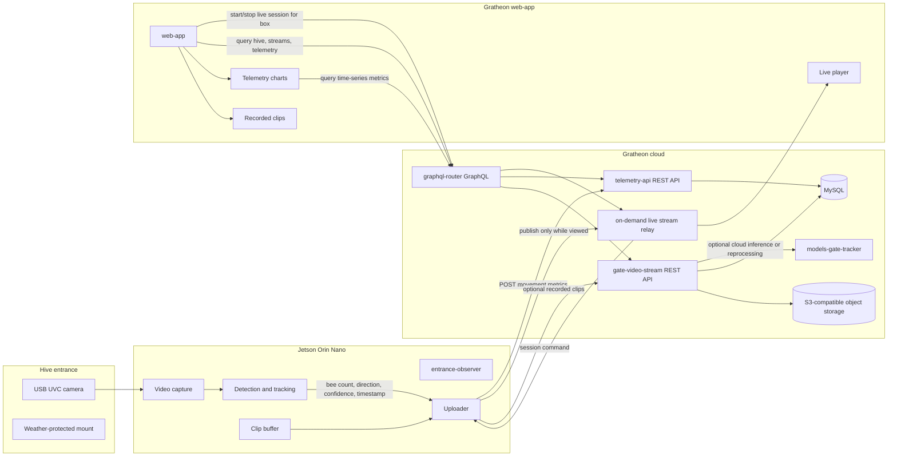

Entrance Observer is the edge vision component that watches a hive entrance, detects bee movement, and sends bee traffic telemetry plus optional video evidence to Gratheon's web platform.

Live viewing should be on-demand, initiated from `web-app` when a user opens or starts viewing a particular hive section. Permanent video upload and S3-backed playback remain optional recording modes, not the default way to inspect a live entrance. See [On-demand entrance video streaming](On-demand%20entrance%20video%20streaming.md) for the target architecture.

The current prototype target is **NVIDIA Jetson Orin Nano Super Developer Kit** with a USB UVC camera. Jetson runs the [`entrance-observer`](https://github.com/Gratheon/entrance-observer) edge application locally so the apiary does not need to stream continuous raw video to the cloud.

For the product-level overview, see [Entrance Observer](../../products/entrance_observer/entrance_observer.md). Captured metrics connect to [hive telemetry storage](../../products/web_app/pro-tier/hive-telemetry-storage.md) and [timeseries analytics](../../products/web_app/pro-tier/timeseries-data-analytics.md).

## Current deployment target

| Area | Current decision | Why |
| --- | --- | --- |
| Edge compute | Jetson Orin Nano Super Developer Kit, 8 GB | Enough GPU headroom for local object detection/tracking and fast iteration with NVIDIA JetPack, CUDA, TensorRT, and Docker. |
| Camera | USB3 UVC 4K camera with manual varifocal lens | UVC is easy to debug on Linux and avoids CSI camera integration work during the prototype phase. |
| Processing mode | Edge-first with optional cloud fallback | Keeps bandwidth low, works with unreliable apiary internet, and still allows retraining/reprocessing from selected uploaded clips. |
| Data product | Bee traffic time series in Gratheon web-app | The primary value is direction/count history, alerts, and correlation with hive telemetry. |
| Video product | On-demand live stream plus optional stored clips | Live viewing is initiated from `web-app` for a specific hive section. Stored clips are kept selectively for verification, debugging, model improvement, and user review. |

## Runtime architecture

## Data flow

1. **Capture** - `entrance-observer` reads frames from the USB camera on Jetson.
2. **Infer and track** - the edge app detects bees near the entrance, tracks movement across configured regions, and computes direction-aware counts.
3. **Aggregate** - raw detections are converted into telemetry buckets such as entrances, exits, unknown direction, confidence, and health metadata.
4. **Upload metrics** - Jetson sends movement telemetry to [`telemetry-api`](../API/rest/telemetry-api.md) using the device REST API.
5. **Start live stream on demand** - when a beekeeper opens a hive section and requests live video, `web-app` starts a short-lived session through the cloud video relay. The Jetson publishes only while the session is active.
6. **Record clips when useful** - the edge app or cloud relay can still send selected clips to [`gate-video-stream`](../API/rest/gate-video-stream.md) for playback, debugging, and model retraining.
7. **Read in web-app** - the Gratheon web-app uses [`graphql-router`](../API/GraphQL.md) for user-facing queries and renders time-series charts directly from telemetry data.
8. **Improve model** - selected stored clips are used to validate detections, retrain the model, and compare cloud inference with edge inference.

## API responsibilities

| Component | Interface | Responsibility |
| --- | --- | --- |
| `entrance-observer` | Local camera, REST/control clients | Capture frames, run edge inference, aggregate telemetry, publish live video on demand, and upload optional clips. |
| `telemetry-api` | REST for devices, GraphQL behind router | Store entrance movement metrics and serve time-series reads to the web-app. |
| Live stream relay/session service | GraphQL/device control plus media relay | Authorize short-lived live sessions, route media through the cloud, and avoid direct browser-to-device access. |
| `gate-video-stream` | REST/OpenAPI | Accept selected entrance videos, serve HLS playback playlists, and retain training/debug clips. |
| `models-gate-tracker` | Internal service | Run cloud-side inference/reprocessing when uploaded video needs validation or model evaluation. |
| `graphql-router` | Federated GraphQL | User-facing API gateway for web-app queries. |
| `web-app` | Browser UI | Device setup, status, video playback links, dashboards, and alerts. |

## Edge device operating requirements

- Stable 5 V / 4 A USB-C power for Jetson Orin Nano.
- NVMe SSD for OS and local buffering because video clips can quickly fill the built-in storage.
- WiFi or Ethernet with retryable uploads and local buffering for offline apiaries.
- Weather-protected camera and electronics enclosure, with clear plexiglass or lens cover placed so it does not create glare.
- Remote diagnostics through SSH, `jtop`, Docker logs, GStreamer tools, and camera test commands.

See also:

- [On-demand entrance video streaming](On-demand%20entrance%20video%20streaming.md)
- [Bill of materials](Bill%20of%20materials.md)
- [Jetson Orin setup](Jetson%20Orin%20setup.md)
- [Future production hardware alternatives](Future%20production%20hardware%20alternatives.md)
- [Legacy research archive](legacy-research/ML%20processing%20devices.md)
