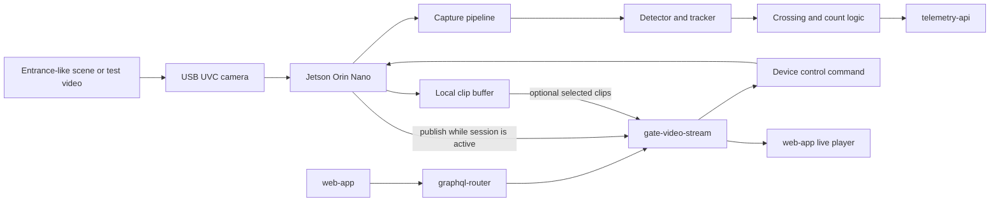

## Goal

The lab phase is a controlled development setup for vision, telemetry, and video-session software. It should be easy to assemble, easy to inspect with SSH/GStreamer/OpenCV, and powerful enough that model quality can be improved without being blocked by early hardware optimization.

Use this phase to validate:

- USB camera capture on Linux.
- Bee detector and tracker behavior on recorded and live clips.
- Direction-aware counting across configured entrance regions.
- Telemetry upload to Gratheon.
- On-demand video session start/stop through `gate-video-stream`.
- Local buffering and retry behavior while the network is unstable.
- Benchmark data for the later cost-down and solar decisions.

## Functionality

- Runs `entrance-observer` locally on Jetson Orin Nano Super Developer Kit.
- Captures from a USB UVC camera with a manual varifocal lens.
- Processes at benchmark profiles such as 640x480@30 FPS and 1280x720@15 FPS.
- Produces movement buckets: bees in, bees out, unknown direction, confidence, FPS, and device health.
- Uploads telemetry continuously or in short batches.
- Starts live video only after `web-app` asks `gate-video-stream` for a session.
- Stores selected clips locally for debugging and model improvement.

## Lab architecture

## Component assessment

| Subsystem | Current component | Lab assessment | Main risk | Better alternative to evaluate later |
| --- | --- | --- | --- | --- |
| Edge compute | NVIDIA Jetson Orin Nano Super Developer Kit, 8 GB | Best current reference platform for model iteration, TensorRT, CUDA, Docker, and debugging. | High power and cost can hide production constraints. Orin Nano is also not the best video-encoding platform because it lacks NVENC. | Raspberry Pi 5 + Hailo AI HAT+ 26 TOPS as the first cost-down benchmark; RK3588 board as a media-heavy alternative. |
| Camera | MOKOSE 4K USB UVC camera | Good for lab because UVC works with common Linux tools and can be swapped quickly. | Generic USB camera may have unstable exposure, rolling-shutter artifacts, weak weather strategy, and bulky cabling. | CSI/MIPI camera module for compact production, or IP/smart camera with onboard H.265 for video-centric SKU. |
| Lens | Manual varifocal CS/C lens | Useful while the required entrance field of view is unknown. | Manual focus/zoom can drift or be mis-set by installers. Long focal lengths may be too narrow for a full entrance. | Fixed-focus, locked-focus lens chosen after measuring entrance geometry and working distance. |
| Storage | 250 GB NVMe SSD | Good for OS, Docker images, logs, clip buffers, and test datasets. | Storage can mask bad upload policies if clips are retained forever. | Smaller industrial microSD/eMMC for low-cost builds, or industrial NVMe only for video-heavy SKU. |
| Network | M.2 WiFi module and antennas | Good for bench and indoor apiary WiFi tests. | Apiaries often have weak WiFi, and antenna placement in an enclosure matters. | Ethernet/PoE for fixed pilot sites; LTE router or apiary gateway for remote sites. |
| Mechanical | 2020 aluminium extrusion, acrylic sheets, camera mount | Good for fast fixture changes and camera alignment experiments. | Not weatherproof, not UV/condensation optimized, and not repeatable for field installation. | IP65/IP67 enclosure, sealed optical window, sun shield, drain path, and fixed bracket. |
| Display | 7 inch HDMI touchscreen | Useful during bench setup when SSH or networking is not ready. | Adds cost, power, cable openings, and breakage risk. | Remove from field builds; use web setup, SSH, logs, or temporary service laptop. |

## Why keep Jetson in Phase 1

Jetson Orin Nano is not the final answer by default, but it is the right reference board for early model work because it reduces software uncertainty:

- Ultralytics/PyTorch workflows can run before conversion to a smaller accelerator.
- TensorRT gives a realistic high-performance edge baseline.
- Docker and JetPack provide a familiar deployment target.
- GPU headroom lets the team test detector, tracker, overlays, telemetry, and local preview together.

The lab phase must still record power and FPS numbers. Without measured FPS/W and count accuracy/W, later hardware choices become marketing comparisons rather than product decisions.

## Lab benchmark plan

| Benchmark | How to run | Why it matters | Exit target |
| --- | --- | --- | --- |
| Detector + tracker FPS | Run the same labelled clips with overlays off and telemetry on. | Generic TOPS does not include tracking and counting overhead. | Stable 15 FPS at 720p or 30 FPS at 640x480 on Jetson reference. |
| Count accuracy | Compare `bees_in` and `bees_out` with manually labelled clips. | Product value is count quality, not raw model FPS. | Direction error and false counts are documented per test clip. |
| FPS/W | Measure wall power while processing fixed clips. | Production solar sizing depends on watts, not only board TDP. | Baseline number exists before buying cost-down hardware. |
| Video session behavior | Start and stop live sessions through `gate-video-stream`. | Live view should not require direct LAN access to Jetson. | Device returns to telemetry-only mode after session expiry. |
| Clip policy | Run with movement/no-movement video. | Prevents storage and bandwidth waste. | No permanent upload when no one watches and no event is selected. |
| Thermal stability | Run for 4-8 hours in an enclosure-like location. | Outdoor pilot will be hotter than a desk. | No thermal throttling that changes count output. |

## Software and API boundaries

| Component | Lab responsibility |
| --- | --- |
| `entrance-observer` | Capture frames, run detector/tracker, aggregate metrics, buffer clips, and publish live media only during a session. |
| `telemetry-api` | Accept movement telemetry and health metrics from the device API. |
| `gate-video-stream` | Own stored clips and live session control. It should issue playback/publisher endpoints instead of exposing the device directly. |
| `graphql-router` | Route user-facing GraphQL requests from `web-app`. |
| `web-app` | Start/stop live sessions and display movement charts and clips. |

## Recommended lab operating modes

| Mode | Camera | AI | Video upload | Use |
| --- | --- | --- | --- | --- |
| Model debug | On | Full | Optional local clips | Improve detector/tracker quality. |
| Telemetry demo | On | Full | Off unless event selected | Show bee traffic charts without wasting storage. |
| Live session test | On | Full | Publish only while viewed | Validate `gate-video-stream` control path. |
| Dataset capture | On | Optional | Store local clips | Build labelled training/evaluation set. |
| Night/off-hours | Off or scheduled | Off | Off | Validate sleep and restart behavior. |

## Exit criteria

- Camera capture is repeatable after reboot.
- `entrance-observer` can process a fixed test set and produce reproducible count metrics.
- Telemetry reaches Gratheon with stable device and hive identity.
- On-demand live viewing is controlled through `gate-video-stream`, not a direct browser-to-Jetson URL.
- At least one labelled benchmark set exists for comparing Jetson, Hailo, RK3588, and future smart-camera options.
- Power, FPS, temperature, and bandwidth are recorded for the current prototype.

## Bill of materials

The detailed purchase list is in [Phase 1 - Lab BOM](bill-of-materials.md). The core parts are Jetson Orin Nano, USB UVC camera, varifocal lens, NVMe SSD, WiFi or Ethernet, bench power, and a temporary camera fixture.