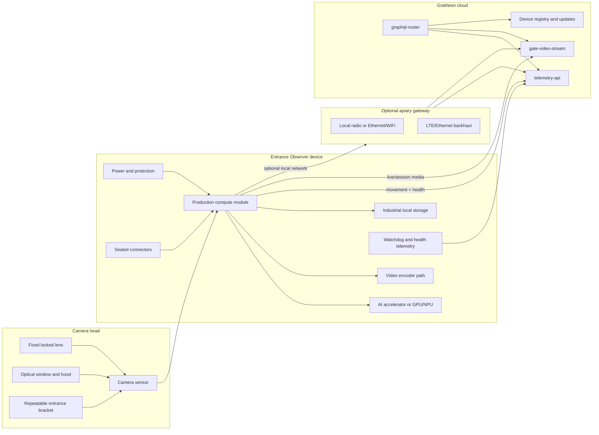

## Goal

The production phase converts the Entrance Observer from a field prototype into a repeatable Gratheon kit. The final product should be chosen from measured model, energy, video, and field data rather than from the convenience of the Jetson developer kit.

The production product must be:

- accurate enough for beekeeper decisions;
- power-aware enough for its target installation mode;
- weatherproof and serviceable;
- secure and supportable remotely;
- manufacturable from stable suppliers;
- integrated with Gratheon telemetry, video, and device-management flows.

## Recommended product strategy

Do not force one hardware SKU to solve every apiary. Entrance video has very different constraints in an urban powered apiary and a remote solar apiary.

| SKU | Target site | Video behavior | Connectivity | Likely compute direction | Product promise |
| --- | --- | --- | --- | --- | --- |
| Urban WiFi/video | Apiary with mains/PoE and good internet | On-demand live plus selected clips | Ethernet, PoE, or WiFi | Jetson production SOM, Raspberry Pi + Hailo, or RK3588 | Best live inspection and model QA. |
| Field telemetry-first | Remote apiary with limited power/data | Movement telemetry by default, rare low-res clips | LTE gateway, local gateway, or store-and-forward | Pi + Hailo, RK3588, or smart camera only if energy fits | Bee traffic trends with low bandwidth. |
| Research/dev kit | Gratheon team and advanced contributors | Flexible recording and overlays | Lab network | Jetson Orin Nano dev kit | Dataset and model development, not customer default. |

## Production architecture

## Production component recommendations

| Subsystem | Recommended direction | Why | Defer or avoid |
| --- | --- | --- | --- |
| Compute | Benchmark Jetson reference against Raspberry Pi 5 + Hailo AI HAT+ 26 TOPS and one RK3588 board. Choose by count accuracy per watt and serviceability. | TOPS alone is not the product metric. The device must run camera, AI, tracking, encode, upload, and watchdog together. | Do not select a production board only because it is cheaper or has higher advertised TOPS. |
| AI runtime | Keep model export paths for TensorRT, HailoRT, and one secondary NPU path. | Avoids locking dataset/model work to a single vendor too early. | Avoid vendor-only smart-camera AI until model quality is stable. |
| Camera | Move from generic USB camera to a locked, documented camera head. | Production installation needs repeatable FOV, focus, exposure, and cable retention. | Avoid manual varifocal lenses on customer units unless focus is physically locked and documented. |
| Sensor shutter | Prefer a camera with low motion blur; test global shutter if rolling shutter causes count errors. | Bees move fast near the entrance, and motion artifacts affect tracking. | Do not overpay for global shutter until side-by-side clips show a real count benefit. |
| Video encode | Prefer a platform or camera pipeline with efficient H.264/H.265 encode for selected clips and live view. | Live sessions and clips should not starve AI or burn solar energy. | Avoid relying on software H.265 on low-power CPUs for field SKU. |
| Storage | Use industrial-rated storage sized to retention policy. | Customer device should survive power cycles and temperature better than consumer media. | Avoid storing continuous video by default. |
| Enclosure | Use a branded UV-resistant IP65/IP67 enclosure or a designed camera-head + electronics-box assembly. | Weather failures become support failures. | Avoid acrylic hobby cases and ad-hoc 2020 frames for customer kits. |
| Connectors | Use sealed connectors or rated glands with documented pinouts. | Cameras, power, antennas, and optional sensors must be serviceable. | Avoid soldered field cables that cannot be replaced. |
| Power | Split powered/PoE SKU from solar SKU. | The product promise and BOM are different. | Do not claim solar autonomy without Wh/day and sunless-day validation. |
| Connectivity | Use Ethernet/PoE or WiFi for powered SKU; gateway/LTE for remote SKU. | Remote apiaries need a deliberate data and power model. | Avoid cellular in every unit until costs and power are proven. |

## Compute selection matrix

| Candidate | Strength | Weakness | Best production fit | Decision gate |
| --- | --- | --- | --- | --- |
| Jetson Orin Nano production module/carrier | Best ML ecosystem and TensorRT path. | Higher cost and power; Orin Nano lacks NVENC, so video encode must be planned carefully. | Premium/dev or powered video SKU. | Beats alternatives on accuracy or development velocity enough to justify watts and cost. |
| Raspberry Pi 5 + Hailo AI HAT+ 26 TOPS | Good cost/power candidate with strong community and camera ecosystem. | Requires Hailo model conversion and tracker CPU benchmark. | Near-term production candidate for WiFi/PoE SKU. | Same count quality as Jetson at at least 2x better FPS/W or lower total cost. |
| Raspberry Pi 5 + Hailo AI HAT+ 13 TOPS | Lower cost than 26 TOPS. | Less headroom for tracker and future models. | Cost-down after 26 TOPS is proven. | Meets target FPS and accuracy with thermal margin. |
| RK3588 board | Integrated NPU and often strong media codecs. | Vendor support, RKNN tooling, and OS maintenance vary. | Alternative if video encode is central or Hailo conversion fails. | Stable full pipeline with lower energy/cost than Jetson. |
| Coral TPU | Very low power for supported models. | Current YOLO-style detector may need major redesign. | Telemetry-only or simplified detector experiments. | A simplified model reaches count target. |
| Smart camera / vision module | Integrated sensor, encoder, and sometimes AI. | Vendor lock-in, less control, supply risk. | Long-term solar field SKU research. | Vendor pipeline exposes frames/metadata/control needed by Gratheon. |

## Camera-head production requirements

| Requirement | Implementation rule |
| --- | --- |
| Repeatable FOV | Define entrance width coverage, working distance, angle, and target pixel density. |
| Locked optics | Use fixed-focus or physically locked lens settings. |
| Lighting robustness | Test dawn, noon, shade, clouds, rain, and backlight. Add hood or constrained exposure profile. |
| Clean optical path | Window must be cleanable, tilted/hooded, and resistant to scratches and condensation. |
| Service replacement | Camera cable and camera head should be replaceable without rebuilding the whole device. |
| Model metadata | Store camera model, lens, FOV profile, and calibration image in device metadata. |

## Power and solar decision rules

Production must define installation mode before sizing power.

| Installation mode | Power design | Acceptance rule |
| --- | --- | --- |
| PoE powered | PoE splitter or board with Ethernet data and regulated power. | Runs full daytime profile and live sessions without brownouts. |
| Mains powered | Outdoor-safe power supply and protected low-voltage DC into enclosure. | Safe installation, no exposed mains in hobby enclosure. |
| Solar telemetry-first | Battery sized from measured Wh/day, panel sized for worst season, aggressive sleep and low-video policy. | Survives target sunless days and reports low battery before failure. |
| Gateway remote | Hive nodes/device connect to one powered gateway with LTE/Ethernet. | Per-hive unit does not need a modem unless product economics support it. |

## Production telemetry and support checklist

| Field | Required | Why |
| --- | --- | --- |
| `beesIn`, `beesOut`, `unknownDirection`, `netFlow` | Yes | Core product value. |
| `confidence`, `countIntervalSeconds`, `modelVersion` | Yes | Explains data quality and model changes. |
| `fps`, `droppedFrames`, `cameraOnline` | Yes | Detects camera/processing failures. |
| `deviceTemperature`, `uptimeSeconds`, `resetReason` | Yes | Support and reliability diagnostics. |
| `diskFreeBytes`, `queuedTelemetryCount`, `queuedClipCount` | Yes | Prevents silent storage and upload failures. |
| `rssi`, `uploadLatencyMs`, `networkType` | Yes | Explains missing data and weak connectivity. |
| `inputVoltage`, `batteryVoltage`, `batteryPercent` | Required for battery/solar SKUs | Low-power alerting and warranty support. |
| `hardwareRevision`, `cameraProfileId`, `firmwareVersion` | Yes | Links field behavior to exact build. |

## Production quality gates

- Two or more identical units produce comparable counts on the same labelled clip set.
- Outdoor enclosure passes rain, UV, condensation, heat, and cable-pull tests appropriate to the claimed rating.
- Live session starts, stops, expires, and recovers without manual SSH.
- Device can be paired to a Gratheon hive/box through the web app without manual database edits.
- Firmware update and rollback plan exists before customer sale.
- All critical parts have at least two acceptable suppliers or an approved substitute.
- Production test fixture validates camera, AI, network, storage, power, LEDs/buttons, and cloud registration.

## Exit criteria

- A production candidate platform is selected using measured count accuracy, FPS/W, bandwidth, thermal stability, cost, and support complexity.
- Camera head geometry is frozen and documented.
- Power SKU boundaries are explicit: powered/PoE, field telemetry-first, and research/dev kit.
- BOM includes enclosure, connectors, labels, packaging, service tools, and QA fixtures, not only compute and camera.
- Gratheon support can identify device state remotely without asking the beekeeper to SSH into the unit.

## Bill of materials

The detailed purchase list is in [Phase 3 - Production BOM](bill-of-materials.md). It includes production compute candidates, camera-head choices, enclosure/connectors, power variants, networking, factory test tools, and sourcing rules.