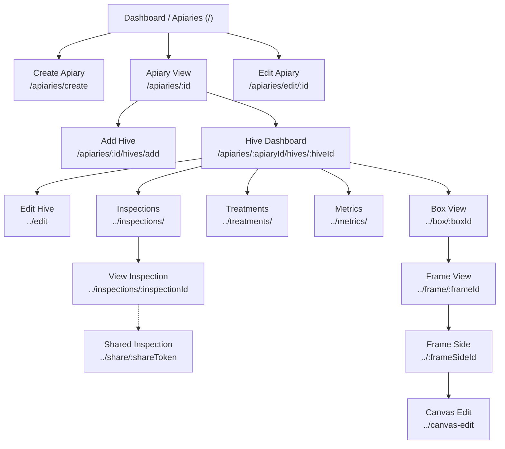
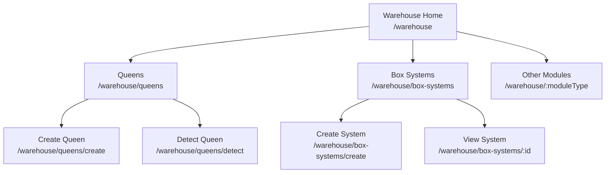
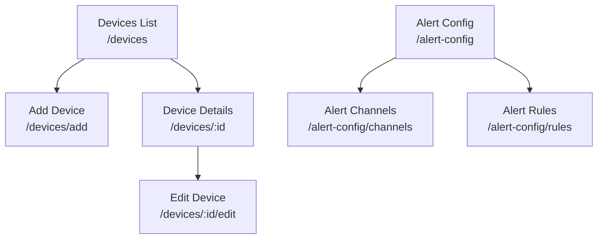
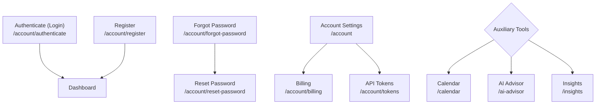

# User Journey & Application Flow

These diagrams map out the typical user journeys and page connectivity in the web application. Because the application encompasses multiple domains, the flows are split into thematic areas.

## Core Beekeeping Flow (Apiaries & Hives)
This maps the main user journey of navigating their apiary list, drilling down into individual apiaries, hives, and ultimately to box and frame-level details.

## Inventory & Warehouse
Navigation mapping for managing assets like queens and box systems.

## IoT Devices & Alerting
Flows related to hardware device management and alerting configurations.

## Settings & Onboarding
User authentication, basic account management, and auxiliary features.

