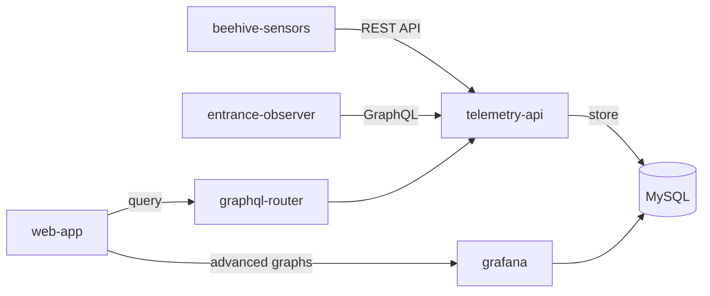

Gratheon almacena y visualiza datos de series temporales procedentes de sensores IoT instalados en colmenas. Esto permite seguimiento a largo plazo de indicadores como temperatura, humedad, peso y actividad en la piquera.

## Resumen

Los apicultores profesionales necesitan datos históricos para tomar mejores decisiones. El sistema de telemetría recoge métricas desde dispositivos de hardware, las guarda y las deja disponibles para visualización, análisis y alertas.

Esta función ayuda a:

- monitorizar continuamente condiciones ambientales;
- analizar tendencias históricas entre temporadas;
- detectar anomalías de forma temprana mediante patrones de datos;
- tomar decisiones de manejo basadas en evidencia.

## Métricas compatibles

### Datos ambientales

- **Temperatura**: temperatura interna de la colmena en grados Celsius.
- **Humedad**: nivel de humedad dentro de la colmena en porcentaje.
- **Peso**: peso total de la colmena para seguir flujo de néctar o consumo de reservas.

### Actividad en la entrada

- **Abejas entrando y saliendo**: conteo direccional del tráfico.
- **Flujo neto**: diferencia entre entradas y salidas.
- **Velocidad media**: velocidad de movimiento de las abejas.
- **Abejas estacionarias**: abejas que permanecen en la piquera.
- **Abejas detectadas**: cantidad total en el encuadre de la cámara.
- **Interacciones entre abejas**: encuentros o contactos detectados en la entrada.

## Cómo funciona

1. **Conectar sensores**
   - Instala sensores de colmena para temperatura, humedad y peso.
   - Instala Entrance Observer para análisis de tráfico de abejas.
   - Configura los dispositivos con un token de autenticación API.

2. **Recogida automática de datos**
   - Los sensores envían métricas al servicio de telemetría.
   - Los datos se almacenan en tablas optimizadas para series temporales.
   - La autenticación se verifica mediante los servicios de cuenta.

3. **Ver y analizar datos**
   - Las métricas recientes se muestran en el panel de la colmena.
   - Los gráficos históricos permiten elegir rangos de tiempo.
   - La analítica avanzada puede integrarse con Grafana.
   - Los datos pueden exportarse para análisis externo.

4. **Configurar alertas**
   - Crea reglas por umbral.
   - Recibe avisos cuando una métrica sale de rangos seguros.
   - Detecta cambios bruscos o anomalías.

## Retención de datos

El nivel Pro incluye:

- **Periodo de almacenamiento**: hasta 3 años de datos históricos.
- **Resolución**: desde agregados de 1 minuto hasta agregados diarios, según configuración.
- **Rangos de consulta**: desde la última hora hasta periodos de varios años con agregación.
- **Tamaño estimado**: alrededor de 500 MB por colmena y año, según frecuencia y sensores.

## Arquitectura



El sistema usa:

- **telemetry-api**: servicio principal para almacenar y consultar métricas.
- **MySQL**: almacenamiento optimizado por identificador de colmena y fecha.
- **graphql-router**: puerta de enlace para consultas desde la aplicación web.
- **Grafana**: visualización avanzada y análisis operativo.

## Acceso API

Hay APIs REST y GraphQL disponibles para integraciones:

**REST API** para dispositivos IoT:

```text
POST /v1/metrics/:hiveId
POST /v1/entrance/:hiveId/:boxId
GET /v1/metrics/:hiveId/temperature?minutes=60
```

**GraphQL API** para la aplicación web:

```graphql
query {
  temperatureCelsius(hiveId: "123", timeRangeMin: 60)
  humidityPercent(hiveId: "123", timeRangeMin: 1440)
  weightKgAggregated(hiveId: "123", days: 7, aggregation: DAILY_AVG)
  entranceMovement(hiveId: "123", timeFrom: "2024-12-01", timeTo: "2024-12-06")
}
```

## Casos de uso

### Comparación estacional

Compara temperatura y humedad entre años para preparar la cría de primavera, el manejo de verano y la invernada.

### Seguimiento de mielada

Monitoriza cambios de peso para detectar inicio de flujo de néctar, escasez, consumo de reservas o momento óptimo de cosecha.

### Salud de la colonia

Observa actividad en la entrada para detectar colonias huérfanas, pillaje, cambios de forrajeo o eventos anómalos.

### Eficacia de tratamientos

Compara métricas antes y después de una intervención para verificar recuperación, estabilidad térmica o respuesta a alimentación.

## Limitaciones técnicas

- Las consultas largas requieren agregación.
- Hay límites de puntos por consulta para mantener rendimiento.
- La frecuencia mínima de escritura depende del dispositivo y la configuración.
- Algunas vistas usan actualización por sondeo, no WebSockets en tiempo real.
- Grafana puede requerir autenticación separada.

## Funciones relacionadas

- [🔔 Alertas](../flexible-tier/alerts.md): notificaciones basadas en umbrales.
- [📊 Analítica de series temporales](timeseries-data-analytics.md): comparar métricas entre colmenas.

## Recursos

- [Documentación de sensores de colmena](/docs/beehive-sensors/beehive-sensors/)
- [Configuración de Entrance Observer](/docs/entrance-observer/entrance-observer/)
- [Telemetry API en GitHub](https://github.com/Gratheon/telemetry-api)
