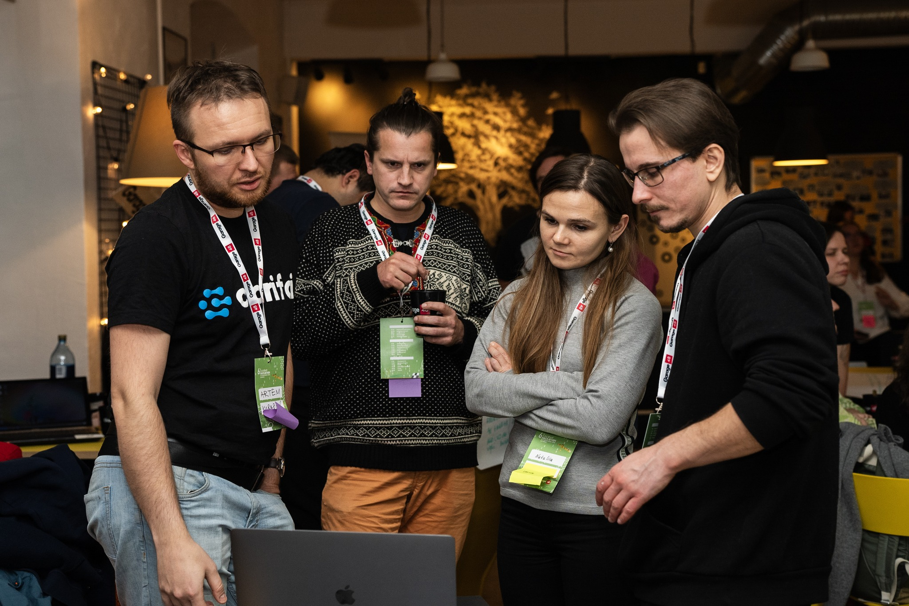

Siin loetleme kõik [vabatahtlikud](volunteer.md), kes meid on aidanud. Võtke seda kui autahvlit.

## Inseneeria

| Isiku nimi | Fookus |
| --- | --- |
| [Aleksei Prokopov](https://www.linkedin.com/in/roboter/) | Töötas digitaalsete kaalude IoT seadmega (riistvara) |
| [Vjatšeslav Kekšin](https://www.linkedin.com/in/vjatsheslav-kekshin-63455053) | Avaldati meie [whitepaperis](https://easychair.org/publications/preprint/QGJN) (uurimustöö) |
| [Kurban Ramazanov](https://www.linkedin.com/in/kurban-ramazanov-2b50b026b/) | Aitas UI/UX disainiga |
| [Alonso Solis](https://www.linkedin.com/in/alonso-solis-a5b88020a/) | Andmetormi häkaton, FE |
| Adrian Ala | Andmetormi häkaton, UX |
| [Ahmed Daoudi](https://www.linkedin.com/in/ahmed-daoudi-aa693a230/) | telemetry-api |
| [Muhammad Zain Shakeel](https://www.linkedin.com/in/zains96/) | 3D mudelid |
| [Natalia Kinash](https://www.linkedin.com/in/nataliia-kinash/) | Satelliidipildid |
| [Reinis Indans](https://www.linkedin.com/in/reinis-indans/) | Satelliidipildid ja mudelid |

**Suur tänu kõigile!**