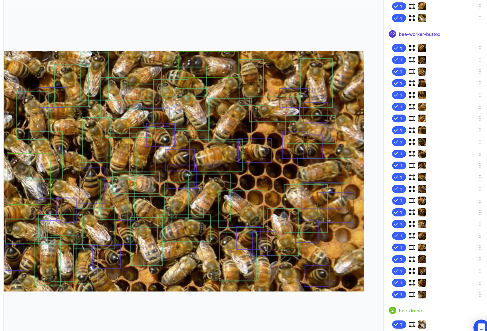
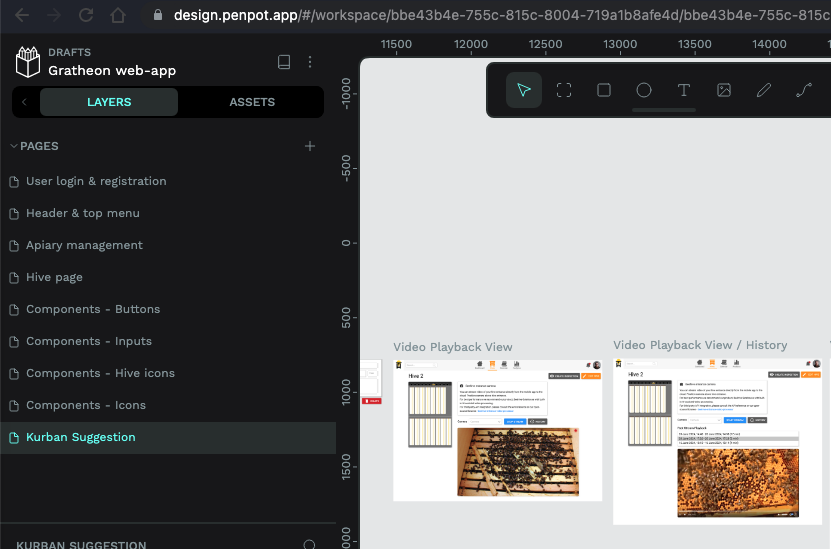

<iframe width="100%" height="400" src="https://www.youtube.com/embed/QhFyfKqgdUE" title="Company mission" frameborder="0" allow="accelerometer; autoplay; clipboard-write; encrypted-media; gyroscope; picture-in-picture; web-share" referrerpolicy="strict-origin-when-cross-origin" allowfullscreen></iframe>

#### Miks olla vabatahtlik

Vabatahtlik töö tähendab, et teete tööd tasuta, sest teid **motiveerivad** muud asjad:
- Soovite õppida, uskudes meie missiooni aidata mesinikke ja mesilasi.
- Avatud lähtekoodiga projekti kogemuse saamine.
- Uute oskuste õppimine.

## Mida teha

1. [**Liitu meie Discordiga**](https://discord.gg/PcbP4uedWj)
2. Vaata GitHubi ülesandeid.
3. Küsi Discordis lisainfot.

### Näited
- GitHubi pull-request.
- QA testimine.
- ML mudelite annotatsioonid.

