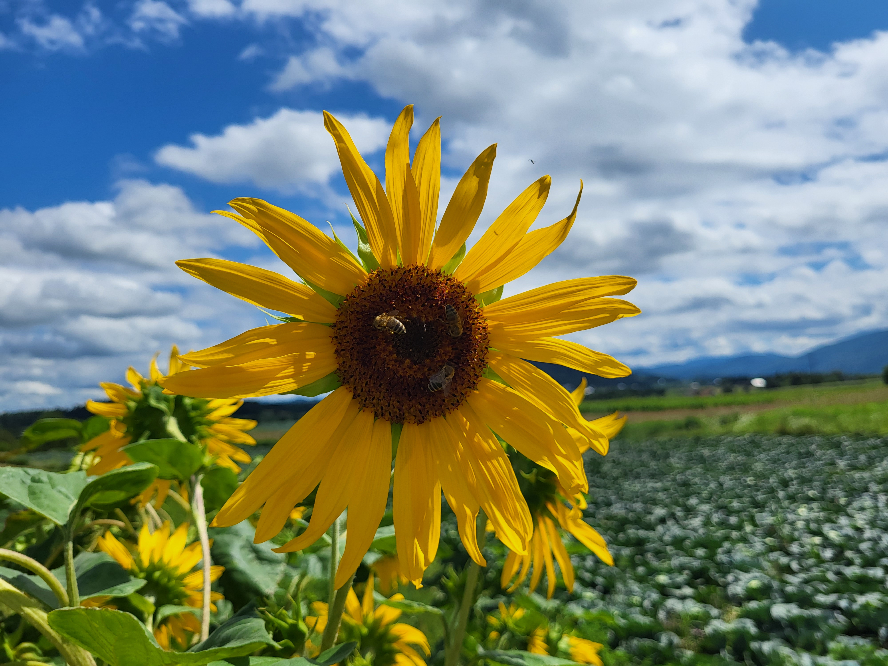
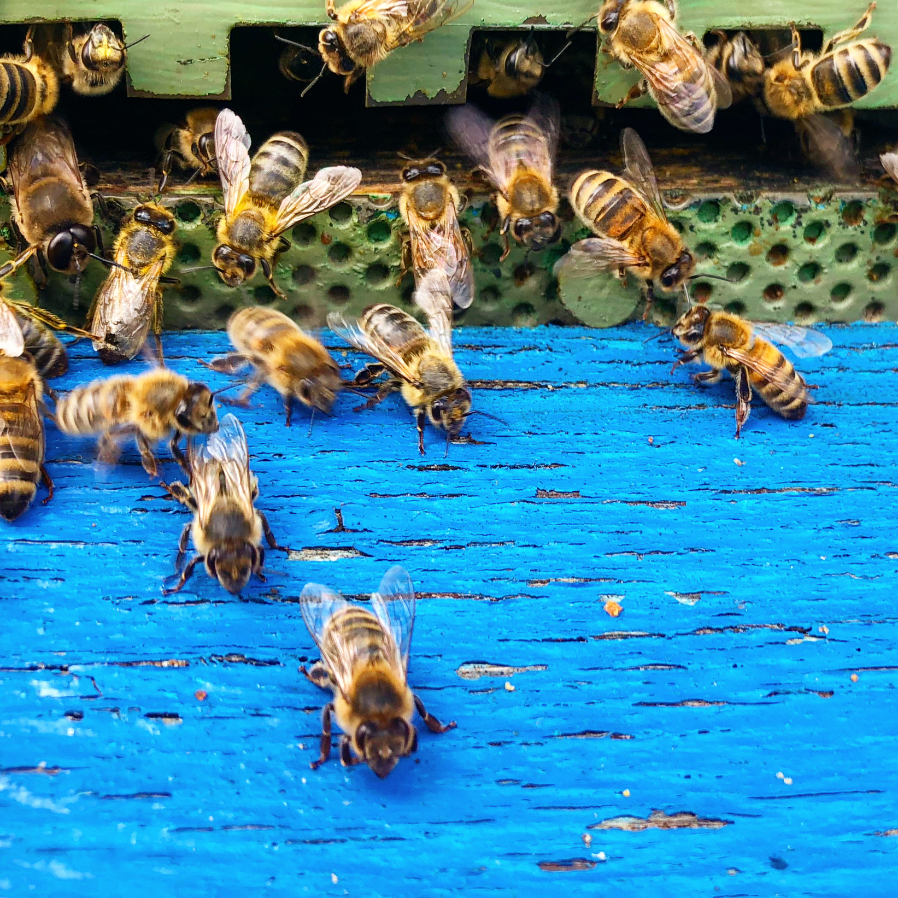
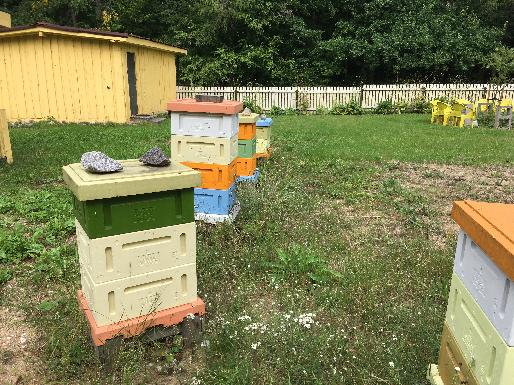
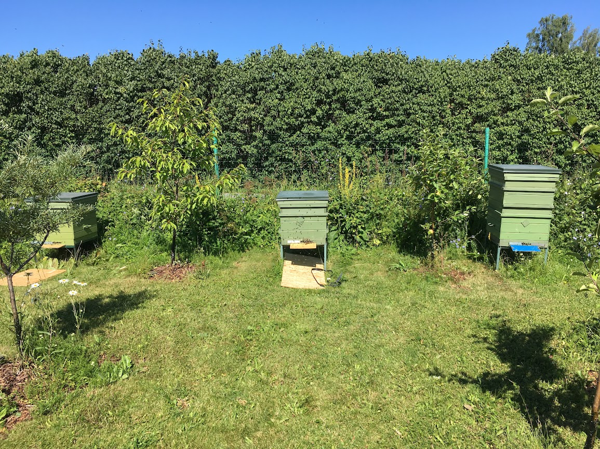
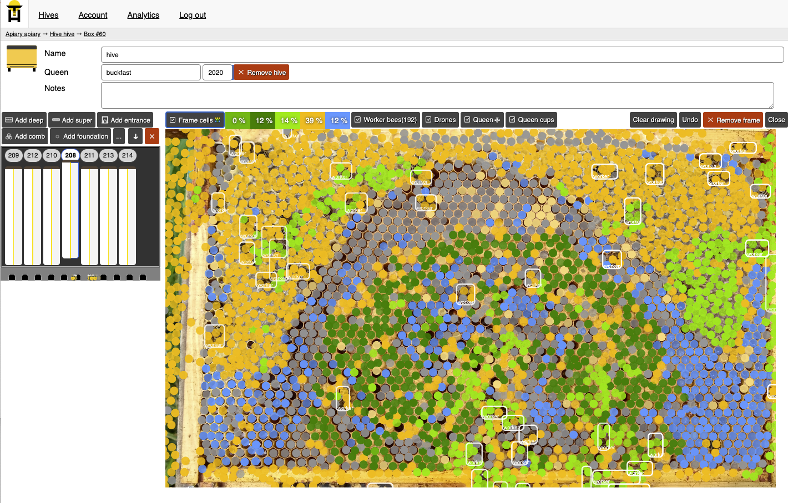
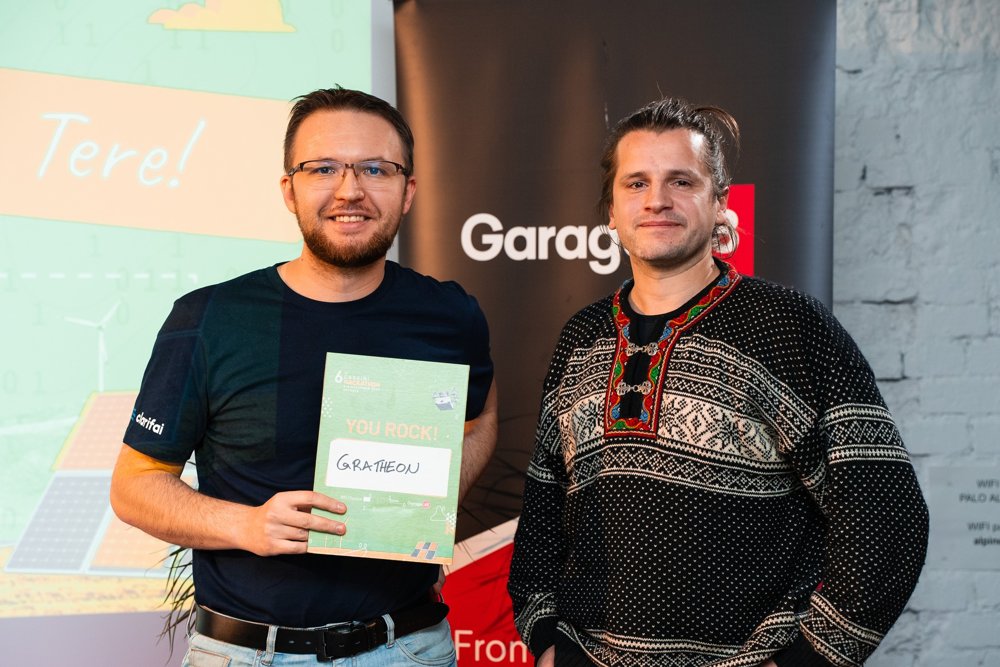
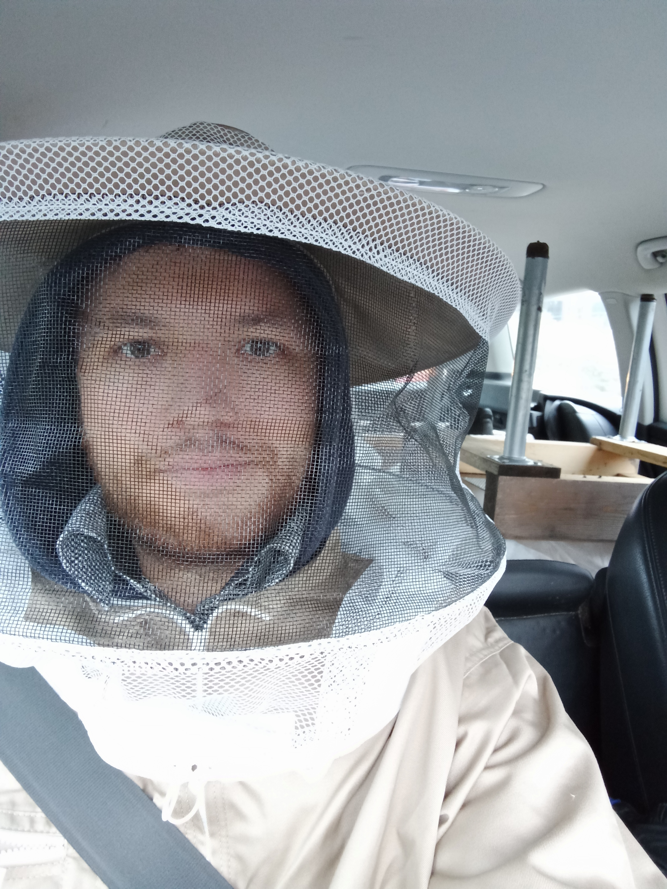
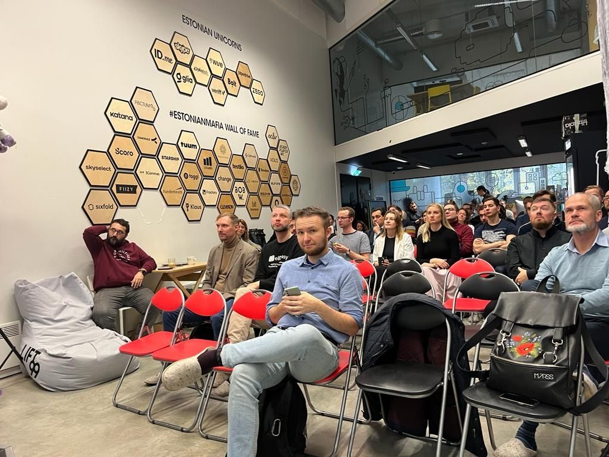

Materjalid meediakajastuse jaoks.
Vaata [Sümboolika](mission/Symbolism.md) logo viitamiseks.

## Kontakt

- Gratheon OÜ, Reg. nr. [12245103](https://ariregister.rik.ee/eng/company/12245103/Gratheon-O%C3%9C)
- E-post: [pilot@gratheon.com](mailto:pilot@gratheon.com)
- Telefon: (+372) 58058720
- Discord: [https://discord.gg/PcbP4uedWj](https://discord.gg/PcbP4uedWj)

## Mesindus

Mesilased päevalillel Horvaatias. Foto: Artjom Kurapov

Mesilased lennulaua juures, foto: Artjom Kurapov

Tallinna Loomaaia mesila, foto: Artjom Kurapov

Isiklik mesila, foto: Artjom Kurapov

Rakenduse kasutajaliides (inglise keeles)

# Meeskond

