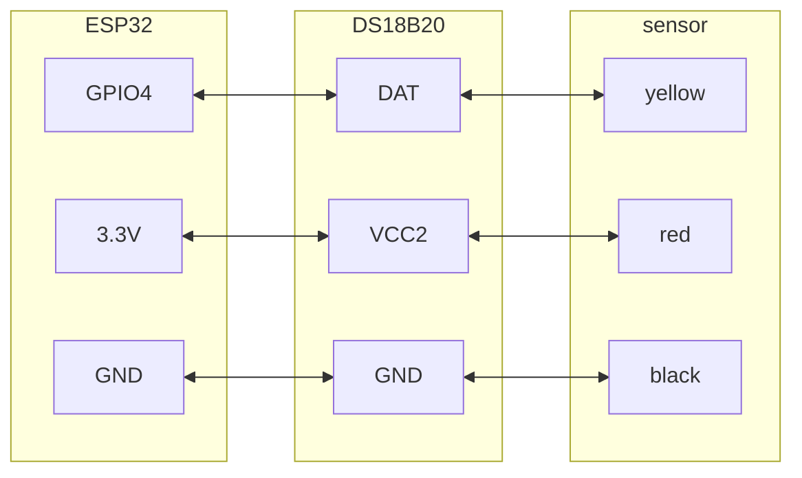

https://www.aliexpress.com/item/1005006431677780.html

### Ühendusskeem
  

DS18B20 Temperatuuriandur:
- ANDMED IO4-le (valikulise 4,7 kΩ tõmbetakistiga DATA ja VCC vahel)

Kirjeldus:

Ühendatav klemm veekindel DS18B20 temperatuuriandurit saab kasutada paljudes kohtades, näiteks pinnase temperatuuri tuvastamine, kuumaveepaagi temperatuuri kontroll, veekindel DS18B20 temperatuuriandur tuleb ühendada ka tõmbetakistiga, mille jaoks muunduri disainisime kasutamiseks saatmiseks.

Toote spetsifikatsioonid:

Temperatuurianduri toitepinge: 3,0V ~ 5,5V

Temperatuurianduri eraldusvõime: 9 kuni 12 reguleeritav eraldusvõime

Temperatuurivahemik: -55 ~ +125 ° (plii talub ainult kõrgeimat temperatuuri 85 kraadi)

Temperatuurianduri väljundjuhe: kollane (DATA) punane (VCC) ja must (GND)

Adapteri kaablid: DATA, VCC, BLK,

Sobiv platvorm: Arduino ja Raspberry Pi jaoks

Pakett sisaldab:

1PC * DS18B20 temperatuuriandur

1PC * ühendatav terminaliadapter

1 PC * 3 kontaktiga kaabel

<iframe width="100%" height="400" src="https://www.youtube.com/embed/iee3QBuVx6M" title="ESP32 &amp; DS18B20 thermometer - simple projects with Arduino and ESP32" frameborder="0" allow="accelerometer; autoplay; clipboard-write; encrypted-media; gyroscope; picture-in-picture; web-share" referrerpolicy="strict-origin-when-cross-origin" allowfullscreen></iframe>