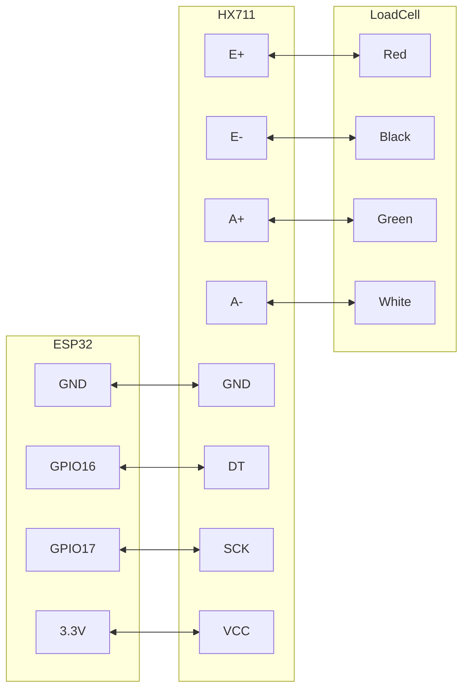

https://www.aliexpress.com/item/1005006827930173.html
[https://www.amazon.de/-/en/gp/product/B079FQNJJH/](__ETDOCS_URL_00006__)

### Juhtmed

#### Single Load Cell Setup
HX711 Koormuselemendi võimendi:

- E = Ergastus. E+ (punane) ja E- (must) on koormusanduri ergutusjuhtmed, mis annavad koormusandurile toiteks oleva pinge.
- A = võimendi. A+ (valge) ja A- (roheline) on koormusanduri signaalijuhtmed, mis kannavad diferentsiaalsignaali, mida HX711 võimendab.



#### Nelja koormuselemendi seadistamine (mesitaru kaalu täielikuks mõõtmiseks)

**Jah, ühe ESP32 külge saate ühendada 4 kaaluandurit!** Iga koormusandur vajab oma HX711 võimendit. Ühendused töötavad järgmiselt.

```mermaid
flowchart TD
    subgraph ESP32
        VCC[3.3V]
        GND[GND]
        GPIO16[GPIO16 - DT1]
        GPIO17[GPIO17 - SCK1]
        GPIO18[GPIO18 - DT2] 
        GPIO19[GPIO19 - SCK2]
        GPIO21[GPIO21 - DT3]
        GPIO22[GPIO22 - SCK3]
        GPIO23[GPIO23 - DT4]
        GPIO25[GPIO25 - SCK4]
    end

    subgraph HX711_1[HX711 #1 - Front Left]
        DT1[DT]
        SCK1[SCK]
        VCC1[VCC]
        GND1[GND]
        E1+[E+]
        E1-[E-]
        A1+[A+]
        A1-[A-]
    end

    subgraph HX711_2[HX711 #2 - Front Right]
        DT2[DT]
        SCK2[SCK]
        VCC2[VCC]
        GND2[GND]
        E2+[E+]
        E2-[E-]
        A2+[A+]
        A2-[A-]
    end

    subgraph HX711_3[HX711 #3 - Back Left]
        DT3[DT]
        SCK3[SCK]
        VCC3[VCC]
        GND3[GND]
        E3+[E+]
        E3-[E-]
        A3+[A+]
        A3-[A-]
    end

    subgraph HX711_4[HX711 #4 - Back Right]
        DT4[DT]
        SCK4[SCK]
        VCC4[VCC]
        GND4[GND]
        E4+[E+]
        E4-[E-]
        A4+[A+]
        A4-[A-]
    end

    subgraph LoadCell1[Load Cell 1 - Front Left]
        Red1[Red - E+]
        Black1[Black - E-]
        White1[White - A-]
        Green1[Green - A+]
    end

    subgraph LoadCell2[Load Cell 2 - Front Right]
        Red2[Red - E+]
        Black2[Black - E-]
        White2[White - A-]
        Green2[Green - A+]
    end

    subgraph LoadCell3[Load Cell 3 - Back Left]
        Red3[Red - E+]
        Black3[Black - E-]
        White3[White - A-]
        Green3[Green - A+]
    end

    subgraph LoadCell4[Load Cell 4 - Back Right]
        Red4[Red - E+]
        Black4[Black - E-]
        White4[White - A-]
        Green4[Green - A+]
    end

    %% Power connections
    VCC -.-> VCC1
    VCC -.-> VCC2
    VCC -.-> VCC3
    VCC -.-> VCC4
    
    GND -.-> GND1
    GND -.-> GND2
    GND -.-> GND3
    GND -.-> GND4

    %% Digital connections
    GPIO16 --- DT1
    GPIO17 --- SCK1
    GPIO18 --- DT2
    GPIO19 --- SCK2
    GPIO21 --- DT3
    GPIO22 --- SCK3
    GPIO23 --- DT4
    GPIO25 --- SCK4

    %% Load cell connections
    E1+ --- Red1
    E1- --- Black1
    A1+ --- Green1
    A1- --- White1

    E2+ --- Red2
    E2- --- Black2
    A2+ --- Green2
    A2- --- White2

    E3+ --- Red3
    E3- --- Black3
    A3+ --- Green3
    A3- --- White3

    E4+ --- Red4
    E4- --- Black4
    A4+ --- Green4
    A4- --- White4
```



**Alternatiivne juhtmestik (jagatud SCK):**
ESP32 kontaktide salvestamiseks saate jagada SCK (kell) rida kõigi HX711 moodulite vahel. Sel juhul vajate kokku ainult 5 tihvti (1 jagatud SCK + 4 eraldi DT kontakti):

```
ESP32 GPIO17 → All HX711 SCK pins (shared)
ESP32 GPIO16 → HX711 #1 DT
ESP32 GPIO18 → HX711 #2 DT  
ESP32 GPIO21 → HX711 #3 DT
ESP32 GPIO23 → HX711 #4 DT
3.3V → All HX711 VCC pins
GND → All HX711 GND pins
```


# Omadused

Kaks valitavat diferentsiaalset sisendkanalit

Kiibil olev aktiivne madala müratasemega PGA valitava võimendusega 3264 ja 128

Kiibil olev toiteallika regulaator koormuselemendi ja ADC analoogtoiteallika jaoks

Kiibil olev ostsillaator, mis ei vaja välist komponenti koos valikulise välise kristalliga

Kiibil olev toite sisselülitamine ja lähtestamine

Lihtne digitaalne juhtimine ja jadaliides: tihvtidega juhitavad juhtelemendid pole vaja programmeerida

Valitav 10SPS või 80SPS väljundandmeedastuskiirus

Samaaegne 50 ja 60 Hz varustuse tagasilükkamine

Voolutarve koos kiibil oleva analoogtoite regulaatoriga: normaalne töö < 1.5mApower down < 1uA

Operation supply voltage range: 2.6 ~ 5.5V

Operating Temperature Range:-20 degree ~ +85 degree

### Connection Summary

**For 4-sensor beehive scale setup:**

| Load Cell Position | HX711 Module | ESP32 DT Pin | ESP32 SCK Pin | Load Cell Wires |
|-------------------|--------------|--------------|---------------|-----------------|
| Front Left        | HX711 #1     | GPIO16       | GPIO17        | Red→E+, Black→E-, White→A-, Green→A+ |
| Front Right       | HX711 #2     | GPIO18       | GPIO19*       | Red→E+, Black→E-, White→A-, Green→A+ |
| Back Left         | HX711 #3     | GPIO21       | GPIO22*       | Red→E+, Black→E-, White→A-, Green→A+ |
| Back Right        | HX711 #4     | GPIO23       | GPIO25*       | Red→E+, Black→E-, White→A-, Green→A+ |

*Can be shared (all connected to GPIO17) to save pins.

**Power connections:**
- ESP32 3.3V → All HX711 VCC pins
- ESP32 GND → All HX711 GND pins

**Arduino Code Example:**
__ETDOCS_CODE_00003__

Red to E+

Black to E-

Green to A+

White to A-


<iframe width="100%" height="400" src="https://www.youtube.com/embed/AwSBbMUPjSc" title="HX711 Load Cell Arduino | HX711 calibration | Weighing Scale | Strain Gauge" frameborder="0" allow="accelerometer; autoplay; clipboard-write; encrypted-media; gyroscope; picture-in-picture; web-share" referrerpolicy="strict-origin-when-cross-origin" allowfullscreen></iframe>


## Alternatiiv 
https://www.aliexpress.com/item/1005006593556468.html