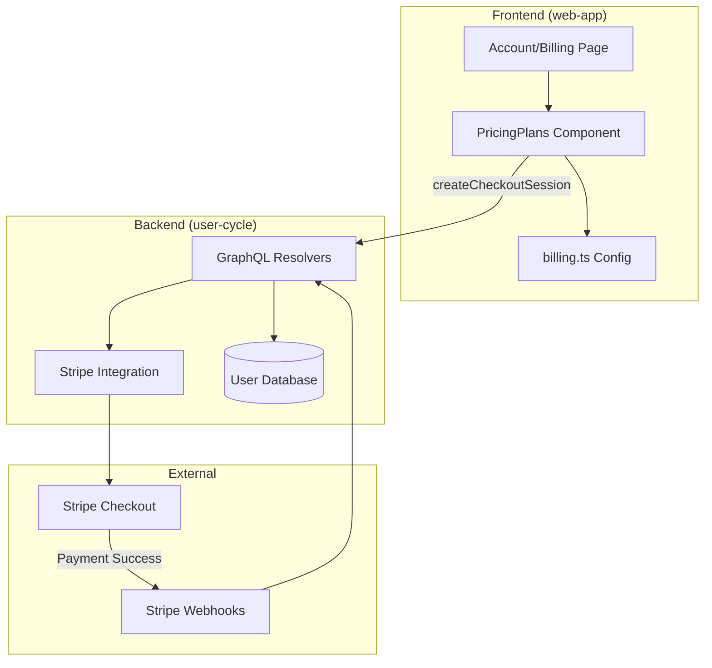
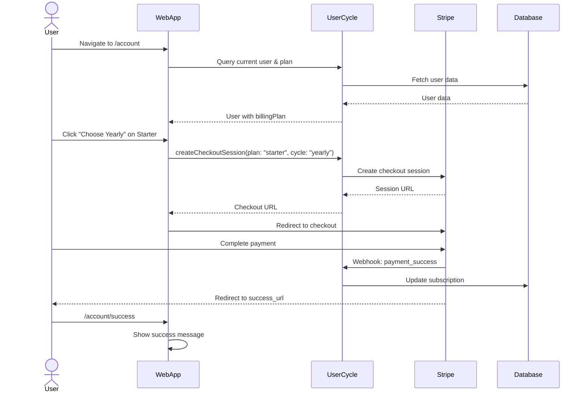
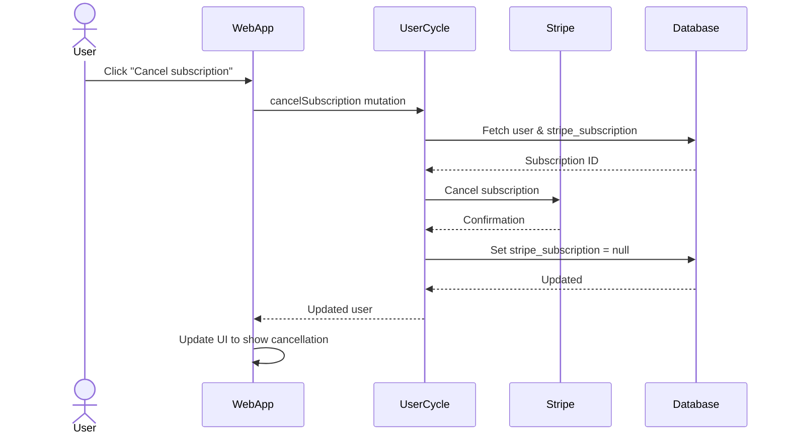

## Ülevaade

Gratheoni arveldussüsteem võimaldab kasutajatel tellida erinevaid hinnatasemeid (tasuta, starter, professionaalne) ja hallata oma tellimusi. Süsteemi rakendatakse kolmes hoidlas:
- **web-app**: kasutajaliides arvelduse haldamiseks
- **user-cycle**: taustaprogrammi GraphQL API ja Stripe integreerimine
- **veebisait**: avalik hinnakujundusleht

## Arhitektuur

### Süsteemi komponendid



## Hinnakujundustasemed

### Tasuta (harrastaja)
- **Hind**: igavesti tasuta
- **Omadused**:
  - Kuni 3 taru
  - max 10 kaadrit taru kohta
  - Töömesilaste tuvastamine
  - Kuninganna tuvastamine
  - Avalik taru jagamine
  - Ravipäevik
- **Piirangud**:
  - Madala prioriteediga AI töötlemine
  - 1 aasta pildi säilitamine

### Starter
- **Kuu**: 22 €/kuus
- **Aasta**: 12 eurot kuus (144 eurot aastas) - **Säästke 45%**
- **Omadused**:
  - Kuni 20 taru
  - 30 kaadrit taru kohta
  - Rakuanalüüs
  - Varroa loendamine (alumine laud)
  - tarude paigutuse planeerija
  - ülevaatuse juhtimine
  - AI mesinduse assistent
- **Piirangud**:
  - 1 kasutajakonto
  - 2-aastane kujutise säilitamine

### Professionaalne
- **Kuu**: 55 €/kuus
- **Aasta**: 33 eurot kuus (396 eurot aastas) - **Säästke 40%**
- **Omadused**:
  - Kuni 150 taru
  - piiramatu arv kaadreid
  - Telemeetriasalvestus
  - Ajaridade andmete analüüs
  - Kolooniate võrdlus
  - Piiramatu kontroll
  - Kuni 20 kasutajakontot
- **Piirangud**:
  - 10 min telemeetria eraldusvõime
  - 3-aastane kujutise säilitamine
- **Olek**: arendamisel

### Paindlik (lisand)
- **Hind**: 100 € ühekordne (1000 märki, kehtib 1 aasta)
- **Eesmärk**: tasulised infrastruktuuri funktsioonid
- **Omadused**:
  - Video töötlemine ja salvestamine
  - IoT telemeetria kiiruspiirangud
  - SMS-teated
  - Veebihaagi integratsioonid
  - Täiendav võimsus üle tasandi piiride
- **Olek**: väljatöötamisel (pole näidatud web-app arveldusvalikus)

### Ettevõtlus
- **Hind**: kohandatud hinnakujundus
- **Omadused**:
  - Kohandatud integratsioonid
  - Kohalik juurutamine
  - 24/7 prioriteetne tugi
  - Täiustatud turvalisus
  - Piiramatu ulatus
- **Võtke ühendust**: enterprise@gratheon.com

## Rakenduse üksikasjad

### Frontend (web-app)

#### Konfiguratsioon (`src/config/billing.ts`)
Määratleb kõik arveldustasemed:
- tasandite nimed ja värvid
- Igakuine/aastane hinnakujundus
- Säästuprotsendid
- Stripe hinna ID-d

```typescript
export const BILLING_TIERS = {
  free: { name: 'Free', color: '#f0f0f0', textColor: '#666' },
  starter: {
    name: 'Starter',
    color: '#FFD900',
    monthly: { price: 22, currency: 'EUR', stripePrice: 'price_starter_monthly' },
    yearly: { 
      price: 12, 
      pricePerYear: 144, 
      currency: 'EUR', 
      savings: '45%', 
      stripePrice: 'price_starter_yearly' 
    }
  },
  // ... more tiers
}
```

#### Komponendid

**`src/page/accountEdit/billing/index.tsx`**
- Peamise arvelduslehe ümbris
- Näitab tellimuse olekut
- Kuvab aegumiskuupäevad
- Tellimuse tühistamise nupp
- Manustatakse PricingPlansi komponent

**`src/page/accountEdit/billing/pricingPlans.tsx`**
- 3-veeruline paigutus: tasuta, starter, professionaalne
- Igakuine/aastane lülitus tasandi kohta
- Stripe kassa integreerimine
- Praeguse plaani näit
- Vigade käsitlemine

**`src/page/accountEdit/billing/pricingPlans.css`**
- Tundlik ruudustiku paigutus
- astmepõhised värvid
- hõljutusefektid
- Mobiilile reageeriv

### Taustaprogramm (user-cycle)

#### GraphQL Skeem (`schema.graphql`)
```graphql
type User {
  billingPlan: String
  hasSubscription: Boolean
  isSubscriptionExpired: Boolean
  date_expiration: DateTime
}

type BillingHistoryEvent {
  id: Int!
  userId: Int!
  eventType: String!
  billingPlan: String
  amount: Float
  currency: String
  details: String
  createdAt: String!
}

type Query {
  billingHistory: [BillingHistoryEvent]
}

type Mutation {
  createCheckoutSession(plan: String, cycle: String): URL
  cancelSubscription: CancelSubscriptionResult
}
```

#### Arveldusajalugu

Arveldusajaloo funktsioon jälgib kõiki kasutaja arveldamisega seotud sündmusi:

**Sündmuste tüübid**:
- `registration` - Kasutajakonto loodud
- `purchase` - Taseme tellimus ostetud
- `cancellation` - Kasutaja tühistas tellimuse
- `system_downgrade` - Automaatne alandamine tasuta tasemele (nt maksetõrge)
- `upgrade` - Plaan on täiendatud
- `downgrade` - Plaan viidi madalamale versioonile

**Mudel** (`src/models/billingHistory.ts`):
```typescript
export const billingHistoryModel = {
  async getByUserId(userId: number): Promise<BillingHistoryEvent[]> {
    // Fetch all events for user, ordered by createdAt DESC
  },
  
  async addRegistration(userId: number, plan: string) {
    // Track when user registers
  },
  
  async addPurchase(userId: number, plan: string, amount: number, currency: string) {
    // Track tier purchase
  },
  
  async addCancellation(userId: number, previousPlan: string) {
    // Track cancellation
  },
  
  async addSystemDowngrade(userId: number, reason: string) {
    // Track auto-downgrade to free tier
  }
}
```**Andmebaasi tabel** (`billing_history`):
- `id`: primaarvõtme automaatne suurendamine
- `user_id`: kontotabeli võõrvõti
- `event_type`: ENUM('registreerimine', 'ost', 'tühistamine', 'süsteemi_alandamine', 'uuendus', 'alla versioonile üleminek')
- `billing_plan`: ENUM('tasuta', 'alustaja', 'professionaalne', 'lisa', 'ettevõte')
- `amount`: kümnendkoht (makse summa)
- `currency`: VARCHAR (nt 'EUR')
- `details`: TEXT (JSON-string koos lisateabega)
- `created_at`: ajatempel

**UI Ekraan**:
Arveldusajalugu kuvatakse ajaskaalana lehel web-app `/account`:
- Registreerimiskuupäev
- tasandi ostud summadega
- tühistamised
- Süsteemi muudatused (nt automaatne alandamine makse ebaõnnestumise korral)

See asendab vajaduse selgesõnaliste aegumise hoiatusteadete järele – kasutajad näevad oma täielikku arvelduse ajaskaala.

#### Lahendajad (`src/resolvers.ts`)

**`createCheckoutSession`**
- Kinnitab kasutaja autentimise
- Mapsi plaan/tsükkel kuni Stripe hinna ID
- Loob Stripe kassasseansi
- Tagastab kassa URL-i
- Toetab režiime: "tellimus" (algaja, professionaalne) või "makse" (lisand)

```typescript
createCheckoutSession: async (parent, { plan, cycle }, ctx) => {
  if (!ctx.uid) return err(error_code.AUTHENTICATION_REQUIRED);
  
  const user = await userModel.getById(ctx.uid);
  let priceId = getPriceIdForPlan(plan, cycle);
  let mode = plan === 'addon' ? 'payment' : 'subscription';
  
  const session = await stripe.checkout.sessions.create({
    customer_email: user.email,
    mode: mode,
    line_items: [{ price: priceId, quantity: 1 }],
    success_url: `${appUrl}/account/success`,
    cancel_url: `${appUrl}/account/cancel`,
    metadata: { plan, cycle }
  });
  
  return session.url;
}
```

**`cancelSubscription`**
- Tühistab Stripe tellimuse
- Värskendab kasutajate andmebaasi
- Tagastab värskendatud kasutajaobjekti

#### Konfiguratsioon (`src/config/config.default.ts`)
```typescript
stripe: {
  secret: 'sk_test_...',
  webhook_secret: 'whsec_...',
  plans: {
    starter: {
      monthly: 'price_starter_monthly_placeholder',
      yearly: 'price_starter_yearly_placeholder'
    },
    professional: {
      monthly: 'price_professional_monthly_placeholder',
      yearly: 'price_professional_yearly_placeholder'
    },
    addon: {
      oneTime: 'price_addon_onetime_placeholder'
    }
  }
}
```

### Veebisait (avalik hinnakujundus)

**`src/components/CustomPricingPage.js`**
- Avalik hinnakujundusleht
- Näitab kõiki tasemeid: harrastaja, alustaja, paindlik, professionaalne, ettevõte
- Üksikasjalikud funktsioonide loendid
- Lisakalkulaator (arenduses)
- Lingid registreerimisele/müügile

## Kasutajavoog

### Tellimuse ostuvoog



### Tellimuse tühistamise voog



## Andmebaasi skeem

### konto tabel (in user-cycle MySQL)
- `id`: esmane võti
- `email`: kasutaja e-posti aadress
- `stripe_subscription`: Stripe tellimuse ID (null)
- `billing_plan`: ENUM('tasuta', 'alustaja', 'professionaalne', 'lisa', 'ettevõte') - Vaikimisi: 'tasuta'
- `date_expiration`: tellimuse aegumiskuupäev
- `date_added`: konto loomise kuupäev

### arvelduse_ajaloo tabel (in user-cycle MySQL)
- `id`: primaarvõtme automaatne suurendamine
- `user_id`: kontotabeli võõrvõti
- `event_type`: ENUM('registreerimine', 'ost', 'tühistamine', 'süsteemi_alandamine', 'uuendus', 'alla versioonile üleminek')
- `billing_plan`: ENUM('tasuta', 'alustaja', 'professionaalne', 'lisa', 'ettevõte')
- `amount`: DECIMAAL(10,2) - Maksesumma (null)
- `currency`: VARCHAR(3) - nt 'EUR' (null)
- `details`: TEKST - JSON-string koos lisateabega (null)
- `created_at`: TIMESTAMP - Vaikimisi: CURRENT_TIMESTAMP

**Migratsioonifailid**:
- `migrations/023-create-billing-history.sql` - Loob kontoandmetest tabeli ja järeltäitmisi
- `migrations/024-update-billing-plan-enum.sql` - Värskendab loendiväärtusi vanadelt ('base', 'profi') uuteks ('alustaja', 'professionaalne')

## Stripe Integratsioon

### Hinna ID-d (tootmine)
Peab olema konfigureeritud `user-cycle/src/config/config.default.ts`:
- `price_starter_monthly`: stardikuupakett
- `price_starter_yearly`: algav aastaplaan
- `price_professional_monthly`: professionaalne kuupakett
- `price_professional_yearly`: professionaalne aastaplaan
- `price_addon_onetime`: paindlik lisamakse ühekordne

### Veebihaagid
Seadistage Stripe juhtpaneelil:
- `checkout.session.completed`: käsitlege edukaid makseid
- `customer.subscription.deleted`: käsitlege tühistamisi
- `customer.subscription.updated`: käsitlege plaani muudatusi

Veebihaagi lõpp-punkt: `https://app.gratheon.com/webhooks/stripe`## Keskkonnamuutujad

### user-cycle
- `STRIPE_SECRET_KEY`: Stripe API salavõti
- `STRIPE_WEBHOOK_SECRET`: Stripe veebihaagi allkirjastamise saladus
- `JWT_KEY`: seansi loa allkirjastamise võti
- `MYSQL_HOST`, `MYSQL_USER`, `MYSQL_PASSWORD`, `MYSQL_DATABASE`: andmebaasi konfiguratsioon

### web-app
- `VITE_API_URL`: GraphQL API lõpp-punkt (osutab user-cycle)

## Turvakaalutlused

1. **Autentimine**: kõik arveldusmutatsioonid nõuavad kontekstis kehtivat JWT luba
2. **CSRF-kaitse**: GraphQL mutatsioonid kasutavad POST-i koos õigete CORS-idega
3. **Veebihaagi kinnitamine**: Stripe veebihaagi allkirjad peavad olema kinnitatud
4. **Hinna terviklikkus**: hinnad on määratud serveri, mitte kliendi poolel
5. **Seansi turvalisus**: kassaseansid aeguvad 24 tunni pärast

## Testimine

### Käsitsi testimise kontroll-loend
- [ ] Vaba tasand kuvatakse õigesti
- [ ] Starter kuu/aasta valik töötab
- [ ] Professionaalsed igakuised/aastased valikutööd
- [ ] Stripe checkout suunab korralikult ümber
- [ ] Edu leht kuvatakse pärast makse sooritamist
- [ ] Tühista leht näitab, kui kasutaja loobub kassast
- [ ] Tellimuse tühistamine toimib
- [ ] Aegunud tellimus näitab hoiatust
- [ ] Praeguse plaani märk kuvatakse õigesti

### Stripe Testkaardid
- Edu: `4242 4242 4242 4242`
- Keeldu: `4000 0000 0000 0002`
- 3D-turvaline: `4000 0027 6000 3184`

## Teadaolevad probleemid ja edasised täiustused

### Lõpetatud funktsioonid
- ✅ Arveldusajaloo jälgimine (registreerimine, ostmine, tühistamise sündmused)
- ✅ Makse ebaõnnestumise korral automaatne alandamine tasuta tasemele
- ✅ Ei mingeid kõvasid tasumüüre – kasutajad säilitavad rakendusele juurdepääsu
- ✅ Uuendatud hinnastruktuur (45% aastane allahindlus Starterile, 40% professionaalile)
- ✅ Puhas tasandi valik UI praeguse plaani indikaatoriga
- ✅ Andmebaasi loendi migreerimine (alustest/professionaalidest algajatele/professionaalidele)

### Praegune töö pooleli
- 🚧 Arveldusajaloo ajaskaala UI web-app
- 🚧 Eemalda paindlik tasand web-app valikust (säilita ainult veebisaidil)
- 🚧 Funktsioonitasemel juurdepääsukontroll (asendab kõvasid tasulisi seinu)
- 🚧 Parandage tasandi valiku visuaalset kujundust

### Planeeritud funktsioonid
- Tellimuse uuendamine/alandamise voog
- Paindliku lisandmooduli kasutamise jälgimine
- Arvete ajalugu kontolehel
- Makseviiside haldamine
- Mitme valuuta tugi
- Ettevõtete kohandatud lepingud
- Proportsionaalselt jaotatud arveldamine plaani muudatuste eest
- Tellimuse uuendamise meeldetuletused

### Funktsioonitaseme blokeerimisstrateegia

Edaspidine rakendamine kontrollib funktsioone eraldi:

```typescript
// Example feature check
const { hasAccess, requiredTier } = useFeatureAccess('cell-analysis')

if (!hasAccess) {
  return (
    <UpgradePrompt 
      feature="Cell Analysis" 
      requiredTier={requiredTier}
      description="Analyze honeycomb cells and track resources"
    />
  )
}
```

Eelised:
- Kasutajad avastavad funktsioone loomulikult
- Kontekstipõhised versiooniuuendusviibad näitavad väärtust
- Parem UX kui kogu rakenduse blokeerimine
- Selge funktsioonide ja tasandite kaardistamine

## Juurutamise märkused

### web-app
1. Järg: `npm run build`
2. Keskkond: määrake `VITE_API_URL` tootmiseks user-cycle URL
3. Juurutage staatilised failid CDN-i/hostimisse

### user-cycle
1. Seadistage konfiguratsioonis tootmisklahvid Stripe
2. Konfigureerige Stripe veebihaagi URL
3. Juurutage teenus GraphQL
4. Kontrollige andmebaasi migratsiooni

### veebisait
1. Kui tasemed muutuvad, värskendage hinnakujunduse lehte
2. Ehitage Docusaurus uuesti: `npm run build`
3. Juurutage staatiline sait

## Tugi ja tõrkeotsing

### Levinud probleemid

**"Kassasseanssi ei saanud luua"**
- Kontrollige, kas Stripe API võtmed on õiged
- Kontrollige hinna ID-de olemasolu Stripe juhtpaneelil
- Kontrollige serveri logisid API vigade suhtes**"Tellimus on aegunud"**
- Kasutaja peab tellimust uuendama
- Kontrollige andmebaasis `date_expiration`
- Kontrollige Stripe tellimuse olekut

**Veebihaak ei käivitu**
- Kinnitage veebihaagi URL Stripe juhtpaneelil
- Kontrollige, kas veebihaagi saladus on õige
- Kontrollige Stripe veebihaagi logisid

## Võtke ühendust

- Tehnilised probleemid: looge probleem vastavas repos
- Arveldustugi: support@gratheon.com
- Ettevõtte müük: enterprise@gratheon.com