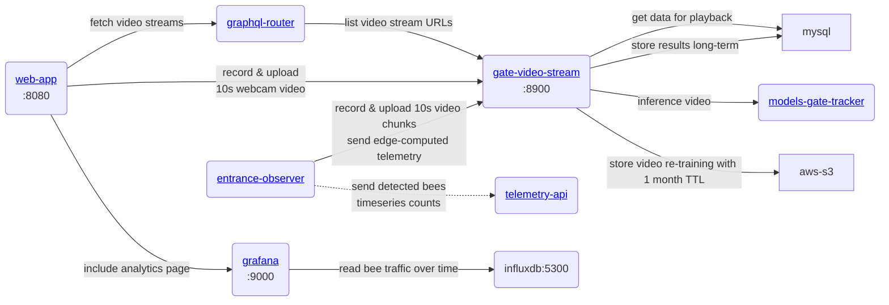

Peamine klienditeenindus on [betaru-sissepääs-videoprotsessor](https://github.com/Gratheon/beehive-entrance-video-processor), see peab töötama ääreseadmes, et jäädvustada ja saata andmeid aadressile web-app. Meie peamine prioriteet on järelduste tegemine ääreseadmel, kuid tahame ka pilve toega hübriidjäreldusi.

Tootetaseme ülevaate saamiseks vaadake jaotist [Entrance Observer](../../products/entrance_observer/entrance_observer.md). Jäädvustatud mõõdikud loovad ühenduse [taru telemeetriasalvestusega](/products/web_app/pro-tier/hive-telemetry-storage/) ja [aegridade analüüsiga](/products/web_app/pro-tier/timeseries-data-analytics/).
### Videotöötlus, taasesitus ja analüüs

Kaamera kaitsekate

## Töötlemisarhitektuuri valimine

Video töötlemisele saame läheneda erinevate nurkade alt:| **Kus** | **Pussid** | **Miinused** |
| ------------------------------------------------------------------------------------------ ------------------------------------------------------------------------------------------- ------------------------------------------------------------------------------------------- ------------------------------------------------------------------------------------------- | -------------------------------------------------------------------- --------------------------------------------------------------------- --------------------------------------------------------------------- --------------------------------------------------------------------- | ------------------------------------------------------------------------------------------------------ ------------------------------------------------------------------------------------------------------ |
| Edge seade ilma GPU  raspberry-pi    ex.   [🇨🇿 BeeLogger](https://www.notion.so/BeeLogger-ad269086bf8449faa0aae6754f879181?pvs=21), [BeePi](https://www.notion.so/BeePi-2e3023f492864fa98b2790743c3ba6e4?pvs=21) | - soodne ~ 95 EUR tahvel | - piiratud lihtsate arvmudelitega  - ei pruugi olla usaldusväärne |
| Edge-seade GPU  (jetson nano)    ex.   [🇩🇪Apic.ai](https://www.notion.so/Apic-ai-7859a940fd644a3fa35008fd3a2f1909?pvs=21), [🇦🇺Beemate](https://www.notion.so/Beemate-7f54f62332334254b42e3e584dfae537?pvs=21), [🔬BeeAlarmed. Magistritöö](https://www.notion.so/BeeAlarmed-Masters-thesis-d9c40374718b480ab08a3872f441a2d8?pvs=21) | - tõhus  - madal võrgusõltuvus  - võib töötada võrguühenduseta oma GPU | ~ ainuüksi tahvlile kulus 230 EUR |
| Hübriid:  - kohapealne (kohalik) GPU tööjaam  - Video voogedastusseadmed | - madalamad kulud kokku | - seadme suurem alghind  - vajadus spetsiaalse tööjaama asukoha järele |
| Ainult pilv, nt.  [LabelBee](https://www.notion.so/LabelBee-482ad7f33192487caae38697b21b7f5d?pvs=21) |                                                                                                                                                                                                                                                                                     | - vajavad suurt võrgu ribalaiust  - tuleb optimeerida muutuva võrgu ribalaiuse jaoks  - kallis  - video voogesituse ja töötlemise hind  - video salvestuskulu |
| Spetsiaalsed [PCB-seadmed](https://jlcpcb.com/) | - energiatõhusus  - madal tootmiskulu | - tavaliselt vähe RAM-i, GPU  - suured arenduskulud |
| Mobiiltelefonis | - kliendi kontrollitav hind  - on sisseehitatud võrguühendus  - kaamera  - ekraan on  - aku- ja toitehaldus ____0 müüja puudub - TAG__0 ETDO2_5  - kõige lihtsam alustada  - mesinikul on lihtne seadistada  - automaatsed rakenduste ümberpaigutused | - suur valik telefone, ebaühtlane kogemus  - telefonis töötlemiseks, probleemid GPU-ga, vajadus kasutada kohandatud mobiili tensorvoogu  - liiga kõrge tase (brauseris), kasutaja sekkumine võib olla keeruline |