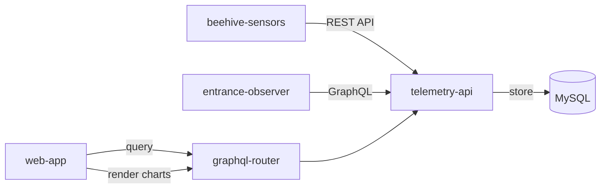

Stocker et visualiser les données de séries temporelles provenant d’appareils IoT installés sur les ruches, afin de suivre sur le long terme des indicateurs comme la température, l’humidité, le poids et l’activité à l’entrée.

## Vue d’ensemble

Les apiculteurs professionnels et les exploitations orientées données ont besoin d’historique pour prendre de meilleures décisions de gestion. Le système de télémétrie collecte les mesures depuis les capteurs matériels, les stocke, puis les rend disponibles pour la visualisation, l’analyse et les alertes.

Cette fonction permet :

- la surveillance continue des conditions environnementales ;
- l’analyse de tendances entre saisons ;
- la détection précoce d’anomalies dans les motifs de données ;
- des décisions fondées sur des mesures plutôt que sur des impressions isolées.

## Mesures prises en charge

### Données environnementales

- **Température** : température interne de la ruche en degrés Celsius.
- **Humidité** : niveau d’humidité à l’intérieur de la ruche en pourcentage.
- **Poids** : poids total de la ruche pour suivre miellée, consommation des réserves et récolte.

### Activité à l’entrée

- **Abeilles entrantes/sortantes** : comptage directionnel des abeilles.
- **Flux net** : différence entre entrées et sorties.
- **Vitesse moyenne** : vitesse de déplacement des abeilles à l’entrée.
- **Abeilles stationnaires** : abeilles qui restent à l’entrée.
- **Abeilles détectées** : nombre total dans le champ de la caméra.
- **Interactions entre abeilles** : rencontres détectées à l’entrée, par exemple trophallaxie ou agressivité.

## Fonctionnement

1. **Connecter les capteurs**
   - Installer les capteurs de ruche pour la température, l’humidité et le poids.
   - Installer Entrance Observer pour l’analyse du trafic à l’entrée.
   - Configurer les appareils avec un jeton d’authentification API.

2. **Collecte automatique**
   - Les capteurs envoient les mesures au service de télémétrie.
   - Les données sont stockées dans des tables optimisées pour les séries temporelles.
   - L’authentification est vérifiée par les services de compte utilisateur.

3. **Visualiser et analyser**
   - Les mesures récentes apparaissent dans le tableau de bord de la ruche.
   - Les graphiques historiques permettent de choisir des plages temporelles.
   - Les analyses avancées sont disponibles dans les graphiques intégrés de l’application web.
   - Les données peuvent être exportées pour des analyses externes.

4. **Configurer des alertes**
   - Créer des règles basées sur des seuils.
   - Recevoir une notification lorsque les valeurs sortent des plages sûres.
   - Surveiller les changements brusques et anomalies.

## Conservation des données

Le niveau Pro inclut :

- **Durée de stockage** : jusqu’à 3 ans de données historiques.
- **Résolution** : des agrégats à la minute jusqu’aux agrégats journaliers selon la configuration.
- **Plages de requête** : de la dernière heure à plusieurs années avec agrégation.
- **Taille estimée** : environ 500 Mo par ruche et par an selon les capteurs et la fréquence.

## Architecture



Le système utilise :

- **telemetry-api** : service principal de stockage et de requête des mesures ;
- **MySQL** : stockage optimisé par identifiant de ruche et horodatage ;
- **graphql-router** : passerelle API utilisée par l’application web ;
- **graphiques de la web-app** : visualisation et analyse opérationnelle intégrées.

## Accès API

Des API REST et GraphQL sont disponibles.

**REST API** pour les appareils IoT :

```text
POST /v1/metrics/:hiveId
POST /v1/entrance/:hiveId/:boxId
GET /v1/metrics/:hiveId/temperature?minutes=60
```

**GraphQL API** pour l’application web :

```graphql
query {
  temperatureCelsius(hiveId: "123", timeRangeMin: 60)
  humidityPercent(hiveId: "123", timeRangeMin: 1440)
  weightKgAggregated(hiveId: "123", days: 7, aggregation: DAILY_AVG)
  entranceMovement(hiveId: "123", timeFrom: "2024-12-01", timeTo: "2024-12-06")
}
```

## Cas d’usage

### Comparaison saisonnière

Comparer température et humidité sur plusieurs années pour préparer le développement de printemps, les périodes de miellée et l’hivernage.

### Suivi de la miellée

Surveiller les variations de poids pour détecter le début du flux de nectar, la disette, la consommation des réserves ou le bon moment de récolte.

### Santé de la colonie

Observer l’activité à l’entrée pour repérer une colonie orpheline, du pillage, une modification du butinage ou un événement inhabituel.

### Efficacité des traitements

Comparer les mesures avant et après une intervention afin d’évaluer la récupération, la stabilité thermique ou le bon moment d’un traitement.

## Limites techniques

- Les requêtes longues nécessitent une agrégation.
- Le nombre de points par requête est limité pour préserver les performances.
- La fréquence minimale d’écriture dépend du type d’appareil et de la configuration.
- Certaines vues utilisent du polling plutôt que des WebSockets en temps réel.
- L’analyse utilise la même session authentifiée que l’application web.

## Fonctions liées

- [🔔 Alertes](/fr/products/web_app/flexible-tier/alerts/) : notifications par seuils et anomalies.
- [📊 Analyse de séries temporelles](/fr/products/web_app/pro-tier/timeseries-data-analytics/) : comparaison multi-ruches.

## Ressources

- [Documentation technique](/docs/web-app/features/telemetry-storage/)
- [Telemetry API sur GitHub](https://github.com/Gratheon/telemetry-api)
- [Configuration des capteurs de ruche](/docs/beehive-sensors/beehive-sensors/)
- [Configuration d’Entrance Observer](/docs/entrance-observer/entrance-observer/)
