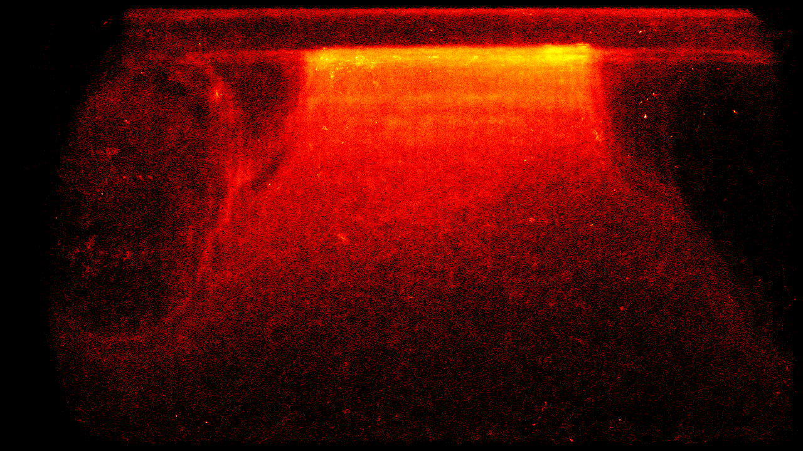

# 🛣️ Landing board heatmap generation

### 🎯 Purpose
Generates daily visual heatmaps showing bee movement patterns and activity zones on the landing board to optimize hive entrance design and understand traffic flow.

### 🎭 User Story
- As a beekeeper interested in optimizing hive entrance efficiency
- I want to open the Entrance Observer section in hive details and switch from live view or recordings to heatmaps
- So that I can compare the most recent day by default and move to previous days when investigating traffic bottlenecks

### 🚀 Key Benefits
- **Traffic optimization**: Identify congested areas and potential improvements
- **Entrance design insights**: Data-driven approach to landing board modifications
- **Long-term behavior analysis**: Understanding of seasonal and daily patterns
- **Research value**: Visual data for studying bee traffic behavior

### 🔧 Technical Overview
Heatmap computation is owned by `gate-video-stream`, not the edge `entrance-observer` device.

`entrance-observer` still detects bees and keeps local daily JSONL track history for debugging. After each analysis run it also sends the tracked coordinates to `gate-video-stream` with the box ID, timestamp, frame dimensions, and `trackHistory`. `gate-video-stream` aggregates those trajectories into a per-user, per-box, per-day heat grid, renders a daily SVG heatmap, stores it in the same object-storage bucket pattern used by video recordings, and exposes it to the web app through GraphQL.

### 📋 Acceptance Criteria
- `entrance-observer` uploads trajectory payloads to the video stream service after tracking analysis
- `gate-video-stream` computes and stores one cumulative heatmap per entrance and day
- Stored heatmaps are addressable by URL similarly to stored video assets
- Web app Hive details > Entrance Observer has three tabs: live view, recordings, and heatmaps
- The heatmaps tab shows the latest available day by default
- Previous day, next day, and latest controls let the user navigate historical heatmaps
- Missing days show an empty state instead of failing the view

### 🚫 Out of Scope
- 3D visualization or depth analysis
- Weather correlation with traffic patterns
- Automated landing board design recommendations
- Replacing raw video recordings with heatmaps

### 🏗️ Implementation Approach
- **Data input**: Edge-generated track history coordinate arrays per track ID
- **Transport**: Authenticated REST upload from `entrance-observer` to `gate-video-stream`
- **Processing**: Server-side daily grid accumulation with logarithmic visual scaling
- **Visualization**: SVG heatmap image generated by `gate-video-stream`
- **Storage**: Object storage under the user and entrance camera namespace, plus a MySQL index row for day navigation
- **Web app**: `entranceHeatmaps` GraphQL query powers the Hive details heatmap tab

### 📊 Success Metrics
- Accurate coordinate processing within frame boundaries (0 <= x < width, 0 <= y < height)
- Daily heatmap generated from uploaded trajectory batches
- Proper normalization and color mapping for visual interpretation
- Web app can open latest available heatmap without knowing the date in advance
- Historical navigation works across days that have or do not have generated heatmaps

### 💳 Availability
Landing board heatmaps are included in the [Professional plan](/pricing/) as part of Entrance Observer analytics.

### 🔗 Related Features
- [📈 Count bees coming in and out - on the edge](📈%20Count%20bees%20coming%20in%20and%20out%20-%20on%20the%20edge.md)
- [📊 Bee movement metric reporting](📊%20Bee%20movement%20metric%20reporting.md)
- [🎥 Video streaming via API](🎥%20Video%20streaming%20via%20API.md)
- [Hive telemetry storage](../../web_app/pro-tier/hive-telemetry-storage.md)

### 📚 Resources & References
- [Entrance Observer source](https://github.com/Gratheon/entrance-observer/)
- [Gate Video Stream API docs](../../../docs/API/rest/gate-video-stream.md)
- [Example heatmap outputs](img/heatmap-09-06%201.png)

### 💬 Notes
The older local `heatmap_generator.py` script remains useful for offline debugging and backfills, but production heatmaps are generated centrally so the web app can show them next to live streams and stored video recordings.
