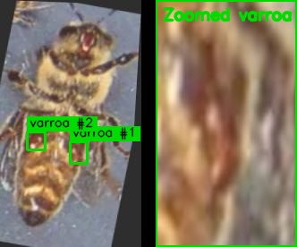

Some of the models that we trained
### Bee detection
https://github.com/Gratheon/models-bee-detector/
https://github.com/Gratheon/entrance-observer/tree/main/weights

### Queen bee detection
https://github.com/Gratheon/models-queen-bee-detector

In-house object detector for finding **queen bees among worker bees, drones, pollen bees, and frame/background content**.

It supports two deployment paths:
- browser inference for [Live Queen Finder](../about/products/web_app/free-tier/live-queen-finder.md) via ONNX + `onnxruntime-web`
- HTTP inference service for server-side experiments and integrations

Baseline training setup:
- Model: `yolov8n.pt`
- Image size: `512`
- Epochs: `60`
- Dataset: merged queen datasets with queen labels normalized to class `queen` and non-queen images kept as negative/background samples

Test metrics (`weights/best.pt`):
- Precision: `0.9727`
- Recall: `0.8590`
- mAP50: `0.9187`
- mAP50-95: `0.6114`

Precision is high, but recall still leaves room for missed queens, so detections should be confirmed visually in field use.

### BeePose
https://github.com/Gratheon/models-beepose2

<iframe width="100%" height="400" src="https://www.youtube.com/embed/BSwhqxDsRck" title="Bee pose model with 13 key points" frameborder="0" allow="accelerometer; autoplay; clipboard-write; encrypted-media; gyroscope; picture-in-picture; web-share" referrerpolicy="strict-origin-when-cross-origin" allowfullscreen></iframe>

### Varroa-on-bee detection
https://github.com/Gratheon/models-varroa-on-bee

In-house model and microservice for detecting **varroa mites directly on bees** in hive images.
It is integrated in our pipeline (`web-app -> graphql-router -> image-splitter -> models-varroa-on-bee`) and returns bounding boxes over HTTP.

Highlights:
- Dedicated `varroa_on_bee` detections (not only hive-bottom mites)
- Simple API (`POST /` with `multipart/form-data` image upload)
- Health endpoint for operations (`GET /health`)

Validation metrics (`varroa_model5`, `best.pt`):
- Precision: `0.926`
- Recall: `0.823`
- mAP50: `0.871`
- mAP50-95: `0.485`
- Varroa class precision/recall: `0.858` / `0.651`
- Dataset source: Roboflow Universe `varroa-j8231/varroa8k` v1  
  https://universe.roboflow.com/varroa-j8231/varroa8k/dataset/1

