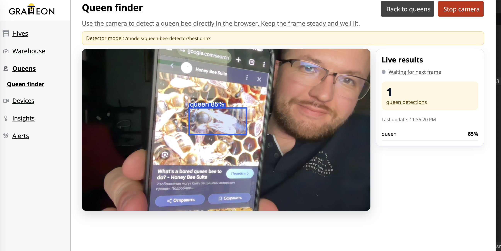

In-house object detector for finding **queen bees among worker bees, drones, pollen bees, and frame/background content**.

Repository: https://github.com/Gratheon/models-queen-bee-detector

It supports two deployment paths:

- browser inference for [Live Queen Finder](/about/products/web_app/free-tier/live-queen-finder/) via ONNX + `onnxruntime-web`
- HTTP inference service for server-side experiments and integrations

Baseline training setup:

- Model: `yolov8n.pt`
- Image size: `512`
- Epochs: `60`
- Dataset: merged queen datasets with queen labels normalized to class `queen` and non-queen images kept as negative/background samples

Test metrics (`weights/best.pt`):

- Precision: `0.9727`
- Recall: `0.8590`
- mAP50: `0.9187`
- mAP50-95: `0.6114`

Precision is high, but recall still leaves room for missed queens, so detections should be confirmed visually in field use.

