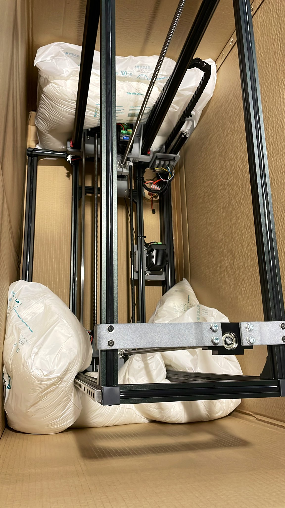
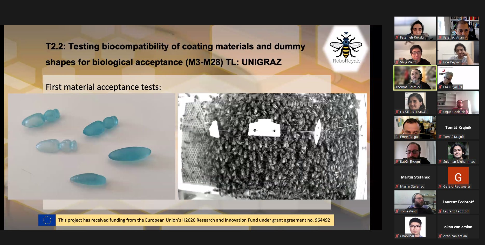
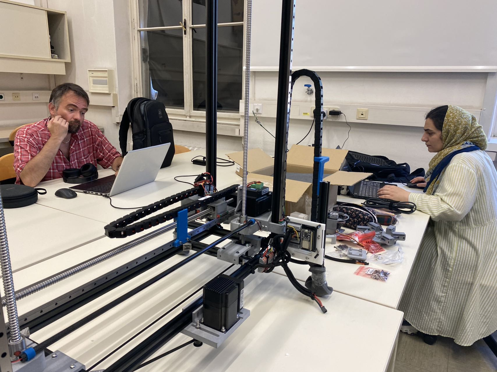
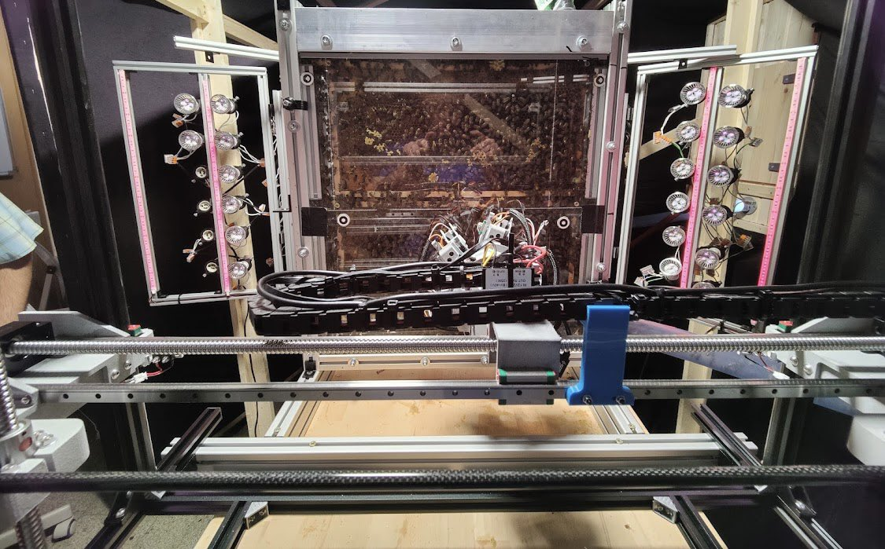
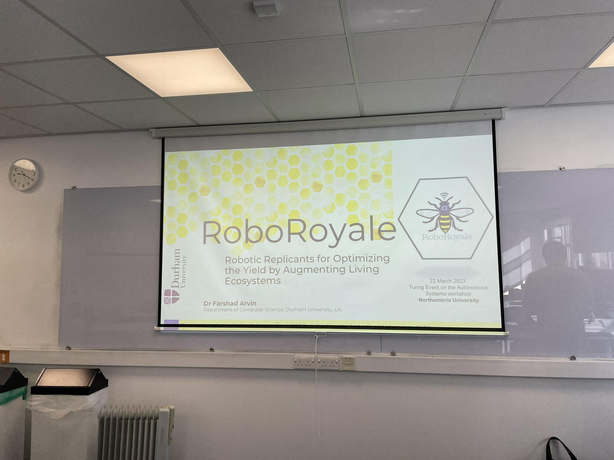
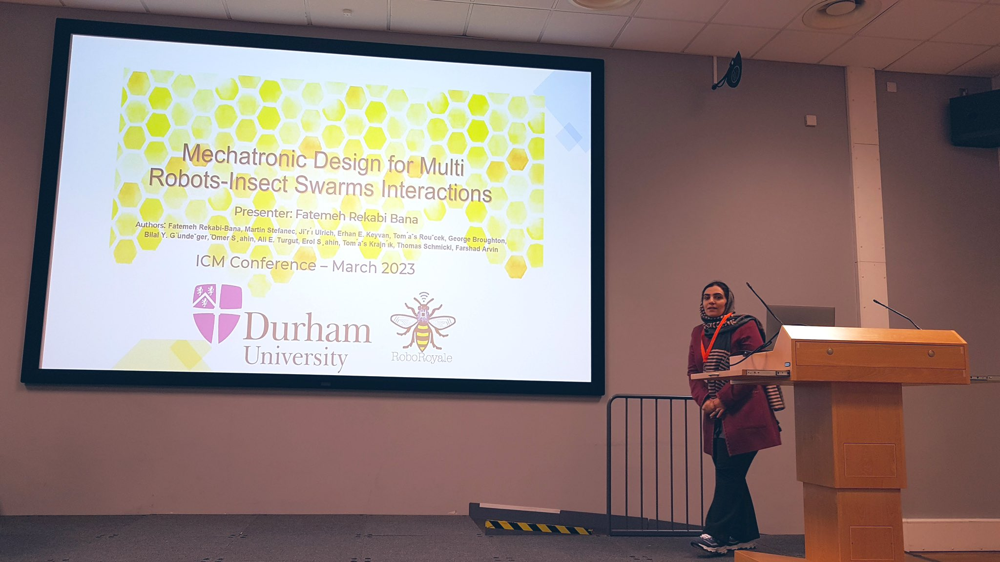
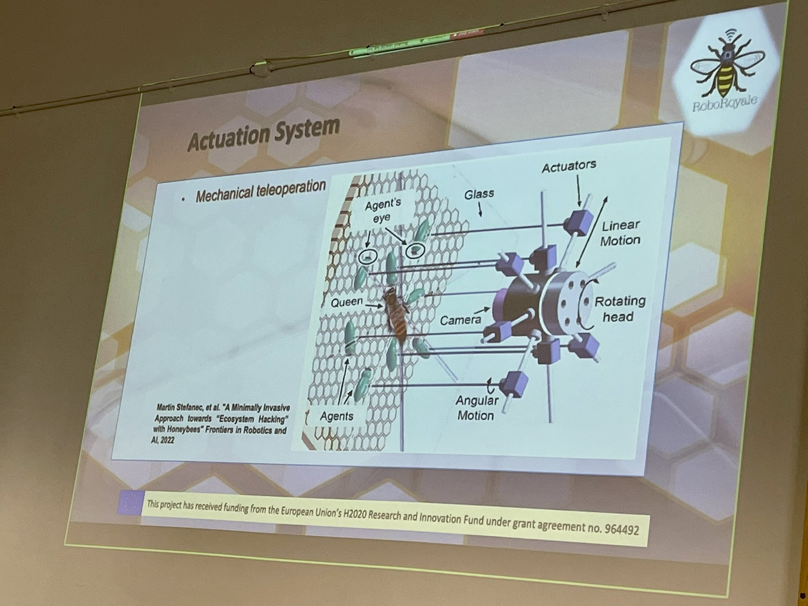
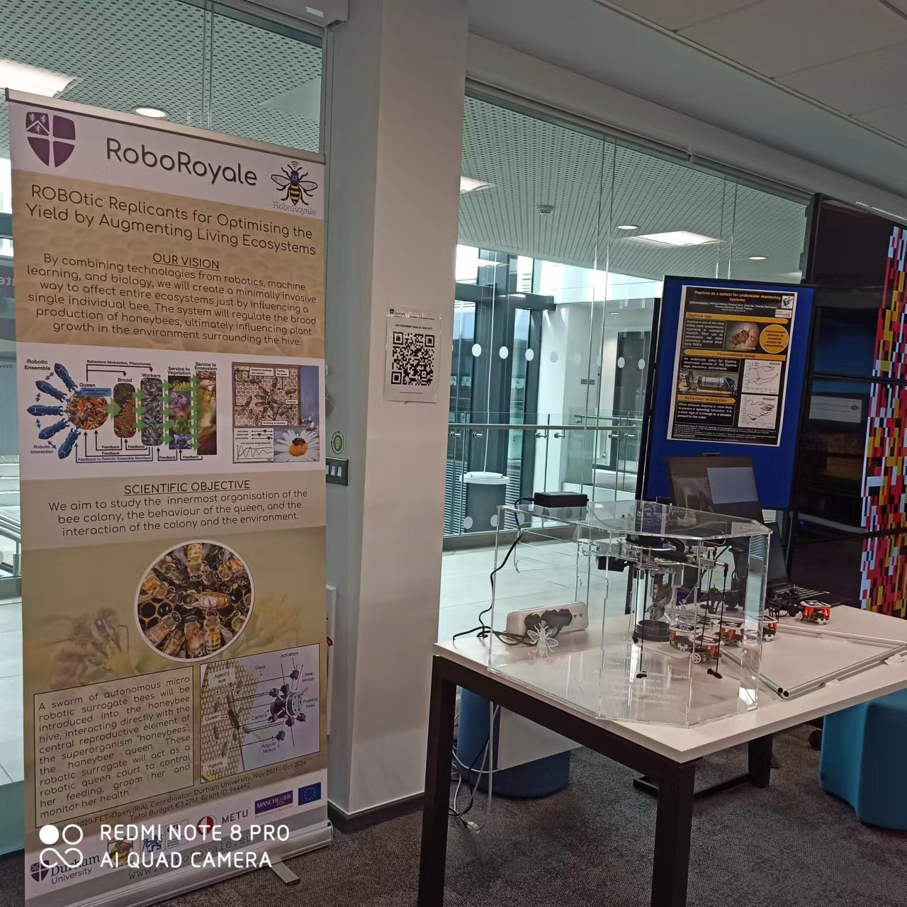
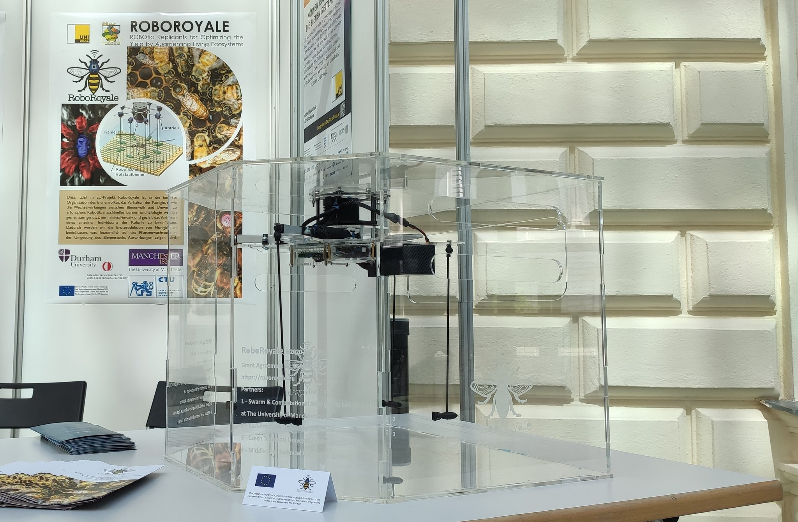

<iframe width="100%" height="400" src="https://www.youtube.com/embed/Wv_iQ3VHyeQ" title="Autonomous tracking of honeybee behaviors over long-term periods with cooperating robots" frameborder="0" allow="accelerometer; autoplay; clipboard-write; encrypted-media; gyroscope; picture-in-picture; web-share" referrerpolicy="strict-origin-when-cross-origin" allowfullscreen></iframe>

<iframe width="100%" height="400" src="https://www.youtube.com/embed/RtaotaaB5SM?list=PLwJcdKVRxEGLCrmPlRZjI0PEkswdf8O9g" title="Dashboard of the AROBA system" frameborder="0" allow="accelerometer; autoplay; clipboard-write; encrypted-media; gyroscope; picture-in-picture; web-share" referrerpolicy="strict-origin-when-cross-origin" allowfullscreen></iframe>

## Relevancy to Gratheon

The RoboRoyale / AROBA project represents the long-term autonomous-apiary vision that Gratheon is working toward. The robotic camera mounted on a scanning stage inside an observation hive mirrors the hardware approach Gratheon is planning for its hive-scanner module. Gratheon's web app could ingest and visualize the behavioral datasets this system produces — queen location, court-bee count, brood-cell states — as value-added analytics for professional beekeepers. The 30-day continuous-recording capability also sets the operational durability benchmark that Gratheon's edge hardware must meet in real deployments.

RoboRoyale is a R&D collaboration between multiple universities to analyze queen bee behaviour using a robot-driven camera and a transparent observation beehive.

- [https://x.com/EU_RoboRoyale](https://x.com/EU_RoboRoyale)

