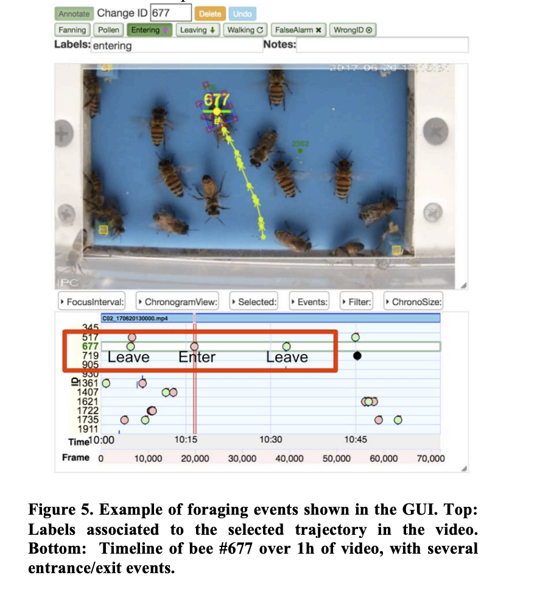

## Relevancy to Gratheon

LabelBee is a strong reference for Gratheon's entrance-camera data pipeline. The web app can borrow its human-in-the-loop concepts: video review, timeline navigation, bee selection, event labels, and quality-control states for correcting model predictions before they become training data. For the Entrance Observer and gate-tracker product area, the paper's label vocabulary maps directly to Gratheon metrics: entering, leaving, pollen return, fanning/cooling, and identity or trajectory confidence. In the autonomous-apiary vision, a LabelBee-style workflow would let beekeepers and researchers turn rare visual observations into curated datasets, close the loop between deployed hardware and model retraining, and make Gratheon's analytics auditable instead of treating computer-vision output as an opaque counter.
