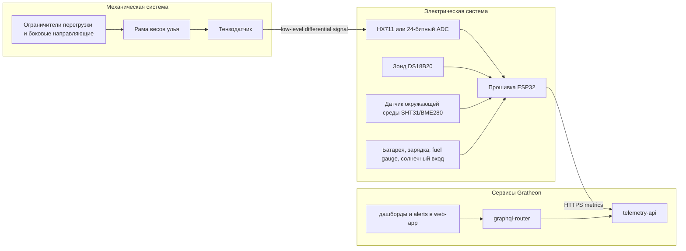
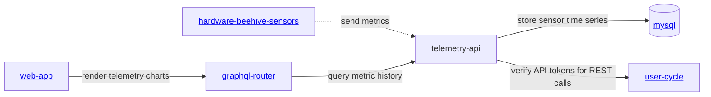

<iframe width="100%" height="400" src="https://www.youtube.com/embed/Ags3rplPkQE" title="Getting started with iot sensors development" frameborder="0" allow="accelerometer; autoplay; clipboard-write; encrypted-media; gyroscope; picture-in-picture; web-share" referrerpolicy="strict-origin-when-cross-origin" allowfullscreen></iframe>

## Направление продукта

IoT-датчики для улья должны развиваться через три понятных аппаратных этапа. Документация теперь сгруппирована сначала по этапам, потому что каждому этапу нужны и описание продукта, и собственный список компонентов:

1. **[Этап 1 - лабораторная проверка](phase-1-lab-validation/)** - проверить прошивку, проводку, калибровку и загрузку телеметрии на рабочем столе.
2. **[Этап 2 - полевой MVP](phase-2-field-mvp/)** - развернуть защищённые от погоды DIY-весы для улья, которые измеряют самые важные для пчеловода сигналы.
3. **[Этап 3 - производственный комплект](phase-3-production-kit/)** - превратить проверенную конструкцию в повторяемое, поддерживаемое и продаваемое устройство.

Такое разделение сохраняет первую публичную сборку дешёвой и понятной, но одновременно показывает путь к законченному продукту Gratheon. Текущий прототип уже доказывает главный сценарий: ESP32 собирает данные температуры и веса и отправляет показания в [telemetry-api](https://github.com/gratheon/telemetry-api). Аппаратный объём, список компонентов, функциональность, электрические интерфейсы, механические интерфейсы и путь развития описаны внутри соответствующего этапа, поэтому боковая навигация повторяет путь сборки.

## Обзор этапов

| Этап | Цель | Основной пользователь | Целевая стоимость | Описание продукта | BOM |
| --- | --- | --- | ---: | --- | --- |
| Этап 1 - Lab | Быстрый настольный прототип для проверки прошивки и API | Разработчик, контрибьютор, ранний maker | €20-35 | [Описание продукта](phase-1-lab-validation/product-description.md) | [Bill of materials](phase-1-lab-validation/bill-of-materials.md) |
| Этап 2 - Field MVP | Защищённые DIY-весы для пилотных пасек | Пилотный пчеловод, полевой тестировщик | €45-90 | [Описание продукта](phase-2-field-mvp/product-description.md) | [Bill of materials](phase-2-field-mvp/bill-of-materials.md) |
| Этап 3 - Production | Откалиброванный, поддерживаемый аппаратный комплект | Платящий клиент, реселлер, управляемая пасека | €90-180+ | [Описание продукта](phase-3-production-kit/product-description.md) | [Bill of materials](phase-3-production-kit/bill-of-materials.md) |

## Модель соединения системы

Аппаратную часть нужно описывать как связанные подсистемы, а не как разрозненный список деталей. Так электрические, механические и сервисные решения становятся явными.

## Оценка текущего подхода

| Область | Текущее состояние | Разрыв | Рекомендуемое изменение |
| --- | --- | --- | --- |
| Группировка документации | Старые docs имели отдельные родительские папки для этапов продукта и BOM. | Читателю приходилось прыгать между уровнями для одного этапа сборки. | Использовать phase-first папки: каждый этап содержит своё описание продукта и bill of materials. |
| Ценность продукта | Docs говорят, что датчики поддерживают продукт [beehive scales](../../products/scales/scales.md). | Страница не объясняла, зачем пчеловоду собирать устройство и какие события оно помогает заметить. | Начинать с “DIY hive scale + climate telemetry” и связывать метрики с решениями пчеловода. |
| Bill of materials | Старый BOM смешивал купленные детали и исследовательские датчики. | В одном месте были lab, MVP, optional research sensors, механические prototype parts и недостающие цены. | Держать BOM по этапам: [Lab](phase-1-lab-validation/bill-of-materials.md), [Field MVP](phase-2-field-mvp/bill-of-materials.md), [Production](phase-3-production-kit/bill-of-materials.md). |
| Электрические интерфейсы | Детали были перечислены, но границы соединений были неявными. | Load-cell, 1-Wire, I2C, питание и service/debug соединения требуют разного подхода. | Добавить для каждого этапа interconnect maps, таблицы pin allocation, выбор connectors и wiring rules. |
| Механические интерфейсы | Рама весов рассматривалась как компонент. | Точность веса зависит от load path, side load, overload stops, защиты кабеля и доступа к калибровке. | Рассматривать раму, тензодатчик, верхнюю плиту, ограничители и routing кабеля как одну механическую подсистему. |
| Выбор чипа | ESP32 указан как популярный и дешёвый. | Нет правила выбора WiFi vs LoRa vs cellular. | Оставить ESP32-WROOM/DevKit для [Lab](phase-1-lab-validation/product-description.md) и [Field MVP](phase-2-field-mvp/product-description.md); добавить LoRa/cellular gateway как варианты [Production](phase-3-production-kit/product-description.md). |
| Telemetry API | `telemetry-api` поддерживает `temperatureCelsius`, `humidityPercent`, `weightKg`, timestamps, batching и `dedupeKey`. | Прошивка и docs должны единообразно использовать JSON-контракт `/iot/v1/metrics`; battery voltage пока не представлен. | Для MVP backend-блокера нет; добавить в будущем `batteryVoltage`, `batteryPercent`, `rssi`, firmware, hardware и calibration metadata. |
| Питание | Прошивка большую часть времени спит. | Страница не давала battery budget, guidance по интервалу отправки или solar recommendation. | Использовать 30-60 секунд в лаборатории и 10-15 минут в поле, затем подбирать батарею/solar по измеренному току. |
| Представление продукта | Страница была только инженерной. | Она не выглядела как поэтапный продукт с install scope, cost, data examples или следующим действием. | Использовать roadmap из трёх этапов и phase-specific BOM pages. |

## Исследовательские выводы

Локальные research notes и проверки в интернете сходятся на одном порядке MVP: **сначала вес + температура/влажность**, затем звук, CO2, качество воздуха и tamper sensors.

- Мультисенсорная платформа мониторинга улья с измерением **веса, звука, температуры, влажности и CO2** показала возможность обнаруживать роение, кражу, медосбор, нехватку корма и ослабление семьи через sensor fusion ([A Smart Sensor-Based Measurement System for Advanced Bee Hive Monitoring](/research/papers/A%20Smart%20Sensor-Based%20Measurement%20System%20for%20Advanced%20Bee%20Hive%20Monitoring/), DOI:10.3390/s20092726). Для Gratheon это подтверждает долгосрочное multimodal-направление, но не означает, что все датчики нужны в первый день.
- Обзор 2024 года по low-cost beehive monitoring выделяет температуру, влажность, вес улья и звук как практичные modalities, но подчёркивает, что полезность зависит от точности и интерпретации пчеловодом ([Advances in Beehive Monitoring Systems: Low-Cost Integrating Sensor Technology for Improved Apiculture Management](../../research/papers/Advances%20in%20Beehive%20Monitoring%20Systems%20Low-Cost%20Integrating%20Sensor%20Technology%20for%20Improved%20Apiculture%20Management.md), DOI:10.1051/e3sconf/202458904001).
- Исследования энергопотребления в precision beekeeping подтверждают, что offline field deployments нужно проектировать вокруг sleep cycles, radio duty cycle и reduced edge processing, а не вокруг постоянного стриминга ([Analysis of Energy Consumption in a Precision Beekeeping System](../../research/papers/Analysis%20of%20Energy%20Consumption%20in%20a%20Precision%20Beekeeping%20System.md), arXiv:2010.14934).
- Исследование ESP8266/ESP32 + ESP-NOW + GSM/GPRS gateway показывает cost-effective топологию пасеки, где дешёвые hive nodes общаются локально с одним internet gateway ([Bee colony remote monitoring based on IoT using ESP-NOW protocol](../../research/papers/Bee%20colony%20remote%20monitoring%20based%20on%20IoT%20using%20ESP-NOW%20protocol.md), DOI:10.7717/peerj-cs.1363). Это хорошая production-архитектура для пасек без WiFi.
- Открытые DIY-примеры и component guides часто используют **ESP32/ESP8266 + HX711 + load cell + DS18B20/DHT-style climate sensor**, включая публичные tutorials и open-source smart-scale projects. Это снижает adoption risk, потому что пчеловоды могут купить детали и отлаживать их обычным Arduino/ESP32 tooling.
- Наружная проводка датчиков должна считать cable entry, strain relief, sealing, O-rings и unused connector caps частью конструкции, а не послесловием. Поэтому production-этап теперь имеет connector strategy вместо общей строки “waterproof connectors”.

## Сервисы

- [https://github.com/Gratheon/hardware-beehive-sensors](https://github.com/Gratheon/hardware-beehive-sensors) - прошивка датчиков и аппаратные notes
- [https://github.com/gratheon/telemetry-api](https://github.com/gratheon/telemetry-api) - server-side ingestion and querying
- [Telemetry API docs](../API/rest/telemetry-api.md) - OpenAPI-документация сервиса

## Текущая сервисная архитектура

